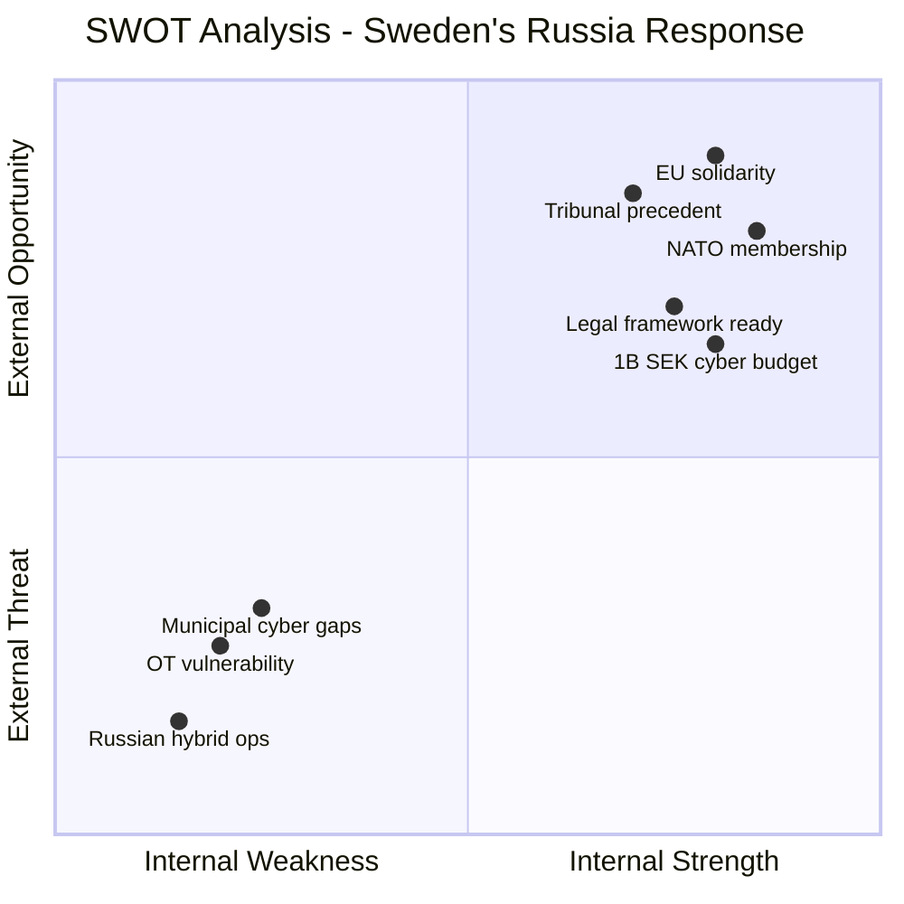

# 🔬 SWOT Analysis — Realtime Monitor 1442

**Date:** 2026-04-16 | **Theme:** Sweden Confronts Russia

## Context

| Field | Value |
|-------|-------|
| **Analysis Scope** | Ukraine accountability + cybersecurity defense |
| **Primary Documents** | HD03231, HD03232, cybersecurity briefing |
| **Named Actors** | PM Kristersson (M), FM Malmer Stenergard (M), CD Bohlin (M) |

## Strengths
- **NATO-aligned response**: Two propositions + cybersecurity investment position Sweden as committed alliance member
- **Comprehensive approach**: Criminal tribunal + damages commission + defensive measures = full-spectrum strategy
- **Significant funding**: Over 1 billion SEK for cybersecurity demonstrates fiscal commitment
- **Legal readiness**: New cybersecurity law (Jan 2026) + CoE institutional framework

## Weaknesses
- **Municipal preparedness**: Local government OT systems lack dedicated security capacity
- **Enforcement gap**: Both tribunal and damages commission face Russian non-cooperation
- **Cost uncertainty**: Open-ended commitments to international mechanisms + ongoing cybersecurity needs

## Opportunities
- **Diplomatic leverage**: Sweden's first major NATO-era accountability actions strengthen bargaining position
- **EU asset seizure debate**: Damages commission links to frozen Russian assets discussions
- **Alliance integration**: NCSC-NATO cooperation deepens collective defense

## Threats
- **Russian escalation**: Explicit naming may invite targeted cyber operations
- **Hybrid warfare intensification**: Bohlin acknowledged Russia "increasingly risk-prone"
- **Critical infrastructure vulnerability**: Physical consequences from OT attacks (power, water, hospitals)
