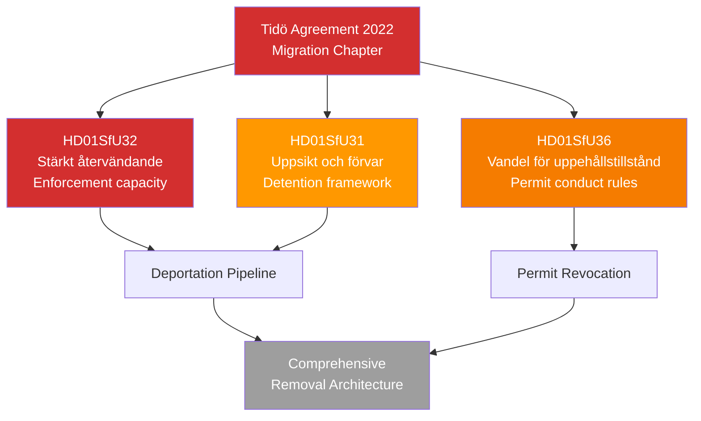

# Per-File Analysis: HD01SfU31+32+36 — Immigration Enforcement Triptych
**Data Depth:** METADATA-ONLY | **Confidence Ceiling:** MEDIUM

## Document Identity

| Field | dok_id | Title |
|-------|--------|-------|
| HD01SfU31 | SfU31 | Ett nytt regelverk för uppsikt och förvar |
| HD01SfU32 | SfU32 | Stärkt återvändandeverksamhet och utlänningskontroll |
| HD01SfU36 | SfU36 | Skärpta och tydligare krav på vandel för uppehållstillstånd |

All three: Committee SfU | Not published (planerat) | Data Depth: METADATA-ONLY

## Collective Analysis

These three betänkanden form the **Tidö Agreement's final migration enforcement package** — the cumulative legislative architecture for a harder Swedish asylum and migration regime.

### Legislation Architecture

### SfU32: Strengthened Deportation Enforcement [MEDIUM confidence]
**Purpose**: Builds operational capacity for the Swedish Police and Migrationsverket to execute deportation decisions more effectively. Likely includes:
- Extended detention periods for persons with enforceable deportation orders
- Enhanced cooperation with home country consulates
- Removal of procedural barriers that delay enforcement
- Financial incentives for voluntary departure (carrot+stick)

**Timeline**: Committee hearings April 23 + May 7, 2026; Deliberation May 21; Vote June 2026.

**Political meaning**: SD flagship — demonstrating that the "firm line" (stram migrationspolitik) delivers actual deportations, not just rhetoric. The enforcement rate (antal avvisningar som verkställs) is a core SD metric.

### SfU31: New Surveillance and Detention Framework [MEDIUM confidence]
**Purpose**: Creates a systematic legal framework for "uppsikt" (surveillance/monitoring) and "förvar" (administrative detention) of foreign nationals awaiting deportation. This replaces ad hoc provisions with a comprehensive detention code.

**Civil Liberties Risk**: ECHR Article 5 requires detention to be lawful, non-arbitrary, and with judicial oversight. A blanket detention framework creates systemic risk of prolonged administrative detention without individualized assessment.

**Timeline**: Committee hearings April 21 + May 7, 2026; Deliberation May 21; Vote June 2026.

### SfU36: Conduct Requirements for Residence Permits [MEDIUM confidence]
**Purpose**: Makes criminal behaviour — including minor offences — a basis for refusing or revoking residence permits. Current law requires serious criminality; the reform extends the "vandel" (conduct) assessment to a broader range of violations.

**Impact**: Potentially affects 100,000s of long-term residents with historical criminal records (even from youth). Creates a chilling effect on political participation among immigrant communities.

**Timeline**: Committee hearings May 5 + May 21, 2026; Deliberation May 28; Vote June 2026.

### Election 2026 Analysis [HIGH confidence]
The scheduling of these committee debates (April–June 2026) means the most politically charged migration debates will occur **during** the election campaign season. This is strategic: SD and M benefit from visible parliamentary action on migration, keeping the issue front and centre in Swedish political discourse precisely when campaign messaging is being set.

**SD framing**: "We deliver on our promises — detention capacity, enforcement, permit standards."
**V/MP framing**: "This is inhumane — criminalizing ordinary migrants who have lived here for years."
**S position**: Nuanced — S has moved right on migration since 2022 and may not oppose the principle, focusing instead on proportionality.

### Risk Assessment [MEDIUM confidence]

| Risk | Score | Trigger |
|------|-------|---------|
| ECHR Art 5 violation (SfU31) | L:4 × I:5 = 20 | ECHR petition from detained foreigner |
| Migrationsdomstol reversal of detention orders | L:3 × I:3 = 9 | First court ruling Q3 2026 |
| Political backlash from diaspora communities | L:3 × I:3 = 9 | Organized protest or strike |
| JO (Parliamentary Ombudsman) investigation | L:3 × I:3 = 9 | JO annual report 2027 |
