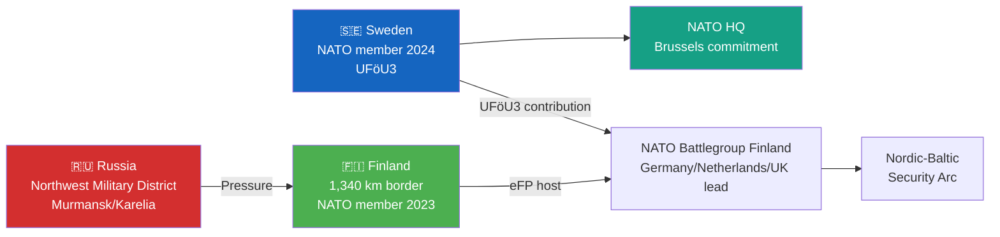

# Per-File Analysis: HD01UFöU3 — Svenskt bidrag till Natos framskjutna närvaro i Finland
**Data Depth:** METADATA-ONLY | **Confidence Ceiling:** MEDIUM

## Document Identity

| Field | Value |
|-------|-------|
| **dok_id** | HD01UFöU3 |
| **Committee** | UFöU (Joint Committee on Foreign Affairs and Defence) |
| **Title** | Svenskt bidrag till Natos framskjutna närvaro i Finland |
| **Proposition** | 2025/26:220 |
| **Vote Date** | June 4, 2026 |
| **Data Depth** | METADATA-ONLY |

## Strategic Analysis

### The Decision: Sweden's First NATO Forward Presence Commitment [HIGH]

Sweden joined NATO in March 2024. UFöU3 marks the transition from **accession** to **operational alliance membership**: Sweden's first commitment to participate in NATO's enhanced forward presence (eFP) on Finnish territory. Finland has hosted a NATO battlegroup (primarily from Germany, Netherlands, UK since 2024). Sweden's contribution signals:

1. **Nordic solidarity** — Sweden and Finland's military integration (LoI agreement 2024) is operationalized
2. **Eastern flank credibility** — Sweden contributes to the Baltic Sea theatre that NATO regards as most exposed to Russian pressure
3. **Article 5 seriousness** — Sweden demonstrates it will bear cost and risk sharing, not just diplomatic alignment

### Geopolitical Context

### Parliamentary Dynamics [MEDIUM confidence]
- **Broad support**: Defence matters typically enjoy M, S, SD, C, KD support in Sweden — cross-bloc consensus on NATO alignment post-2022 Russo-Ukraine war
- **V opposition**: Vänsterpartiet has traditionally opposed NATO and continues to resist military commitments
- **MP position**: Ambivalent — supports Ukraine solidarity but cautious about escalation
- **Timeline**: Committee hearings May 5 + May 19, 2026; vote June 4 — the last major parliamentary sitting before summer recess

### Election 2026 Implications [HIGH]
- **Defence credibility**: Sweden's NATO commitment is now a vote-winner for M/S bipartisan electorate
- **Campaign narrative**: Government frames as "responsible security policy" — strong leadership, reliable ally
- **V/MP attack**: Risk of "unnecessary provocation of Russia" — marginal effect given post-Ukraine war shift in Swedish public opinion (70%+ pro-NATO in 2025 polls)
- **Historical milestone**: June 4, 2026 vote will be Sweden's most significant defence commitment since Cold War national service expansion

### Risk Assessment [MEDIUM confidence]

| Risk | Score | Trigger |
|------|-------|---------|
| Russian diplomatic retaliation | L:3 × I:3 = 9 | Russian ambassador recalled or expelled |
| Russian military exercise on Finnish border | L:3 × I:4 = 12 | Exercise "Zapad" variant near Karelia |
| Swedish casualties in forward presence | L:1 × I:5 = 5 | Any hostile incident in Finland AO |
| Parliamentary criticism of cost | L:2 × I:2 = 4 | Budget discussion Q4 2026 |
