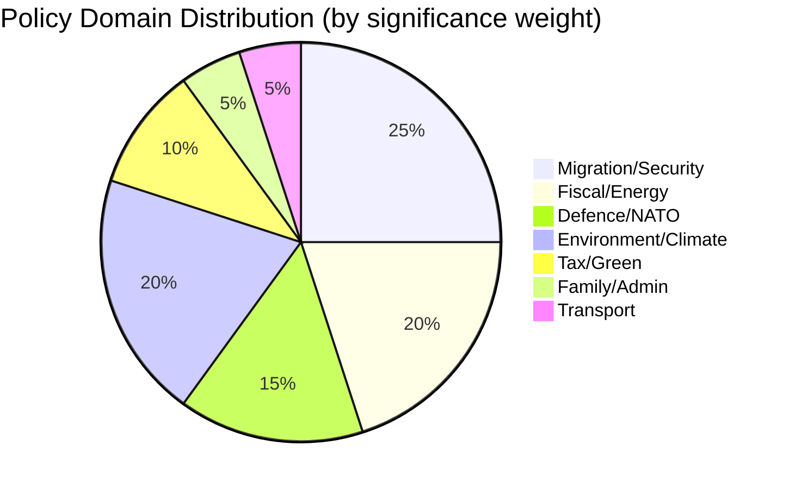

# Political Classification — Committee Reports 2026-04-17
**ID:** classification-committeeReports-2026-04-17 | **Riksmöte:** 2025/26

## Classification Matrix

| dok_id | Policy Domain | Political Temperature | Strategic Significance | Coalition Position | Opposition Position |
|--------|--------------|----------------------|----------------------|-------------------|---------------------|
| HD01FiU48 | Fiscal/Energy | 🔥 HOT | CRITICAL (9/10) | Coalition drive | Left OPPOSE (regressive + anti-climate) |
| HD01SfU32 | Migration/Security | 🔥 HOT | CRITICAL (9/10) | SD flagship | V, MP OPPOSE; S CRITICAL |
| HD01SfU31 | Migration/Rights | 🔥 HOT | HIGH (8/10) | SD/M drive | V, MP OPPOSE; human rights orgs |
| HD01SfU36 | Migration/Integration | 🔥 HOT | HIGH (8/10) | SD/M drive | V, MP OPPOSE; S SCEPTICAL |
| HD01UFöU3 | Defence/NATO | ⚡ WARM-HOT | HIGH (8/10) | Bipartisan (M, S, SD support) | V OPPOSE; MP AMBIVALENT |
| HD01MJU19 | Environment/Business | 🌡️ WARM | MEDIUM-HIGH (7/10) | Coalition (EU compliance minimum) | S, V, C, MP ALL RESERVE |
| HD01MJU20 | Climate/Governance | 🌡️ WARM | MEDIUM-HIGH (7/10) | Coalition accepts Riksrevisionen | V, C, MP RESERVE; S soft statement |
| HD01SkU23 | Tax/Green | 🟡 MILD | MEDIUM (6/10) | Coalition drive | Only V reserves |
| HD01SkU32 | Tax/International | 🟢 COOL | MEDIUM-LOW (5/10) | Bipartisan | No opposition |
| HD01SfU20 | Family/Admin | 🟢 COOL | LOW (4/10) | Bipartisan | No opposition |
| HD01TU16 | Transport/Education | 🟡 MILD | LOW (4/10) | Coalition | V, C, MP partial reservations |

## Policy Domain Distribution

## Legislative Stage Analysis

| Stage | Count | Documents |
|-------|-------|----------|
| **Webbpublicering** (published, ready for vote) | 6 | HD01MJU19, HD01MJU20, HD01SkU23, HD01SkU32, HD01SfU20, HD01TU16 |
| **Planerat** (planned, not yet published) | 5 | HD01SfU31, HD01SfU32, HD01SfU36, HD01FiU48, HD01UFöU3 |

## Political Temperature Scale

- 🔥 HOT: Active partisan conflict; opposition filing reservations; media attention HIGH
- ⚡ WARM-HOT: Bipartisan support on defence/security but left opposition present
- 🌡️ WARM: Moderate opposition; multiple reservation parties; policy substance contested
- 🟡 MILD: Minor opposition; principled but not politically mobilizing
- 🟢 COOL: Administrative/technical; bipartisan or no opposition

## Cross-Cutting Themes

### Theme 1: Pre-Election Legislative Sprint
The concentration of high-significance votes (FiU48 on April 22, MJU19+SkU23+SkU32+SfU20+TU16 in same week) indicates deliberate parliamentary scheduling to complete the Tidö agenda and deploy fiscal resources before the election campaign fully begins. [HIGH confidence]

### Theme 2: Immigration Enforcement as Electoral Signal
SfU31+32+36's scheduling for committee deliberation April–June 2026 means the debate will occur during the election campaign itself — maximizing SD's ability to use the parliamentary process as a campaign platform. [HIGH confidence]

### Theme 3: Green Policy Contradiction
FiU48 (fuel tax cut) + limited MJU19 recycling ambition + MJU20 climate monitoring rejection = a coherent but environmentally problematic package that will be exploited by S/V/MP as "Sweden abandons climate leadership." [HIGH confidence]
