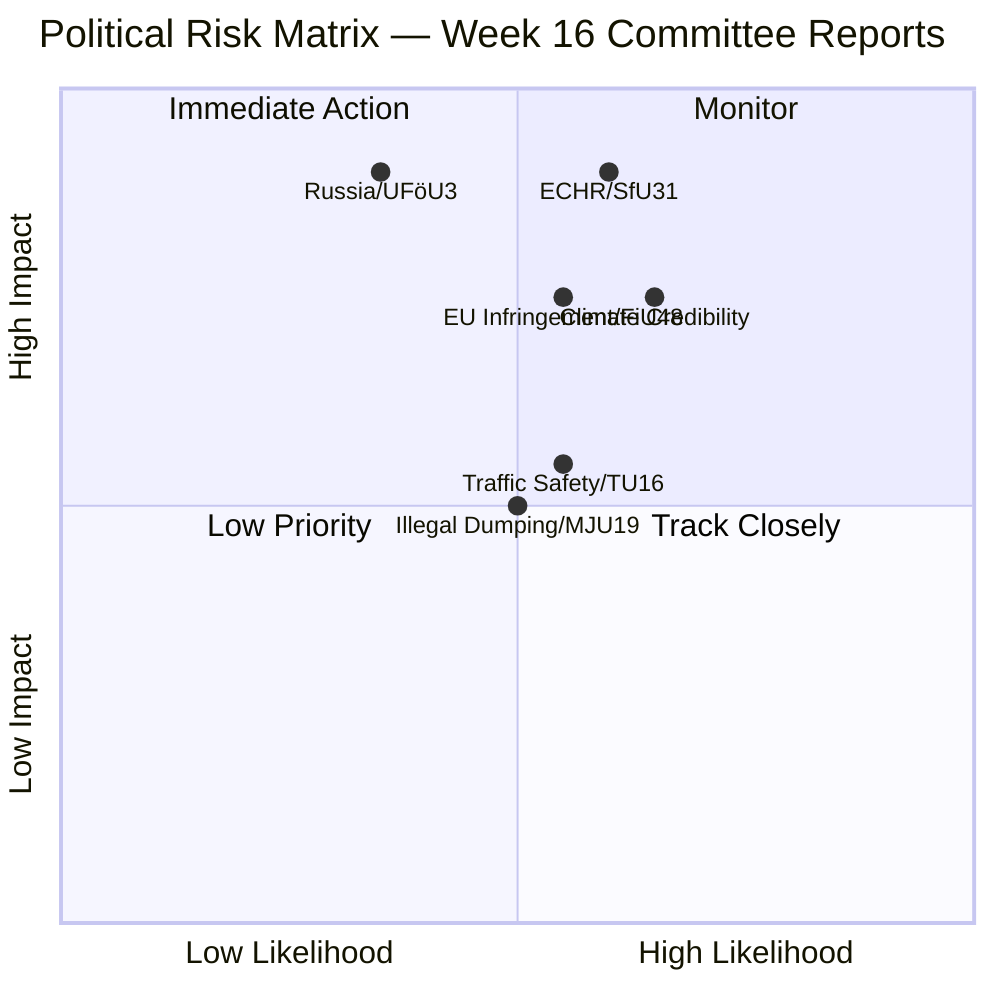

# Risk Assessment — Committee Reports 2026-04-17
**ID:** risk-committeeReports-2026-04-17 | **Riksmöte:** 2025/26
**Methodology:** Likelihood × Impact (1–5 each); Total ≥12 = HIGH RISK

## Risk Matrix

## Detailed Risk Register

| Risk ID | Risk | Category | Likelihood (1–5) | Impact (1–5) | Risk Score | Trigger | Timeline |
|---------|------|----------|-----------------|--------------|------------|---------|---------|
| R-01 | **ECHR challenge on SfU31 detention** — new "uppsikt och förvar" framework exceeds ECHR Art 5 (liberty) limits | Legal/Human Rights | 4 | 5 | **20 🔴** | First deportation detention case appealed to ECHR | 2027–2028 |
| R-02 | **Fuel tax cut EU infringement** — FiU48 violates Energy Taxation Directive or EU state aid rules | Regulatory/EU | 3 | 4 | **12 🟠** | EU Commission formal notice within 6 months | Q4 2026 |
| R-03 | **Climate governance credibility loss** — repeated Riksrevisionen critiques destroy Sweden's climate leadership | Reputational | 3 | 4 | **12 🟠** | Next RiR report on climate; COP 31 review | 2027 |
| R-04 | **Russian escalation in Finland** — UFöU3 NATO forward presence triggers Russian political/military response | Geopolitical | 2 | 5 | **10 🟡** | Russian military exercise on Finnish border; diplomatic expulsion | Ongoing |
| R-05 | **Driving accident increase after TU16** — removing mandatory introduction training leads to measurable accident spike | Social/Safety | 3 | 3 | **9 🟡** | Novice driver accident statistics Q3–Q4 2026 | 2026–2027 |
| R-06 | **Illegal waste dumping increase** — MJU19 supervision gap exploited; enforcement underfunded | Environmental | 3 | 3 | **9 🟡** | Länsstyrelse reports of increased illegal dumping | 2026 |
| R-07 | **Migrant detention conditions** — SfU32 expanded enforcement without corresponding Migrationsverket resources | Administrative | 3 | 3 | **9 🟡** | Parliamentary Ombudsman (JO) investigation | H2 2026 |
| R-08 | **Tax haven residual exposure** — SkU32 terminates 5 of 10 BOT agreements; remaining 5 still operative | Financial/Reputational | 2 | 2 | **4 🟢** | OECD/EU GloBE review | 2027 |

## Top 3 Risks Summary

### 🔴 R-01: ECHR Challenge on SfU31 (Score: 20)
**Nature**: The new "uppsikt och förvar" (surveillance and detention) framework in SfU31 creates a comprehensive legal basis for detaining foreign nationals. Swedish case law and ECHR precedent require individualized necessity assessments for each detention. A framework law that systematizes detention risks being found disproportionate by the European Court of Human Rights.

**Forward Indicators**:
- Any Migrationsdomstolen (Migration Court) ruling questioning proportionality
- V or MP raising KU inquiry on implementation
- First ECHR petition filed (monitor European court register)

### 🟠 R-02: EU Infringement on FiU48 Fuel Tax (Score: 12)
**Nature**: Sweden's fuel tax reduction in FiU48 may conflict with the EU's revised Energy Taxation Directive (ETD 2021) which sets minimum tax rates for motor fuels. If Sweden cuts below EU minimums, or if the timing violates state aid notification requirements, a formal infringement procedure could follow.

**Forward Indicators**:
- European Commission pre-infringement inquiry (Article 258 TFEU)
- Finansdepartementet publication of legal analysis
- Swedish EU Ambassador communications re: energy taxes

### 🟠 R-03: Climate Governance Credibility (Score: 12)
**Nature**: Riksrevisionen report RiR 2025:25 (MJU20) found that government climate monitoring and evaluation frameworks are inadequate. Combined with fuel tax cuts (FiU48) and minimal waste recycling targets (MJU19), Sweden risks being categorized as a "backslider" on climate by the Climate Change Performance Index (CCPI) and EU peer review.

**Forward Indicators**:
- CCPI 2027 ranking for Sweden
- Klimatpolitiska rådet (Climate Policy Council) annual report 2026
- V+C+MP joint parliamentary question demanding remediation
