# Stakeholder Impact Analysis — Committee Reports 2026-04-17
**ID:** stakeholder-committeeReports-2026-04-17 | **Riksmöte:** 2025/26

## Stakeholder Map

```mermaid
graph TD
    style GOV fill:#1565C0,color:#FFFFFF
    style OPP fill:#D32F2F,color:#FFFFFF
    style CIT fill:#4CAF50,color:#FFFFFF
    style BIZ fill:#FF9800,color:#FFFFFF
    style CSO fill:#7B1FA2,color:#FFFFFF
    style INT fill:#16a085,color:#FFFFFF
    style JUD fill:#9E9E9E,color:#FFFFFF
    style MED fill:#D32F2F,color:#FFFFFF

    GOV[🏛️ Government Coalition<br/>M-SD-KD-L] -->|DRIVE| FiU48[FiU48 Fuel Relief]
    GOV -->|DRIVE| SfU_PKG[SfU Enforcement Pack]
    GOV -->|SUPPORT| UFöU3[UFöU3 NATO Finland]
    OPP[🔴 Opposition<br/>S-V-MP] -->|RESERVE x9| MJU19[MJU19 Waste Reform]
    OPP -->|RESERVE| MJU20[MJU20 Climate]
    OPP -->|CHALLENGE| SfU_PKG
    CIT[👥 Citizens] -->|BENEFIT| FiU48
    CIT -->|BENEFIT| SfU20_perm[SfU20 Parental Leave]
    CIT -->|CONCERNED| SfU_PKG
    BIZ[🏢 Business] -->|BENEFIT| SkU23[SkU23 EV Tax Perm.]
    BIZ -->|COMPLIANCE COST| MJU19
    CSO[🤝 Civil Society] -->|RESIST| SfU_PKG
    INT[🌍 EU/International] -->|MONITOR| FiU48
    INT -->|SCRUTINISE| SfU_PKG
    JUD[⚖️ Judiciary] -->|REVIEW| SfU31[SfU31 Detention]
    MED[📰 Media] -->|COVERS| FiU48
    MED -->|POLARISED| SfU_PKG
```

## Winners & Losers

### Winners

| Actor | Gain | Mechanism | dok_id |
|-------|------|-----------|--------|
| **Swedish motorists/commuters** | Reduced fuel costs at pump | FiU48 fuel tax reduction | HD01FiU48 |
| **EV owners / employers** | Permanent tax exemption for workplace EV charging | SkU23 — prop 2025/26:80 | HD01SkU23 |
| **New parents** | Simplified parental benefit application (no pre-notification required) | SfU20 — prop 2025/26:117 | HD01SfU20 |
| **Private driving instructors / families** | Eliminated mandatory introduction course cost (≈2,000 SEK) | TU16 — prop 2025/26:127 | HD01TU16 |
| **SD/M government** | Completed Tidö migration agenda before election | SfU31+32+36 combined | All SfU |
| **Swedish defence sector / NATO** | First operational forward presence commitment | UFöU3 — prop 2025/26:220 | HD01UFöU3 |
| **Swedish recycling sector** | New legal framework aligned with EU Extended Producer Responsibility | MJU19 — prop 2025/26:108 | HD01MJU19 |
| **OECD/anti-tax-haven advocates** | Termination of outdated BOT savings agreements | SkU32 — prop 2025/26:73 | HD01SkU32 |

### Losers

| Actor | Loss | Mechanism | dok_id |
|-------|------|-----------|--------|
| **Refugees/asylum seekers in Sweden** | More extensive detention; more grounds for deportation | SfU31+32+36 enforcement package | All SfU |
| **V/MP (green opposition)** | Climate monitoring demands rejected by majority | MJU20 — reservation rejected | HD01MJU20 |
| **S, V, C, MP (waste reform opposition)** | Binding recycling targets above EU minima rejected | MJU19 — 9 reservations rejected | HD01MJU19 |
| **Driving schools (STR member schools)** | Elimination of mandatory introduction training reduces their revenue | TU16 — deregulation | HD01TU16 |
| **Low-income renters (urban)** | Fuel tax relief primarily benefits car owners; energy support partial | FiU48 — regressive framing | HD01FiU48 |
| **Swedish climate leadership image** | Riksrevisionen critique + fuel tax cut = "backslider" label risk | HD01MJU20, HD01FiU48 | Both |

## Per-Committee Impact Summary

| Committee | Key Report | Net Impact | Controversy Level |
|-----------|-----------|-----------|------------------|
| **FiU** | FiU48 | High positive for voters; negative for fiscal/climate | 🔴 HIGH |
| **SfU** | SfU31+32+36 | High positive for enforcement; negative for rights | 🔴 HIGH |
| **UFöU** | UFöU3 | Positive for defence; geopolitical risk | 🟠 MEDIUM |
| **MJU** | MJU19+20 | Mixed compliance; high opposition dissent | 🟠 MEDIUM |
| **SkU** | SkU23+32 | Technical positive; limited controversy | 🟡 LOW |
| **TU** | TU16 | Administrative simplification; safety concern minor | 🟡 LOW |
| **SfU** | SfU20 | Administrative simplification; unanimous support | 🟢 NONE |
