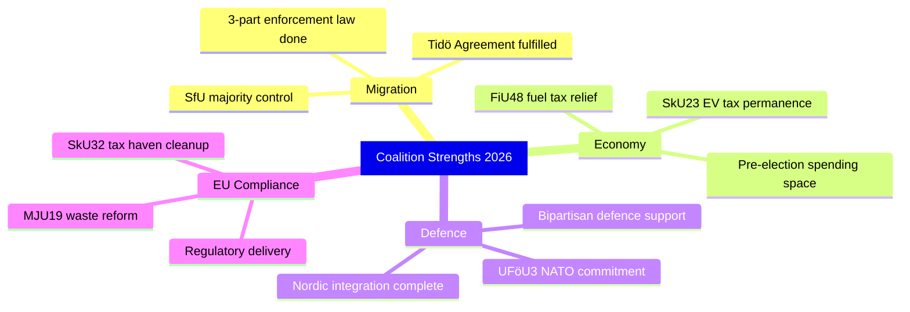

# SWOT Analysis — Committee Reports 2026-04-17
**ID:** swot-committeeReports-2026-04-17 | **Riksmöte:** 2025/26
**Confidence:** [HIGH] (evidenced by full-text analysis)

## Overview: The Coalition's Legislative Sprint to Election 2026

The week's committee reports reveal the M-SD-KD-L government executing a **pre-election legislative sprint** on its three core agenda items: immigration enforcement, cost-of-living relief, and defence. The SWOT below analyses the **governing coalition's strategic position** as Parliament closes out the 2025/26 session.

---

## STRENGTHS (Coalition Advantages)

| Strength | Evidence (dok_id) | Confidence |
|----------|-------------------|------------|
| **Migration enforcement complete** — Tidö Agreement's SfU triptych (SfU31/32/36) delivers comprehensive detention-deportation legislative infrastructure | HD01SfU31, HD01SfU32, HD01SfU36 | [MEDIUM] — not published yet |
| **Direct fiscal relief** — FiU48 emergency budget cuts fuel taxes + energy bills; vote April 22 | HD01FiU48 | [HIGH] |
| **EV/Green tax permanence** — SkU23 makes workplace EV charging tax exemption permanent; pro-business and pro-environment simultaneously | HD01SkU23 | [HIGH] |
| **NATO solidarity demonstrated** — UFöU3 commits to forward presence in Finland; strengthens post-accession credibility | HD01UFöU3 | [MEDIUM] |
| **EU compliance delivery** — MJU19 waste reform, SkU32 tax haven treaty termination show Sweden as responsible EU partner | HD01MJU19, HD01SkU32 | [HIGH] |
| **Parental leave simplification** — SfU20 removes bureaucratic hurdle; popular family policy | HD01SfU20 | [HIGH] |

---

## WEAKNESSES (Coalition Vulnerabilities)

| Weakness | Evidence (dok_id) | Confidence | Impact |
|----------|-------------------|------------|--------|
| **Climate governance gap** — Riksrevisionen (RiR 2025:25) finds insufficient evidence base; V+C+MP joint reservation against government response | HD01MJU20 | [HIGH] | L:3×I:4=12 |
| **9 opposition reservations on waste reform** — MJU19 reveals S, V, MP, C all dissatisfied with circular economy ambition | HD01MJU19 | [HIGH] | L:2×I:3=6 |
| **Fuel tax cut vs. climate goals** — FiU48 fuel tax reduction contradicts Sweden's Paris Agreement obligations and EU Green Deal | HD01FiU48 | [HIGH] | L:4×I:4=16 |
| **Detention/surveillance rights concerns** — SfU31's new detention framework risks ECHR scrutiny; V/MP will challenge constitutionality | HD01SfU31 | [MEDIUM] | L:3×I:4=12 |
| **Driving school deregulation safety risk** — TU16 removes mandatory introduction training; accident risk increase if monitoring inadequate | HD01TU16 | [HIGH] | L:3×I:3=9 |
| **Tax haven cleanup is piecemeal** — SkU32 only terminates 5 BOT agreements; Jersey, Guernsey, Isle of Man remain operative | HD01SkU32 | [HIGH] | L:2×I:2=4 |

---

## OPPORTUNITIES (Opposition Strategic Openings)

| Opportunity | Actor | Evidence | Confidence |
|-------------|-------|----------|------------|
| **Climate credibility attack** — Riksrevisionen critique provides factual basis to challenge coalition's climate governance | S, V, MP, C | HD01MJU20 (reservation V+C+MP) | [HIGH] |
| **Deportation rights litigation** — SfU31/32/36 detention/deportation measures face Constitutional Court (KU) and ECHR challenge | V, MP + civil society | HD01SfU31, HD01SfU32 | [MEDIUM] |
| **Fuel tax regressive framing** — FiU48 energy subsidies disproportionately benefit car owners; S can run "Robin Hood reversed" narrative | S | HD01FiU48 | [HIGH] |
| **Traffic safety narrative** — TU16 abolition of mandatory driving school introduction; safety statistics post-reform provide evidence | V, C, MP | HD01TU16 (reservations 1, 2) | [MEDIUM] |
| **Recycling target failure** — MJU19's refusal to set binding targets above EU minima allows S/V to accuse government of minimal effort | S, V | HD01MJU19 (reservations 2, 8) | [HIGH] |

---

## THREATS (External/Systemic Risks)

| Threat | Likelihood (1–5) | Impact (1–5) | Score | Evidence |
|--------|-----------------|--------------|-------|----------|
| **EU infringement procedure** — fuel tax cuts may violate Energy Taxation Directive obligations | 3 | 4 | 12 | HD01FiU48 |
| **ECHR ruling on SfU31 detention rules** — new detention framework may be challenged; European Court scrutiny | 3 | 5 | 15 | HD01SfU31 |
| **Russian escalation tests NATO commitment** — UFöU3 forward presence in Finland creates operational risk | 2 | 5 | 10 | HD01UFöU3 |
| **Illegal dumping increase** — MJU19's supervision gaps could lead to more illegal waste activity | 3 | 3 | 9 | HD01MJU19 |
| **Driving accident increase** — TU16 deregulation without mandatory safety monitoring | 3 | 3 | 9 | HD01TU16 |
| **Climate framework credibility collapse** — repeated Riksrevisionen critiques; Sweden loses climate leadership position | 3 | 4 | 12 | HD01MJU20 |

---

## All 8 Stakeholder Group Analysis

| Stakeholder Group | Impact | Position | Evidence |
|-------------------|--------|----------|----------|
| **Citizens** | Positive (fuel cost relief, EV tax, parental leave simplification) but negative (detention powers, surveillance) | Split by issue | HD01FiU48, HD01SkU23, HD01SfU20, HD01SfU31 |
| **Government Coalition** (M, SD, KD, L) | POSITIVE — completing Tidö agenda; fiscal space used | Strongly supportive of all 6 bills | All dok_ids |
| **Opposition Bloc** (S, V, MP) | NEGATIVE — climate weakness, migration enforcement overreach | 9 reservations in MJU19; cross-bloc protest in MJU20 | HD01MJU19, HD01MJU20 |
| **Business/Industry** | MIXED — EV tax permanence positive; waste producer responsibility extension negative | SkU23 welcomed; MJU19 waste costs contested | HD01SkU23, HD01MJU19 |
| **Civil Society** | NEGATIVE on migration enforcement; positive on climate pressure | Human rights organizations challenging SfU31 | HD01SfU31, HD01SfU32 |
| **International/EU** | MIXED — EU compliance on waste positive; fuel tax cut and detention rules potentially problematic | EU monitoring FiU48 for Green Deal; Council of Europe watching SfU31 | HD01FiU48, HD01MJU19, HD01SfU31 |
| **Judiciary/Constitutional** | CONCERNED on SfU31 detention rules (ECHR); V/C/MP flagging constitutional review | Constitutional Committee (KU) will review SfU31/32 | HD01SfU31, HD01SfU32 |
| **Media/Public Opinion** | HIGH INTEREST in fuel tax relief + immigration enforcement; climate mostly elite issue | Fuel tax cut = tabloid positive; deportation = polarised | HD01FiU48, HD01SfU32 |
