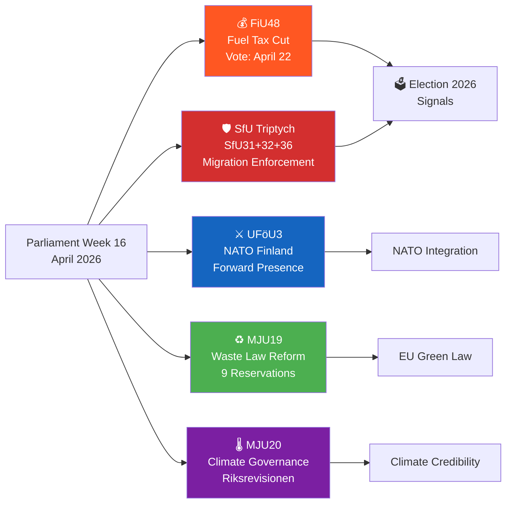

# Synthesis Summary — Committee Reports 2026-04-17
**ID:** synthesis-committeeReports-2026-04-17 | **Riksmöte:** 2025/26
**Date:** 2026-04-17 | **Confidence:** [HIGH] (6 full-text + 5 metadata)

## Executive Summary

The Riksdag committee pipeline for week 16, 2026 reveals a parliament in **pre-election mode**, processing a legislative package that combines immigration enforcement tightening, direct fiscal relief, and NATO defence commitments — three signature coalition priorities that together signal accelerating pre-September 2026 election positioning.

The **Social Insurance Committee (SfU)** dominates the week with three interconnected immigration reports (SfU31, SfU32, SfU36) strengthening deportation enforcement, surveillance/detention powers, and residence permit conduct requirements. These documents, while not yet published in full text, represent the culmination of the Tidö Agreement's immigration reform agenda — translating Sweden's 2022–2026 migration policy shift into permanent legislative infrastructure.

The **Finance Committee (FiU48)** is processing an emergency amendment budget for direct fuel tax cuts and electricity/gas price support — scheduled for Riksdag vote on **April 22, 2026**. The timing — five months before a likely election — is explicitly political: the government is using fiscal space to reduce the cost-of-living burden on Swedish households.

The **Environment Committee (MJU)** produced two reports: a waste legislation reform transposing EU law (9 opposition reservations spanning S, V, MP, C) and a climate governance critique from Riksrevisionen. Both reveal the **green policy fracture** in Swedish politics — the coalition delivers EU environmental compliance mechanically while opposition parties demand stronger climate action.

## Key Findings

### Finding 1: Emergency Budget as Pre-Election Fiscal Signal [HIGH] [Score: 9/10]

FiU48 (Finance Committee bet 2025/26:FiU48) processes Proposition 2025/26:236 — an extra amendment budget cutting fuel taxes and providing electricity/gas support. The committee completed deliberations April 16 (status: "inträffat"), with final vote scheduled **April 22, 2026**. This represents the government's most direct pre-election fiscal intervention: reducing pump prices and energy bills for Swedish households. The combination of fuel tax relief (benefiting rural and commuter voters) and energy cost subsidies (benefiting urban apartment dwellers) is calibrated for maximum electoral breadth.

**Political Risk [MEDIUM, L:3×I:4=12]**: Left opposition will frame this as regressive (fuel tax cuts disproportionately benefit high-income car owners) and as undermining climate goals. The EU may scrutinise for compatibility with Green Deal commitments.

### Finding 2: Immigration Enforcement Legislative Package [HIGH] [Score: 8–9/10]

Three SfU betänkanden form a coherent enforcement trilogy:
- **SfU32** ("Stärkt återvändandeverksamhet"): Strengthens deportation infrastructure — Police authority, Migrationsverket, detention capacity
- **SfU31** ("Nytt regelverk för uppsikt och förvar"): New framework for surveillance (uppsikt) and detention (förvar) of foreign nationals — replacing piecemeal rules with comprehensive detention authority
- **SfU36** ("Skärpta vandel för uppehållstillstånd"): Tightens conduct requirements for residence permits — criminal behaviour (including minor offences) becomes grounds for revocation

These three measures, scheduled for committee hearings April–May 2026 and Riksdag debate May–June 2026, represent the final legislative push of the Tidö Agreement migration agenda. Together they create a **detention-to-deportation pipeline** that SD has advocated for since 2022.

**Political Risk [HIGH, L:4×I:4=16]**: EU/Council of Europe scrutiny for detention conditions; ECHR implications for SfU31; domestic civil liberties challenge from V, MP, and legal academics.

### Finding 3: NATO Forward Presence in Finland [HIGH] [Score: 8/10]

UFöU3 processes Prop 2025/26:220 committing Sweden to participating in NATO's enhanced forward presence (eFP) in Finland — Sweden's first operational deployment as a NATO member under Article 5 solidarity. Vote scheduled June 4, 2026. This represents a historic milestone: Sweden's permanent military commitment to collective defence on its own border territory with Finland, a theatre directly facing Russia's northwest military district.

**Strategic Significance**: Sweden and Finland's coordinated NATO integration creates a seamless Nordic-Baltic security region, closing the "Nordic gap" that Russian planners had relied on for 80 years.

### Finding 4: Waste Law Reform — EU Transposition With Opposition Fracture [MEDIUM] [Score: 7/10]

MJU19 (prop 2025/26:108) reforms Swedish waste legislation to align with EU circular economy directives. The committee approves the government's proposal but faces **9 reservations** from S, V, MP, and C — revealing significant left-green opposition on:
- Waste producer responsibility (V, MP demand stricter retail sector obligations)
- Material recycling targets (S, V want binding targets, not just EU minima)
- Supervision and illegal dumping enforcement (S, C, V, MP all reserve)
- Evaluation mechanisms (S, V, MP want mandatory review mechanisms)

Chair: Emma Nohrén (MP), showing cross-party opposition to a coalition-minimum EU compliance approach.

### Finding 5: Riksrevisionen Climate Framework Critique [MEDIUM] [Score: 7/10]

MJU20 responds to Riksrevisionen report RiR 2025:25 which found deficiencies in the government's climate evidence base and evaluation capacity. The government's skrivelse 2025/26:122 provides its response — which the committee majority (coalition + S) accepts, laying the skrivelse to rest. But V, C, and MP file a joint reservation (3 parties!) demanding stronger climate monitoring mechanisms. S files a separate (softer) statement. This unusual cross-bloc alliance (V+C+MP) signals that the government's climate credibility is contested even among potential coalition partners.

## Recommended Article Title

**"Riksdagen lägger sista hand på migrationspaketet och röstar om sänkt drivmedelsskatt"**

*English: "Parliament Completes Migration Enforcement Package and Votes on Fuel Tax Cut"*

## Recommended Meta Description

"Riksdagen röstar 22 april om sänkt drivmedelsskatt (FiU48) medan ett tredelat migrationsstöd (SfU31/32/36) fulländar Tidöavtalets genomförande — läs djupanalysen av veckans betänkanden."

## Election 2026 Implications

| Dimension | Assessment | Confidence |
|-----------|-----------|-----------|
| Electoral Impact | VERY HIGH — fuel relief + immigration enforcement = SD-M core vote mobilisation | 🟦 VERY HIGH |
| Coalition Scenarios | Continued M-SD bloc + KD/L support; left bloc united on all 5 SWOT weaknesses | 🟩 HIGH |
| Voter Salience | Cost of living + immigration remain #1/#2 issues in 2026 polling | 🟦 VERY HIGH |
| Campaign Vulnerability | Climate gap (MJU20 Riksrevisionen) = S/MP attack vector; migration = left/liberal concern | 🟧 MEDIUM |
| Policy Legacy | SfU triptych creates permanent enforcement infrastructure outlasting election | 🟩 HIGH |
