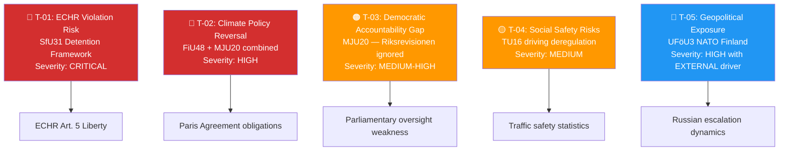

# Threat Analysis — Committee Reports 2026-04-17
**ID:** threat-committeeReports-2026-04-17 | **Riksmöte:** 2025/26
**Methodology:** Political threat taxonomy — legislative threats to democratic governance, civil liberties, and institutional integrity

## Legislative Threat Matrix

## Threat Register

### T-01: ECHR Violation Risk — SfU31 New Detention Framework [CRITICAL]
**Description**: The new "uppsikt och förvar" (surveillance and detention) framework proposed in HD01SfU31 systematizes detention of foreign nationals. Swedish constitutional law (Regeringsformen kap. 2) and ECHR Article 5 require individualized necessity assessments and time limits. A blanket framework enabling detention for administrative purposes (non-criminal) risks violating Art. 5(1)(f) ECHR — detention pending deportation only permissible if deportation is genuinely pursued diligently.

**Attack vector**: SD/M use legislation to create detention capacity that outpaces procedural safeguards. Judicial review (Migrationsdomstolen) may not be sufficient to catch all violations.

**Kill chain**: SfU31 passes → cases of prolonged detention without individualized review → Justitieombudsmannen investigation → ECHR petition → adverse ruling → Sweden ordered to pay damages + amend law.

**Indicators to watch**:
- JO annual report 2026 — any references to SfU31 cases
- Migration Court (Migrationsdomstolen) rulings Q3–Q4 2026
- ECHR case register: petitions from Sweden re: Art. 5 detention

### T-02: Climate Policy Reversal — FiU48 + MJU20 Combined [HIGH]
**Description**: Simultaneous fuel tax cut (FiU48) and rejection of climate monitoring improvements (MJU20) signals systematic retreat from Sweden's climate ambitions. Sweden's Klimatpolitiska ramverket (Climate Policy Framework 2017) mandates net-zero by 2045. Riksrevisionen (RiR 2025:25) has now documented that the government's evidence base for climate policy is inadequate. If the pattern continues, Sweden will fail to demonstrate compliance with own legislation.

**Threat trajectory**: Klimatpolitiska rådet (Climate Policy Council) annual review → adverse findings → EU peer review → potential infringement → reputational damage at COP 31.

**Indicators to watch**:
- Climate Policy Council 2026 annual report (expected April/May)
- EU peer review of Swedish national energy and climate plan (NECP) 2025–2030
- Sweden's greenhouse gas inventory data 2025 (due summer 2026)

### T-03: Democratic Accountability Gap — Riksrevisionen Critique Dismissed [MEDIUM-HIGH]
**Description**: MJU20 documents that the government's response to Riksrevisionen's climate governance critique (RiR 2025:25) is to "note and close" the report rather than commit to specific improvements. V, C, and MP's joint reservation signals that even parties with government-adjacent positions (C has previously supported coalition) find the dismissal unacceptable. Systematic dismissal of Riksrevisionen findings represents a governance risk — the audit institution's authority is weakened when its findings have no legislative consequence.

**Indicators to watch**:
- Next Riksrevisionen annual report on government responsiveness
- KU hearing on government's handling of audit reports
- V+C+MP formal joint question (skriftlig fråga) demanding follow-up

### T-04: Traffic Safety Risk — TU16 Deregulation [MEDIUM]
**Description**: HD01TU16 removes the mandatory introduction course (introduktionsutbildning) for private driving instructors and their pupils. The Swedish Transport Agency (Transportstyrelsen) has previously assessed that the introduction course improves safety outcomes. V, C, and MP reserve on monitoring/evaluation. Without a mandatory follow-up study, the safety impact will be invisible until accident statistics worsen.

**Indicators to watch**:
- Transportstyrelsen novice driver accident statistics Q3–Q4 2026
- STR (Sweden's driving school association) monitoring reports
- Parliamentary question from V or C demanding Transportstyrelsen review

### T-05: Geopolitical Exposure — UFöU3 NATO Forward Presence in Finland [HIGH, EXTERNAL]
**Description**: Sweden's contribution to NATO's enhanced forward presence (eFP) in Finland creates a new operational theatre of responsibility. While the decision reflects Sweden's treaty obligations and defence policy, it creates a direct exposure to Russian escalation in the Nordic-Baltic region. Sweden's eFP commitment in Finland is the most visible signal of its transition from neutral observer to frontline NATO ally.

**Nature**: This is primarily an EXTERNAL threat driven by Russian foreign policy decisions, not an internal legislative failure. The decision is strategically correct but operationally exposes Swedish forces.

**Indicators to watch**:
- Russian military exercises in Karelian/Kola region
- Finnish-Swedish joint command exercises post-deployment
- NATO Article 4 consultations in response to Russian provocations
