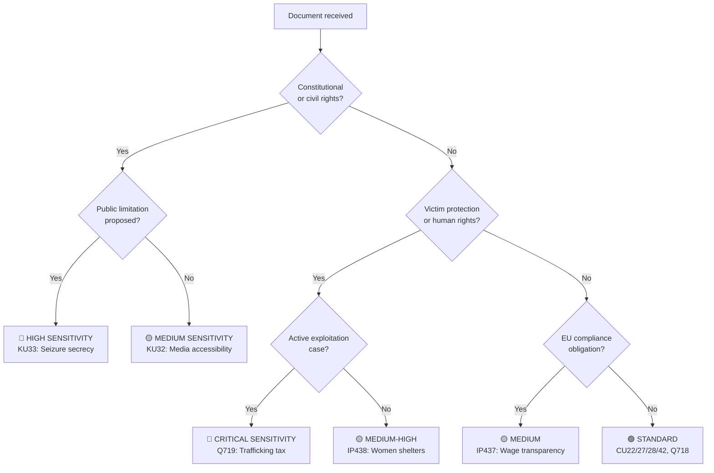
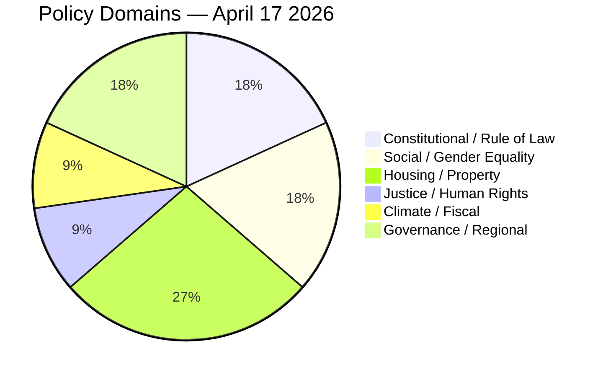

# Classification Results — Evening Analysis 2026-04-17

**CLS-ID**: CLS-EVE-20260417-001
**Generated**: 2026-04-17T18:34:00Z
**Riksmöte**: 2025/26

---

## Sensitivity Decision Tree

---

## Per-Document Classification Table

| dok_id | Title (short) | Sensitivity | Policy Domain | Urgency | Significance | Notes |
|--------|---------------|-------------|--------------|---------|-------------|-------|
| HD11719 | Tax on trafficking victims | 🔴 HIGH | Justice / Human Rights | 🔴 IMMEDIATE | 🔴 CRITICAL | Active exploitation case; victim faces institutional harm |
| HD01KU33 | Seizure document secrecy | 🔴 HIGH | Constitutional / Press Freedom | 🟧 HIGH | 🟩 HIGH | Departure from offentlighetsprincipen; legal challenge likely |
| HD10437 | Wage Transparency Directive | 🟧 MEDIUM | Gender Equality / EU Law | 🟧 HIGH | 🟩 HIGH | June 2026 transposition deadline approaching |
| HD10438 | Women's shelter closures | 🟧 MEDIUM | Social Policy / Gender | 🟧 HIGH | 🟩 HIGH | Documented NGO closures in multiple counties |
| HD024098 | Motion: no fuel tax cut | 🟧 MEDIUM | Climate / Fiscal Policy | 🟧 HIGH | 🟩 HIGH | Green Party vs. coalition extra budget |
| HD01CU22 | Guardianship reform | 🟢 STANDARD | Social / Legal Reform | 🟧 MEDIUM | 🟩 HIGH | Major modernization; broad cross-party support expected |
| HD01KU32 | Media accessibility | 🟢 STANDARD | Constitutional / EU Law | 🟧 MEDIUM | 🟧 MEDIUM | Constitutional amendment (vilande) — procedural milestone |
| HD01CU27 | Property deed identity | 🟢 STANDARD | Housing / Anti-fraud | 🟢 ROUTINE | 🟧 MEDIUM | Anti-money-laundering effect; cross-party support |
| HD01CU28 | Housing coop register | 🟢 STANDARD | Housing / Digital | 🟢 ROUTINE | 🟧 MEDIUM | Major digitization; benefits consumers |
| HD01CU42 | Estate management audit | 🟢 STANDARD | Governance / Audit | 🟢 ROUTINE | 🟧 MEDIUM | Riksrevision recommendations adopted |
| HD11718 | State SE Skåne retreat | 🟢 STANDARD | Governance / Regional | 🟢 ROUTINE | 🟧 MEDIUM | Peripheral services pattern |

---

## Domain Coverage Summary

---

## Urgency Classification Notes

- **IMMEDIATE (24-48h)**: Q719 (trafficking/tax) — Minister must respond; potential for emergency clarification by Skatteverket
- **HIGH (1-2 weeks)**: IP437, IP438 — interpellation response deadlines; KU33 — media reaction cycle  
- **MEDIUM (2-4 weeks)**: Extra budget vote, EU directive planning
- **ROUTINE**: Committee betänkanden schedule votes through normal plenary procedure
