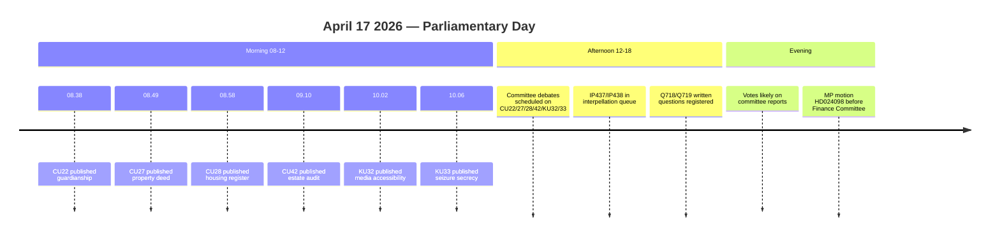

# Cross-Reference Map — Evening Analysis 2026-04-17

**XRF-ID**: XRF-EVE-20260417-001
**Generated**: 2026-04-17T18:37:00Z
**Riksmöte**: 2025/26

---

## Document Relationship Network

```mermaid
graph TD
    EXT["Extra Budget\nprop. 2025/26:236\n(fuel tax + energy)"] --> MP["HD024098\nMP Motion:\nReject fuel tax cut\nJanine Alm Ericson (MP)"]
    
    GOV_GUARD["Government proposition\n(guardianship reform)"] --> CU22["HD01CU22\nCU22 Betänkande:\nGuardianship trustee reform"]
    GOV_DEED["Government proposition\n(property deed identity)"] --> CU27["HD01CU27\nCU27 Betänkande:\nProperty deed ID + housing coop"]
    GOV_REG["Government proposition\n(housing coop register)"] --> CU28["HD01CU28\nCU28 Betänkande:\nNew housing coop register"]
    
    RIKSREV["Riksrevisionens rapport\n(estate management)"] --> CU42["HD01CU42\nCU42 Betänkande:\nEstate mgmt audit response"]
    
    EU_ACCESS["EU Accessibility Act\n(2019/882)"] --> KU32["HD01KU32\nKU32 Betänkande:\nMedia accessibility (vilande)"]
    
    SEIZURE_PROP["Government proposition\n(KU33 seizure secrecy)"] --> KU33["HD01KU33\nKU33 Betänkande:\nSeized document privacy"]
    
    WAGE_DIR["EU Wage Transparency\nDirective 2023/970"] --> IP437["HD10437\nIP437 Interpellation:\nSofia Amloh (S) → Larsson (L)"]
    
    SHELTER_FUND["Municipal procurement\nreform / shelter funding"] --> IP438["HD10438\nIP438 Interpellation:\nSofia Amloh (S) → Larsson (L)"]
    
    STATE_SKANE["State service\nwithdrawal policy"] --> Q718["HD11718\nQ718 Question:\nMagnusson (S) → Slottner (KD)"]
    
    TRAFFIC_CASE["Västernorrland\ntrafficking case"] --> Q719["HD11719\nQ719 Question:\nStrandhäll (S) → Svantesson (M)"]

    IP437 -.->|"Same minister\n(Larsson/L)\nSame day"| IP438
    CU27 -.->|"Related:\nhousing market\nanti-fraud"| CU28
    Q718 -.->|"State capacity\ntheme"| Q719

    style Q719 fill:#B71C1C,color:#ff006e
    style KU33 fill:#5D4037,color:#ffbe0b
    style IP437 fill:#1B5E20,color:#4CAF50
    style IP438 fill:#1B5E20,color:#4CAF50
    style MP fill:#1B5E20,color:#4CAF50
```

---

## Thematic Clusters

### Cluster A: Gender Equality Crisis (High Coherence)
| Document | Relationship | Type |
|----------|-------------|------|
| HD10437 (IP437) | Wage gap + EU directive lag | Interpellation |
| HD10438 (IP438) | Women's shelter closures | Interpellation |
| HD11719 (Q719) | Trafficking victim tax treatment | Written question |
| *Common vector*: Opposition (S) pressure on gender/social justice portfolio | Same day; same opposition actor | Coordinated |

### Cluster B: Housing Market Reform (Medium Coherence)
| Document | Relationship | Type |
|----------|-------------|------|
| HD01CU27 (CU27) | Identity requirement at property registration | Committee report |
| HD01CU28 (CU28) | National housing cooperative register | Committee report |
| *Common vector*: Anti-fraud, transparency, digitization of housing market | Same committee (CU); same debate day | Legislative package |

### Cluster C: Constitutional/Transparency (High Significance)
| Document | Relationship | Type |
|----------|-------------|------|
| HD01KU32 (KU32) | EU accessibility — constitutional amendment | Committee report |
| HD01KU33 (KU33) | Seizure secrecy — departing from offentlighetsprincipen | Committee report |
| *Common vector*: Same KU committee; same debate day; opposite directions on transparency | Constitutional Committee agenda | Same agenda |

### Cluster D: Budget / Climate Conflict (High Salience)
| Document | Relationship | Type |
|----------|-------------|------|
| HD024098 | MP motion against fuel tax cut (prop. 2025/26:236) | Opposition motion |
| *External link*: prop. 2025/26:236 (Extra ändringsbudget) | Government proposition under debate | Budget context |

### Cluster E: State Capacity / Governance (Medium Coherence)
| Document | Relationship | Type |
|----------|-------------|------|
| HD11718 (Q718) | State retreat in southeast Skåne | Written question |
| HD01CU42 (CU42) | Riksrevision: poor oversight of estate administration | Committee report |
| *Common vector*: State institutional capacity concerns | Different domains but shared theme | Thematic |

---

## Timeline: Today's Parliamentary Activity

---

## Cross-Reference with Sibling Article Types

*Note: No sibling analysis directories found for 2026-04-17; this is the first and primary analysis for today.*

All 11 documents analyzed are unique to this evening analysis run. No overlap with prior day's covered documents confirmed by memory check.
