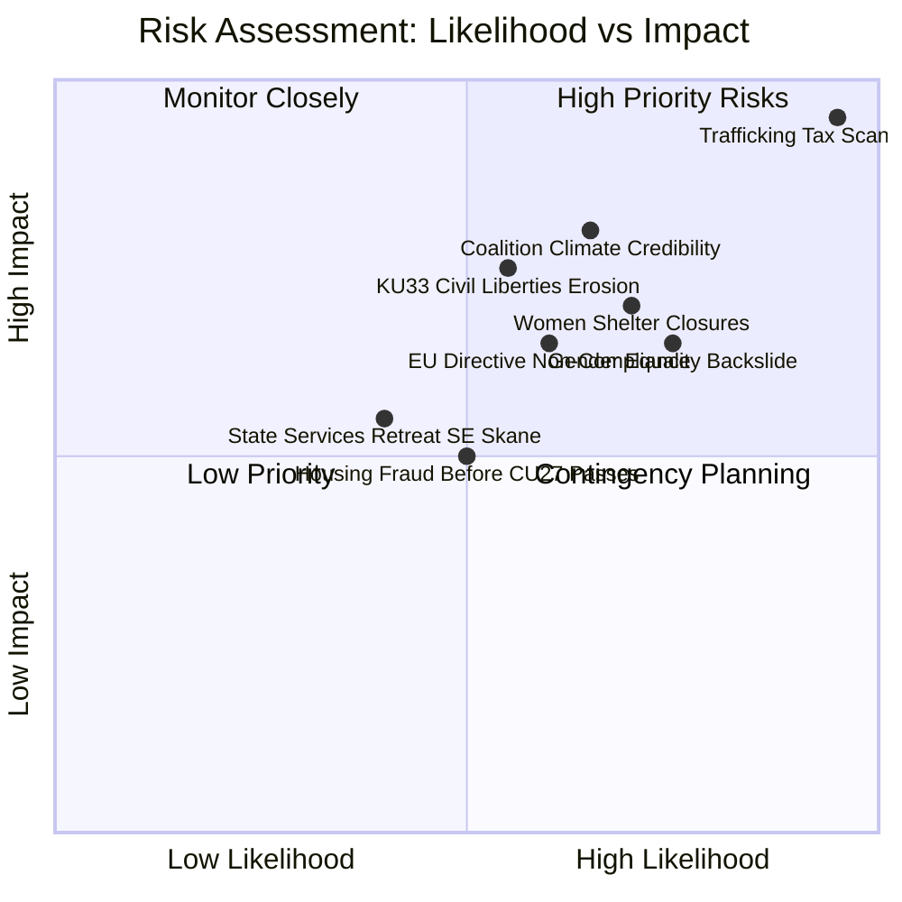
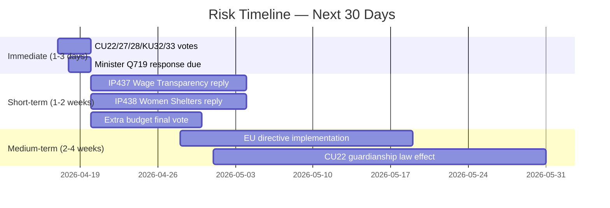
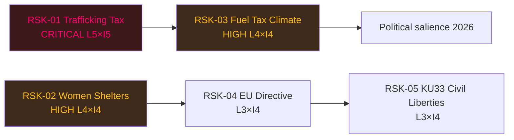

# Risk Assessment — Evening Analysis 2026-04-17

**RSK-ID**: RSK-EVE-20260417-001
**Generated**: 2026-04-17T18:32:00Z
**Riksmöte**: 2025/26

---

## Risk Heat Map

---

## Risk Register

| Risk ID | Risk | Category | L (1-5) | I (1-5) | L×I | Priority | Owner |
|---------|------|----------|---------|---------|-----|----------|-------|
| RSK-01 | Tax demands on trafficking victims (Q719) | Justice/Human Rights | 5 | 5 | **25** | 🟥 CRITICAL | Finansminister Svantesson (M) |
| RSK-02 | Women's shelter funding crisis (IP438) | Social/Gender | 4 | 4 | **16** | 🟥 HIGH | Jämställdhetsminister Larsson (L) |
| RSK-03 | Climate credibility loss — fuel tax cuts | Environmental/Political | 4 | 4 | **16** | 🟥 HIGH | Finansminister Svantesson (M) |
| RSK-04 | EU Wage Transparency Directive lag (IP437) | Legal/EU Compliance | 3 | 4 | **12** | 🟧 MEDIUM | Arbetsmarknadsdepartementet |
| RSK-05 | KU33 civil liberties restriction | Constitutional | 3 | 4 | **12** | 🟧 MEDIUM | Constitutional Committee (KU) |
| RSK-06 | State service hollowing in SE Skåne (Q718) | Governance | 2 | 3 | **6** | 🟨 LOW-MED | Civilminister Slottner (KD) |
| RSK-07 | Housing market fraud before CU27/28 pass | Economic/Fraud | 3 | 3 | **9** | 🟨 LOW-MED | Civil Committee (CU) |
| RSK-08 | Estate management oversight gap (CU42) | Governance | 2 | 3 | **6** | 🟨 LOW-MED | Skatteverket/Court system |

---

## Coalition Stability Risk Analysis

**Critical vulnerability**: The extra budget proposition 2025/26:236 (fuel tax cuts + energy support) carries a Tidöalliansen internal contradiction: L's environmental profile conflicts with SD/M's populist fuel cost reduction demand. The Green Party (MP) has lodged formal opposition via HD024098, seeking outright rejection of the fuel tax cut.

**Risk trajectory**:
- If extra budget passes with fuel tax cuts → MP/V locked into opposition; S picks up climate voters  
- If fuel tax cuts are modified under opposition pressure → coalition shows weakness heading into 2026 election
- S/V/MP/C combined bloc: plausible majority against fuel tax component

**Confidence**: 🟩 HIGH that this becomes a major pre-election media story within 2 weeks.

---

## Temporal Risk Profile

---

## Risk Interdependencies

