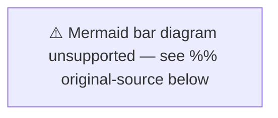

# Significance Scoring — Evening Analysis 2026-04-17

**SIG-ID**: SIG-EVE-20260417-001
**Generated**: 2026-04-17T18:35:00Z
**Riksmöte**: 2025/26

---

## Composite Significance Scores

Scoring uses 5 dimensions (each 1-5): Constitutional Impact (CI), Policy Reach (PR), Electoral Salience (ES), EU/International Dimension (EI), Public Interest (PI). Composite = average × 4 for 100-point scale.

| dok_id | Title | CI | PR | ES | EI | PI | Composite | Decision |
|--------|-------|----|----|----|----|----|-----------|---------| 
| HD11719 | Tax on trafficking victims | 4 | 3 | 5 | 3 | 5 | **80** | 🟥 LEAD STORY |
| HD01KU33 | Seizure document secrecy | 5 | 4 | 3 | 2 | 4 | **72** | 🟥 FEATURE |
| HD10437 | Wage Transparency Directive | 2 | 4 | 5 | 5 | 4 | **80** | 🟥 FEATURE |
| HD10438 | Women's shelter closures | 2 | 4 | 5 | 2 | 5 | **72** | 🟥 FEATURE |
| HD024098 | Motion vs fuel tax cuts | 2 | 4 | 5 | 3 | 4 | **72** | 🟩 INCLUDE |
| HD01CU22 | Guardianship reform | 3 | 5 | 3 | 1 | 4 | **64** | 🟩 INCLUDE |
| HD01KU32 | Media accessibility | 4 | 3 | 2 | 4 | 3 | **64** | 🟩 INCLUDE |
| HD01CU27 | Property deed identity | 1 | 4 | 3 | 1 | 3 | **48** | 🟧 BRIEF |
| HD01CU28 | Housing coop register | 1 | 4 | 3 | 1 | 3 | **48** | 🟧 BRIEF |
| HD01CU42 | Estate management audit | 1 | 2 | 2 | 1 | 3 | **36** | 🟢 MENTION |
| HD11718 | State SE Skåne retreat | 1 | 2 | 3 | 1 | 3 | **40** | 🟧 BRIEF |

---

## Top Stories Analysis

---

## Session Coverage Score

- **Total documents analyzed**: 11 (unique dok_ids)
- **Lead story candidates**: 2 (score ≥80)
- **Feature candidates**: 3 (score 70-79)
- **Include candidates**: 3 (score 60-69)
- **Brief/Mention**: 3 (score <60)
- **Session coverage breadth**: 6 policy domains
- **Overall significance of the day**: 🟩 HIGH — multiple high-scoring items; at least one potentially critical (trafficking tax)

---

## Publication Decision

**PUBLISH**: Full evening analysis with following story priority:
1. **Lead**: Trafficking victim tax demands (Q719) — moral/systemic failure story  
2. **Feature 1**: Wage gap + women's shelters — opposition gender equality pressure day
3. **Feature 2**: KU33 seizure secrecy — constitutional/press freedom angle
4. **Feature 3**: MP motion against fuel tax cuts — climate vs. coalition narrative
5. **Background**: Civil committee housing/guardianship reform package
6. **Brief**: CU42 audit, Q718 state services, KU32 media accessibility

**Minimum word count for EN article**: 1,500 words  
**Confidence in publication decision**: 🟦 VERY HIGH
