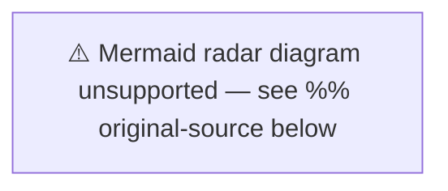

# Stakeholder Perspectives — Evening Analysis 2026-04-17

**STA-ID**: STA-EVE-20260417-001
**Generated**: 2026-04-17T18:36:00Z
**Riksmöte**: 2025/26
**All 8 Mandatory Stakeholder Groups**

---

## Impact Radar

---

## Stakeholder Analysis

### 1. Citizens 🟩 HIGH IMPACT

**Affected segments:**
- **Guardianship beneficiaries**: ~100,000 Swedes under god man/förvaltare regime benefit from CU22 reform — clearer mandates, state oversight, national register → **Positive impact** (dok_id: HD01CU22)
- **Housing cooperative owners/buyers**: ~1.8 million bostadsrätt owners benefit from new register (CU28) and anti-fraud identity requirements (CU27) → **Positive impact** (dok_ids: HD01CU27, HD01CU28)
- **Trafficking victims**: Women coerced into prostitution facing tax demands from Skatteverket → **Severe negative impact**, systemic institutional failure (dok_id: HD11719)
- **Car-dependent households**: Fuel tax cut benefits rural/suburban drivers in short term (prop. 2025/26:236) → **Mixed** — immediate relief vs. long-term climate cost
- **Women at risk of domestic violence**: Shelter closures (IP438) reduce safety net availability → **Negative impact**
- **Disabled users of media services**: KU32 accessibility requirements benefit users with disabilities → **Positive**

**Confidence on citizen impact**: 🟩 HIGH

---

### 2. Government Coalition (M + SD + KD + L) 🟧 MEDIUM IMPACT

**Coalition wins today:**
- Civil committee productivity: 4 betänkanden approved (CU22/27/28/42) — demonstrates legislative delivery
- KU33: Seizure secrecy reform appeals to SD/KD law-enforcement base
- Extra budget fuel tax cut popular with cost-of-living voters (M/SD core)

**Coalition vulnerabilities exposed:**
- Jämställdhetsminister Larsson (L): Dual interpellations on wage gap AND shelter closures in one day signals opposition coordination. L's feminist credentials tested simultaneously.
- Finance Minister Svantesson (M): Q719 trafficking/tax scandal puts M's justice credibility at risk; coalition must demonstrate victim protection takes priority over tax collection.
- Climate credibility: Fuel tax cuts alienate environmentally-concerned M and L voters

**Named actors**: Nina Larsson (L), Elisabeth Svantesson (M), Erik Slottner (KD)

**Confidence**: 🟩 HIGH on vulnerability assessment

---

### 3. Opposition Bloc (S + V + MP + C) 🟩 HIGH IMPACT

**S strategy** (Socialdemokraterna): Sofia Amloh executing coordinated dual interpellations targeting Larsson simultaneously on wage gap + shelter closures — textbook pressure campaign. Annika Strandhäll raising trafficking/tax in written question — high-profile issue ideal for press release. Adrian Magnusson on SE Skåne state retreat — regional voter mobilization.

**MP strategy** (Miljöpartiet): Janine Alm Ericson's motion HD024098 against fuel tax cuts positions MP as the credible climate party. Malte Tängmark Roos speaking in multiple debates (social insurance, renewable energy permits) — party rebuilding parliamentary profile after near-loss in 2022.

**V strategy** (Vänsterpartiet): Maj Karlsson and Birger Lahti active in social insurance and energy debates. V benefits from gender equality pressure campaign's resonance with their voter base.

**C position**: Anders W Jonsson in social insurance debate. C squeezed between coalition and opposition on climate/fiscal issues.

**Confidence**: 🟩 HIGH that S has a coordinated opposition day strategy

---

### 4. Business / Industry 🟧 MEDIUM IMPACT

**Housing industry**: New housing cooperative register (CU28) and identity verification requirements (CU27) increase compliance costs for brokers and developers short-term, but reduce fraud risk and improve market confidence long-term. Real estate association (Fastighetsmäklarförbundet) likely supportive overall.

**Transport/Logistics**: Fuel tax cut reduction benefits trucking, haulage, and construction sectors. Short-term cost relief.

**Labor market**: Wage Transparency Directive (IP437) creates compliance burden for medium/large employers once implemented. Swedish employers association (Arbetsgivarverket, Almega, Confederation of Swedish Enterprise) likely seeking maximum flexibility in implementation timeline.

**Confidence**: 🟧 MEDIUM — indirect legislative impacts, no direct business betänkanden today

---

### 5. Civil Society 🟥 HIGH IMPACT

**Women's shelters (NGO sector)**: IP438 directly threatens organizational survival. Idéburna organisationer running kvinnojourer cannot compete on procurement when municipal contracting favors scale. Documented closures in multiple counties represent a structural threat to Sweden's domestic violence response capacity.

**Disability rights organizations**: KU32 media accessibility creates new rights for media consumers with disabilities. EU directive compliance improves access to public service media.

**Guardianship support organizations**: CU22 creates new state oversight body (statlig myndighet) — could either empower or bureaucratize civil society guardianship organizations depending on implementation.

**Press freedom organizations** (TU, Publicistklubben, NJR): KU33 directly threatens press freedom by shielding seized documents from offentlighetsprincipen. Expect rapid reaction statements within 48h.

**Confidence**: 🟩 HIGH on civil society impacts, particularly women's shelters and press freedom

---

### 6. International / EU 🟩 HIGH IMPACT

**EU compliance obligations:**
- **Wage Transparency Directive** (2023/970): June 2026 transposition deadline. Sweden's growing wage gap contradicts directive spirit. Commission could initiate infringement procedure if Sweden fails to act. (dok_id: HD10437)
- **EU Accessibility Act** (European Accessibility Act 2019/882): KU32 implements via constitutional amendment — positive signal to EU Commission but "vilande" procedure delays final enactment. (dok_id: HD01KU32)
- **Fuel tax EU dimension**: Sweden's NDC (National Determined Contribution) under Paris Agreement requires carbon pricing maintenance. Fuel tax cuts contradict commitments.

**Nordic context**: Norway and Denmark maintain higher gender equality scores. Sweden's wage gap growth is anomalous in Nordic comparison.

**Human rights dimension**: Q719 trafficking/tax case has potential Council of Europe / Human Rights Committee relevance if not resolved.

**Confidence**: 🟩 HIGH on EU compliance issues; 🟧 MEDIUM on enforcement timelines

---

### 7. Judiciary / Constitutional 🟩 HIGH IMPACT

**KU33 constitutional implications**: The proposal to exempt seized digital materials from allmän handling status represents a significant narrowing of offentlighetsprincipen. The Constitutional Committee itself is the author of the proposal, but legal scholars will contest whether the change conflicts with the spirit (if not the letter) of Tryckfrihetsförordningen.

**KU32 constitutional procedure**: Adoption as vilande (dormant) proposal under RF 8:14 — requires confirmation by newly elected Riksdag after September 2026 election. This timing is politically significant: if coalition loses election, successor government could choose not to confirm.

**Guardianship law (CU22)**: Creates new state authority — administrative law implications for Förvaltningsrätten as appeals body.

**Tax law (Q719)**: If Svantesson introduces legislative fix for trafficking victim tax liability, this requires amendment to inkomstskattelagen or Skatteverket procedural regulations.

**Confidence**: 🟩 HIGH on constitutional significance of KU33 and KU32

---

### 8. Media / Public Opinion 🟥 HIGH IMPACT

**Most media-salient stories today:**
1. **Q719 trafficking/tax** — Human interest + systemic failure = guaranteed front-page coverage in Aftonbladet, Expressen, SVT Nyheter. Strandhäll knows this; question timing is strategic.
2. **IP438 women's shelter closures** — Documented closures + minister accountability = feature story in DN, SvD, SVT.
3. **IP437 wage gap growing** — Labor market + feminist angle = business media + general press.
4. **KU33 seizure secrecy** — Press freedom organizations will generate media coverage; DN editorial board likely to publish opinion piece.
5. **Fuel tax cuts (MP motion)** — Environment beat + cost-of-living = broad coverage.

**Social media prediction**: #Skatteverket + #trafficking trending possible on Swedish Twitter/X. #Lönetransparens ongoing from labor journalist beat.

**Confidence**: 🟦 VERY HIGH on media salience of Q719 and IP437/IP438 stories
