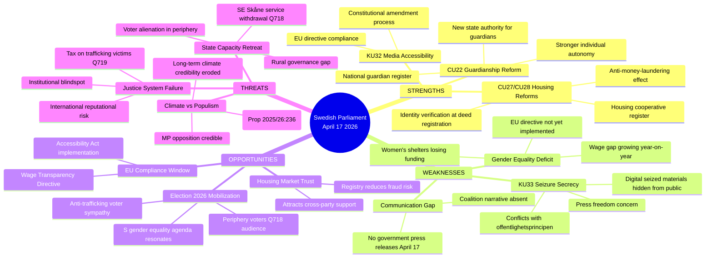
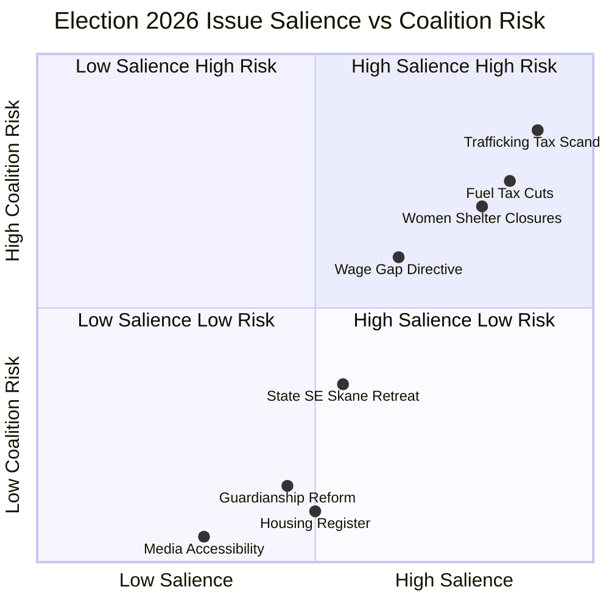

# SWOT Analysis — Evening Analysis 2026-04-17

**SWT-ID**: SWT-EVE-20260417-001
**Generated**: 2026-04-17T18:31:00Z
**Framework**: SWOT with Election 2026 lens

---

## Quadrant Mapping

---

## Coalition SWOT (Tidöalliansen: M + SD + KD + L)

| Dimension | Evidence | dok_id |
|-----------|----------|--------|
| **Strength** | Civil law modernization package (CU22/27/28) demonstrates legislative productivity in final session weeks | HD01CU22, HD01CU27, HD01CU28 |
| **Strength** | EU compliance via KU32 media accessibility (constitutional amendment) demonstrates rule-of-law commitment | HD01KU32 |
| **Strength** | KU33 seizure document restriction appeals to law-and-order voters; SD/KD base approves | HD01KU33 |
| **Weakness** | Fuel tax cut in extra budget divides ecological voters; MP exploitation certain | HD024098 |
| **Weakness** | Jämställdhetsminister Larsson (L) has no visible response to wage gap growth — EU directive lag | HD10437 |
| **Weakness** | Women's shelter funding crisis under L's watch — weakens L's feminist profile | HD10438 |
| **Opportunity** | Housing register (CU28) + deed identity (CU27) = credible anti-crime narrative | HD01CU27, HD01CU28 |
| **Threat** | Q719 trafficking/tax scandal — Svantesson (M) must respond; failure = coalition ethical problem | HD11719 |

---

## Opposition SWOT (S + V + MP + C)

| Dimension | Evidence | dok_id |
|-----------|----------|--------|
| **Strength** | Sofia Amloh (S) dual interpellations on gender equality = coordinated pressure on Larsson (L) | HD10437, HD10438 |
| **Strength** | MP motion on fuel tax (HD024098) provides clear green differentiation ahead of 2026 | HD024098 |
| **Strength** | Q719 (Strandhäll/S) on trafficking victims exposes moral failure — high media salience | HD11719 |
| **Weakness** | S leadership visible on individual issues but no unified alternative budget narrative | — |
| **Weakness** | KU33 critique requires careful legal framing — risk of being seen as pro-criminal if mishandled | HD01KU33 |
| **Opportunity** | Wage gap + shelter closures = coherent feminist platform for election campaign 2026 | HD10437, HD10438 |
| **Threat** | CU22/27/28 reforms are popular — opposition cannot easily attack without appearing obstructionist | HD01CU22 |

---

## Election 2026 Implications

**Confidence labels:**
- Fuel tax cuts as 2026 campaign issue: 🟩 HIGH
- Gender equality as S/V voter mobilizer: 🟩 HIGH
- Trafficking tax scandal as media story: 🟦 VERY HIGH
- Housing reforms as coalition "deliverables" narrative: 🟧 MEDIUM
