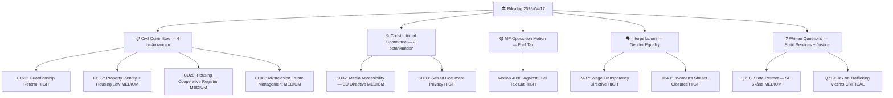

# Synthesis Summary — Evening Analysis 2026-04-17

**SYN-ID**: SYN-EVE-20260417-001
**Generated**: 2026-04-17T18:30:00Z
**Riksmöte**: 2025/26
**Analysis Depth**: deep

---

## 📊 Intelligence Dashboard

---

## 🔍 Top Findings Table

| # | Document | Significance | Key Actor | Impact |
|---|----------|-------------|-----------|--------|
| 1 | HD11719 — Tax demands on trafficking victims (Q719) | 🟥 CRITICAL | Annika Strandhäll (S) → Svantesson (M) | Systemic justice failure; exposes gaps in victim protection law |
| 2 | HD01KU33 — Seized document privacy (KU33) | 🟩 HIGH | Constitutional Committee (KU) | Major civil liberties restriction: digital seized materials no longer public records |
| 3 | HD10437 — Wage Transparency Directive (IP437) | 🟩 HIGH | Sofia Amloh (S) → Nina Larsson (L) | Sweden's EU implementation at risk; wage gap growing despite obligations |
| 4 | HD10438 — Women's shelter closures (IP438) | 🟩 HIGH | Sofia Amloh (S) → Nina Larsson (L) | Funding cuts threatening NGO women's shelters; gender violence risk |
| 5 | HD024098 — MP motion vs fuel tax cuts | 🟩 HIGH | Janine Alm Ericson (MP) | Green opposition to extra budget prop. 2025/26:236 — climate vs. cost-of-living |
| 6 | HD01CU22 — Guardianship reform (CU22) | 🟩 HIGH | Civil Committee (CU) | Major social reform: new state authority + national guardian register |
| 7 | HD01CU27+28 — Housing law reforms | 🟧 MEDIUM | Civil Committee (CU) | Anti-fraud housing market reforms via identity verification and registry |
| 8 | HD01KU32 — Media accessibility (KU32) | 🟧 MEDIUM | Constitutional Committee (KU) | EU Accessibility Act via constitutional amendment (vilande procedure) |
| 9 | HD01CU42 — Estate management audit (CU42) | 🟧 MEDIUM | Riksrevision → CU | National Audit criticism of state supervision of estate administration |
| 10 | HD11718 — State retreat SE Skåne (Q718) | 🟧 MEDIUM | Adrian Magnusson (S) → Slottner (KD) | Hollowing of state services in peripheral regions |

---

## 🔄 Aggregated SWOT

| Strengths | Weaknesses |
|-----------|------------|
| Major civil law modernization (CU22, CU27, CU28) | KU33 limits transparency of law enforcement seized evidence |
| EU-compliant media accessibility reform (KU32) | No government press releases today — communication deficit |
| Housing market integrity measures improving anti-fraud | Wage gap increasing despite EU directive obligations |
| Riksrevision accountability on estate management | Women's shelter funding under structural pressure |

| Opportunities | Threats |
|---------------|---------|
| Guardianship reform strengthens vulnerable people protection | Trafficking victims facing tax demands — systemic oversight failure |
| Housing register creates transparent property market data | Fuel tax cut sets back climate commitments; MP opposition credible |
| EU Wage Transparency Directive could close gender pay gap | State withdrawal from periphery creates governance desert in rural areas |
| Opposition gender equality agenda may drive 2026 voter mobilization | Coalition fracture risk over budget priorities (climate vs. populism) |

---

## ⚠️ Risk Landscape

| Risk | Likelihood | Impact | L×I Score | Status |
|------|-----------|--------|-----------|--------|
| Trafficking victim tax protection gap (Q719) | 5 | 5 | **25** | 🟥 CRITICAL — Immediate legislative action needed |
| Civil liberties erosion via KU33 | 3 | 4 | **12** | 🟧 MEDIUM — Constitutional committee oversight required |
| Gender equality policy backslide | 4 | 3 | **12** | 🟧 MEDIUM — EU directive implementation at risk |
| Coalition stability on climate/budget | 3 | 4 | **12** | 🟧 MEDIUM — MP fuel tax opposition viable |
| Housing market fraud before CU27 implementation | 3 | 3 | **9** | 🟨 LOW-MED — Mitigated if CU27/CU28 pass |
| State service desert in SE Skåne | 2 | 3 | **6** | 🟨 LOW — Political salience growing |

---

## 🔮 Forward Indicators

1. **Votes on CU22/CU27/CU28/CU42/KU32/KU33** — Scheduled for debate today (Apr 17); votes expected today or early next week. 🟩 HIGH confidence
2. **Minister response to IP437 (Wage Transparency)** — Nina Larsson (L) must respond within 2 weeks; signals government pace on EU directive implementation. 🟧 MEDIUM confidence
3. **Minister response to Q719 (trafficking/tax)** — Svantesson (M) must respond; may require Skatteverket guideline change or emergency legislation. 🟦 VERY HIGH significance
4. **Extra budget vote (prop. 2025/26:236)** — MP opposition (HD024098) and S/V bloc against fuel tax cuts; plenary vote likely within 1 week. 🟩 HIGH confidence
5. **Media debate following KU33** — Press freedom organizations (TU, NJR) likely to respond within 48h given seizure document secrecy proposal. 🟧 MEDIUM confidence

---

## 📁 Artifacts Inventory

| Artifact | File | Status |
|----------|------|--------|
| Synthesis Summary | synthesis-summary.md | ✅ Created |
| SWOT Analysis | swot-analysis.md | ✅ Created |
| Risk Assessment | risk-assessment.md | ✅ Created |
| Threat Analysis | threat-analysis.md | ✅ Created |
| Classification Results | classification-results.md | ✅ Created |
| Significance Scoring | significance-scoring.md | ✅ Created |
| Stakeholder Perspectives | stakeholder-perspectives.md | ✅ Created |
| Cross-Reference Map | cross-reference-map.md | ✅ Created |
| Data Download Manifest | data-download-manifest.md | ✅ Created |
| Per-doc analyses | documents/ | ✅ 11 documents |
