# Threat Analysis — Evening Analysis 2026-04-17

**THR-ID**: THR-EVE-20260417-001
**Generated**: 2026-04-17T18:33:00Z
**Riksmöte**: 2025/26

---

## Threat Taxonomy Network

```mermaid
graph TD
    ROOT["⚠️ Parliamentary Threat Landscape<br/>2026-04-17"] --> T1["🔴 Institutional Failure"]
    ROOT --> T2["⚖️ Constitutional Risks"]
    ROOT --> T3["🌍 EU Compliance Risks"]
    ROOT --> T4["💰 Economic/Fiscal Risks"]
    ROOT --> T5["🏘️ Social Cohesion Risks"]
    ROOT --> T6["🗳️ Democratic Legitimacy Risks"]

    T1 --> T1A["Q719: Skatteverket demanding\ntax from trafficking victims\nSeverity: 5/5"]
    T1 --> T1B["CU42: Poor state oversight\nof estate administration\nSeverity: 2/5"]

    T2 --> T2A["KU33: Restricting public access\nto seized digital materials\nSeverity: 4/5"]
    T2 --> T2B["KU32: Constitutional amendment\nfor media accessibility — procedural\nSeverity: 1/5"]

    T3 --> T3A["IP437: Wage Transparency\nDirective implementation lag\nSeverity: 3/5"]
    T3 --> T3B["KU32 EU Accessibility Act\nconstitutional compliance\nSeverity: 2/5"]

    T4 --> T4A["HD024098: Fuel tax cuts\nin extra budget — climate cost\nSeverity: 4/5"]
    T4 --> T4B["Q719: State revenue\nvs victim protection\nSeverity: 5/5"]

    T5 --> T5A["IP438: Women's shelter\nclosures — NGO sector pressure\nSeverity: 4/5"]
    T5 --> T5B["Q718: State retreat\nfrom SE Skåne periphery\nSeverity: 3/5"]

    T6 --> T6A["CU22 debate: Opposition\nreservations in guardianship\nSeverity: 1/5"]
    T6 --> T6B["Coalition vs. climate bloc\npolarization ahead of 2026\nSeverity: 4/5"]

    style T1A fill:#B71C1C,color:#ff006e
    style T2A fill:#5D4037,color:#ffbe0b
    style T4A fill:#5D4037,color:#ffbe0b
    style T4B fill:#B71C1C,color:#ff006e
    style T5A fill:#5D4037,color:#ffbe0b
    style T6B fill:#5D4037,color:#ffbe0b
```

---

## Threat Register by Category

### Category 1: Institutional Failure (Severity 4-5)

**THR-1A — Tax collection from trafficking victims** (Severity: 5/5)
- **Document**: HD11719 (Q719 Strandhäll → Svantesson)
- **Description**: A woman in Västernorrland was trafficked and forced into prostitution by her spouse; Skatteverket is reportedly pursuing tax claims for the income generated. The perpetrator faces prosecution but the victim faces tax liability.
- **Root cause**: Swedish tax law does not distinguish between voluntary and coerced income in all cases; institutional coordination failure between Skatteverket, prosecutors, and social services.
- **International comparator**: Most EU states have victim protection clauses; Sweden's gap represents a potential Human Rights Convention issue.
- **Confidence**: 🟦 VERY HIGH — confirmed case per Strandhäll's question

### Category 2: Constitutional Risks (Severity 3-4)

**THR-2A — KU33 Seizure Document Secrecy** (Severity: 4/5)
- **Document**: HD01KU33 (Betänkande 2025/26:KU33)
- **Description**: Government proposal (backed by KU) that digital materials obtained via seizure or copying during police searches will NOT be classified as "allmän handling" (public document). This represents a significant departure from offentlighetsprincipen — Sweden's foundational transparency principle enshrined in Tryckfrihetsförordningen (Freedom of the Press Act).
- **Conflict**: Enables police to shield seized evidence from journalistic or academic scrutiny permanently.
- **Opposition**: Civil liberties organizations, press freedom groups, legal scholars expected to challenge.
- **Confidence**: 🟩 HIGH that this generates political controversy

### Category 3: EU Compliance Risks (Severity 3)

**THR-3A — Wage Transparency Directive Implementation** (Severity: 3/5)
- **Document**: HD10437 (IP437 Amloh → Larsson)
- **Description**: The EU Pay Transparency Directive (2023/970) requires member states to implement binding wage disclosure requirements by June 2026. Sweden's wage gap has been growing year-on-year (not contracting). Jämställdhetsminister Nina Larsson (L) has not articulated a clear implementation plan.
- **Deadline pressure**: June 2026 transposition deadline approaches; with election scheduled for September 2026, implementation will be incomplete.
- **Confidence**: 🟧 MEDIUM on implementation failure; 🟩 HIGH on political exploitation

### Category 4: Economic/Fiscal Risks (Severity 4)

**THR-4A — Fuel Tax Reduction Climate Impact** (Severity: 4/5)
- **Document**: HD024098 (MP motion against prop. 2025/26:236)
- **Description**: The Tidöalliansen's extra budget includes fuel tax cuts (sänkt skatt på drivmedel) designed to reduce cost-of-living for car-dependent households. MP (Green Party) via Janine Alm Ericson has moved to reject the fuel tax cut component outright. The measure conflicts with Sweden's Paris Agreement commitments and the European Green Deal.
- **Fiscal cost**: Revenue loss from fuel tax cuts must be offset; energy subsidies add to fiscal pressure.
- **Confidence**: 🟩 HIGH that MP + S + V form an opposition majority on this clause

### Category 5: Social Cohesion Risks (Severity 3-4)

**THR-5A — Women's Shelter Funding Crisis** (Severity: 4/5)
- **Document**: HD10438 (IP438 Amloh → Larsson)
- **Description**: Civil society organizations (idéburna organisationer) running women's shelters (kvinnojourer) are facing closures due to funding cuts or restructured municipal procurement processes that favour larger professional providers. These shelters are a first-line response to intimate partner violence.
- **Structural issue**: The shift from subsidy to procurement models disadvantages NGOs who operate shelters as mission-driven service, not profit-maximizing contracts.
- **Confidence**: 🟩 HIGH — documented closures in multiple counties

### Category 6: Democratic Legitimacy Risks (Severity 3-4)

**THR-6B — Coalition-Climate Polarization** (Severity: 4/5)
- **Description**: The fuel tax cuts and state retreat narrative (Q718) are consolidating a coalition vs. climate/periphery polarization that could accelerate voter sorting ahead of 2026 elections. Centre parties (C) risk being squeezed between left-green and right-populist blocks.
- **Confidence**: 🟧 MEDIUM on electoral impact; 🟩 HIGH on narrative crystallization
