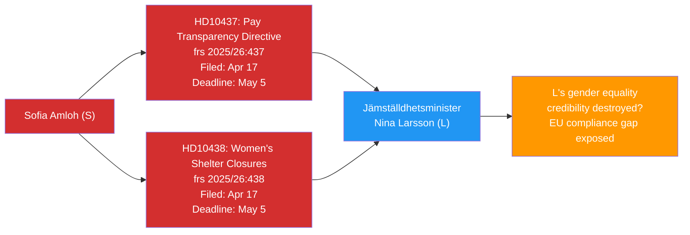
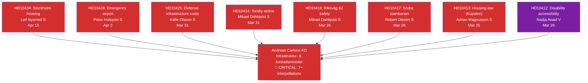

# Cross-Reference Map — Interpellations — 2026-04-17

**Purpose**: Map inter-document relationships, opposition coordination patterns, and thematic clusters

## Coordination Pattern 1: Gender Equality Double-Strike (S → Larsson/L)



**Coordination Evidence**: Same filer, same minister, same day, complementary policy areas. This is deliberate strategic filing.

---

## Coordination Pattern 2: S Infrastructure Siege of Andreas Carlson (KD)



**Pattern Analysis**: S coordinating at least 7 MPs from different constituencies to target Carlson (KD) systematically — Stockholm, Dalarna, Småland, Norrland, Värmland, Skåne. This is a national decapitation campaign against KD's flagship minister.

---

## Cross-Reference: Israel/Palestine Cluster

| dok_id | frs ID | Filer | Minister | Specific Issue | Connection |
|--------|--------|-------|----------|---------------|------------|
| HD10435 | 2025/26:435 | Jamal El-Haj (-) | Malmer Stenergard (M) | Folke Bernadotte assassination | Bernadotte murdered 1948 by Lehi |
| HD10426 | 2025/26:426 | Azra Muranovic (S) | Malmer Stenergard (M) | Israeli death penalty laws | Same minister; different angle |

**Cross-reference**: Both HD10435 and HD10426 target Foreign Affairs Minister Malmer Stenergard on Israel-related accountability. The two interpellations are complementary pressure tools:
- HD10426 (analyzed prior run): Swedish government response to Israel's death penalty laws
- HD10435 (today): Historical accountability for Bernadotte assassination
Together they create a sustained, multi-angle pressure campaign on Sweden's Israel/Palestine stance.

---

## Cross-Reference: Healthcare Infrastructure Cluster

| dok_id | frs ID | Filer | Minister | Issue |
|--------|--------|-------|----------|-------|
| HD10432 | 2025/26:432 | Robert Olesen (S) | Elisabet Lann (KD) | Hospital building investments |
| HD10415 | 2025/26:415 | Robert Olesen (S) | Elisabet Lann (KD) | Patient safety/quality (prior) |

**Same MP, same minister, consecutive interpellations** — Robert Olesen (S) is running a campaign against KD's healthcare minister. Both interpellations address the same underlying problem: aging hospital buildings from the 1960s needing multi-billion investment that the government isn't guaranteeing.

---

## Cross-Reference: Disability Rights Cluster (V Campaign)

| dok_id | frs ID | Filer | Minister | Issue |
|--------|--------|-------|----------|-------|
| HD10416 | 2025/26:416 | Nadja Awad (V) | Waltersson Grönvall (M) | Funktionsrätt Sverige's report |
| HD10412 | 2025/26:412 | Nadja Awad (V) | Carlson (KD) | Accessibility for disabled persons |
| HD10411 | 2025/26:411 | Nadja Awad (V) | Svantesson (M) | Assistansersättning indexation |

**V's Nadja Awad** is conducting a focused disability rights accountability campaign, targeting three different ministers across three interpellations. This is coordinated issue-specific campaigning that builds a policy record for V.

---

## Thematic Cluster Summary

```
GENDER EQUALITY    ██████████ HD10437, HD10438 → Nina Larsson (L)
HOUSING/INFRA      ████████████████████ HD10434, HD10428, HD10425, HD10424, HD10418, HD10417, HD10413 → Carlson (KD)
ISRAEL/PALESTINE   ████████ HD10435, HD10426 → Malmer Stenergard (M)
HEALTHCARE         ████████ HD10432, HD10415 → Lann (KD)
DISABILITY         ██████ HD10416, HD10412, HD10411 → Multiple
FISCAL/TAX         ████ HD10433, HD10421, HD10411 → Svantesson (M)
LGBTQ+/AID         ████ HD10431 → Dousa (M)
FREE SPEECH        ████ HD10429, HD10430 → Strömmer (M), Forssmed (KD)
SPACE/RESEARCH     ██ HD10436 (WITHDRAWN) → Edholm (L)
```

## Opposition Coordination Assessment

| Party | # Interpellations (this period) | Primary Theme | Coordination Signal |
|-------|----------------------------------|--------------|-------------------|
| S | 6 | Multi-domain anti-Tidö campaign | HIGH — multiple coordinated MPs |
| V | 0 new (3 continuing) | Disability rights | HIGH — Awad leading focused campaign |
| C | 1 | LGBTQ+ international | MEDIUM — values-based differentiation |
| Independent | 1 | Israel/Bernadotte | MEDIUM — linked to voter mobilization |
| SD | 0 new (2 continuing) | Cultural/security | HIGH within SD priorities |
| MP | 0 new (1 continuing) | LSS/disability | MEDIUM |
