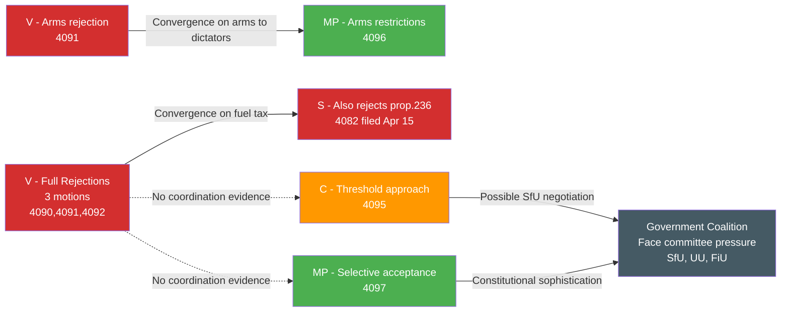

# Stakeholder Perspectives — Opposition Motions 2026-04-17

**Analysis Date**: 2026-04-17  
**Scope**: 8 motions from V, C, MP filed April 16, 2026

---

## Perspective 1: Vänsterpartiet (V) — The Principled Rejector

Vänsterpartiet filed three motions on April 16, all representing full or substantial rejections of government proposals. Under party leader Nooshi Dadgostar (whose name appears on the extra budget motion), V is deploying a clear 2026 electoral strategy: establish unambiguous opposition on the issues most salient to its base.

- **On prop. 235 deportation** (mot. 2025/26:4090, Tony Haddou): V's full rejection is ideologically consistent — the party has long argued that criminal deportation disproportionately affects people who have lived their entire lives in Sweden and have no meaningful connections to their countries of origin. V sees this as a human dignity issue, not just a legal technicality. [HIGH confidence]
- **On prop. 228 arms export** (mot. 2025/26:4091, Håkan Svenneling): V has opposed arms exports since the 1970s. Svenneling has been V's defence/foreign policy spokesperson for several terms. The full rejection of prop. 228 is a classic V position that distinguishes it from MP's more pragmatic conditional acceptance. [HIGH confidence]
- **On prop. 236 fuel tax** (mot. 2025/26:4092, Nooshi Dadgostar): By leading this motion herself, Dadgostar signals this is a top party priority — opposing an SD-engineered fuel tax cut that V characterises as regressive climate policy serving high-income car-owners. The alignment with S (which also filed against prop. 236) demonstrates cross-party fiscal opposition. [HIGH confidence]

**V's Political Logic**: Build a principled, consistent opposition record for 2026. Even if all three motions fail in committee (as expected), V demonstrates it "voted the right way" to retain its progressive base and potentially attract disillusioned MP voters.

---

## Perspective 2: Centerpartiet (C) — The Constructive Challenger

Centerpartiet filed three motions taking distinctly different approaches from V — analytical criticism rather than outright rejection. After losing significant support to both M and S in recent elections, C is rebuilding its profile as a party of substantive governance rather than protest.

- **On prop. 235 deportation** (mot. 2025/26:4095, Niels Paarup-Petersen): C does NOT call for rejection. Instead, it demands a higher threshold — deportation should only apply to "systematic repeated crimes over time." This is legally sophisticated (closer to ECHR proportionality requirements) and politically differentiated (neither soft-on-crime nor reflexively harsh). [HIGH confidence]
- **On prop. 214 cybersecurity** (mot. 2025/26:4093, Paarup-Petersen + Mikael Larsson): C endorses stronger cybersecurity centres but wants more parliamentary analysis first. This is C's "thoughtful governance" brand — support the policy goal, question the implementation speed. [MEDIUM confidence]
- **On prop. 216 healthcare** (mot. 2025/26:4094, Christofer Bergenblock): Technical legal objection to specific paragraphs of healthcare law — demonstrates C has detailed policy expertise in healthcare governance. [MEDIUM confidence]

**C's Political Logic**: Demonstrate that C offers a governing alternative that takes security, law, and governance seriously — unlike V's protest politics or SD's identity politics. The 2025/26 parliamentary session is C's last chance to rebuild before the 2026 election.

---

## Perspective 3: Miljöpartiet (MP) — The Principled Pragmatist

Miljöpartiet filed two motions showing constitutional sophistication: selective acceptance of parts of government propositions rather than blanket rejections.

- **On prop. 228 arms export** (mot. 2025/26:4096, Jacob Risberg): MP accepts the principle of modernising arms export law but demands two specific clauses: (1) ban on exports to dictatorships; (2) ban on exports to warring states. These are targeted, achievable demands — the EU Common Position already contains human rights language, so MP is asking Sweden to match EU standards. [HIGH confidence]
- **On prop. 235 deportation** (mot. 2025/26:4097, Annika Hirvonen): MP's selective acceptance of specific chapters is constitutionally sophisticated. By accepting proportionate deportation grounds (chapter 8) while rejecting the broader expansion, MP positions itself as a party that understands that some deportation for serious crime is legitimate, while opposing disproportionate measures. [HIGH confidence]

**MP's Political Logic**: Facing the 4% threshold for 2026 re-entry to Riksdagen, MP cannot afford to be seen as extremist. By demonstrating legal and policy competence (selective acceptance, targeted demands), MP communicates to middle-class values voters that it is a serious governing party. Annika Hirvonen's prominence on the deportation motion signals it's a party leadership priority.

---

## Perspective 4: Government Coalition (M+KD+L+SD)

The eight motions collectively represent a political attack across five policy fronts simultaneously on April 16. From the government perspective:
- **Prop. 235**: SD will resist any amendments from C or MP; M/KD/L may be willing to accept C's threshold modification to reduce ECHR legal risk [MEDIUM confidence]
- **Prop. 228**: Government will emphasise NATO obligations and Sweden's role in European defence; MP's human rights demands are manageable through non-binding committee language [MEDIUM confidence]  
- **Prop. 236**: Fuel tax cut is a central SD demand; government cannot afford to lose this even with V+S opposition — mathematical majority holds [HIGH confidence]
- **Prop. 214**: C's analysis demand is the easiest concession — can accept without substantive policy change [HIGH confidence]
- **Prop. 216**: C's healthcare objection is specific enough to negotiate without major concessions [MEDIUM confidence]

---

## Cross-Stakeholder Dynamics

## Election 2026 Implications

**Electoral Impact** 🟧 MEDIUM
- V's three full rejections build a consistent left record but unlikely to expand V's electorate beyond its 8-9% floor
- C's constructive approach is a long-term positioning strategy for post-2026 government participation
- MP's nuanced positions are electorally complex but necessary for its fight to stay above 4%

**Coalition Scenarios** 🟧 MEDIUM
- A V+MP+C bloc remains arithmetically insufficient without S — these motions do not change bloc mathematics
- C's approach (particularly on deportation threshold and cybersecurity) positions C as a potential swing partner in government formation negotiations post-2026

**Voter Salience** 🟩 HIGH
- Immigration enforcement (prop. 235 motions) is the #1-2 voter concern in 2026 polling — all three opposition parties' motions directly relevant to voter decision-making

**Campaign Vulnerability** 🟧 MEDIUM
- V vulnerable to "soft on crime" attacks for blanket deportation rejection
- C vulnerable to inconsistency attacks (supports some aspects of government programme)
- MP vulnerable to "unelectable extremism" attacks but actually demonstrates moderation through selective acceptance

**Policy Legacy** 🟩 HIGH
- The three-party SfU opposition to prop. 235 creates a rich committee hearing record documenting legal concerns — provides precedent for future ECHR challenge if law is enacted unchanged
