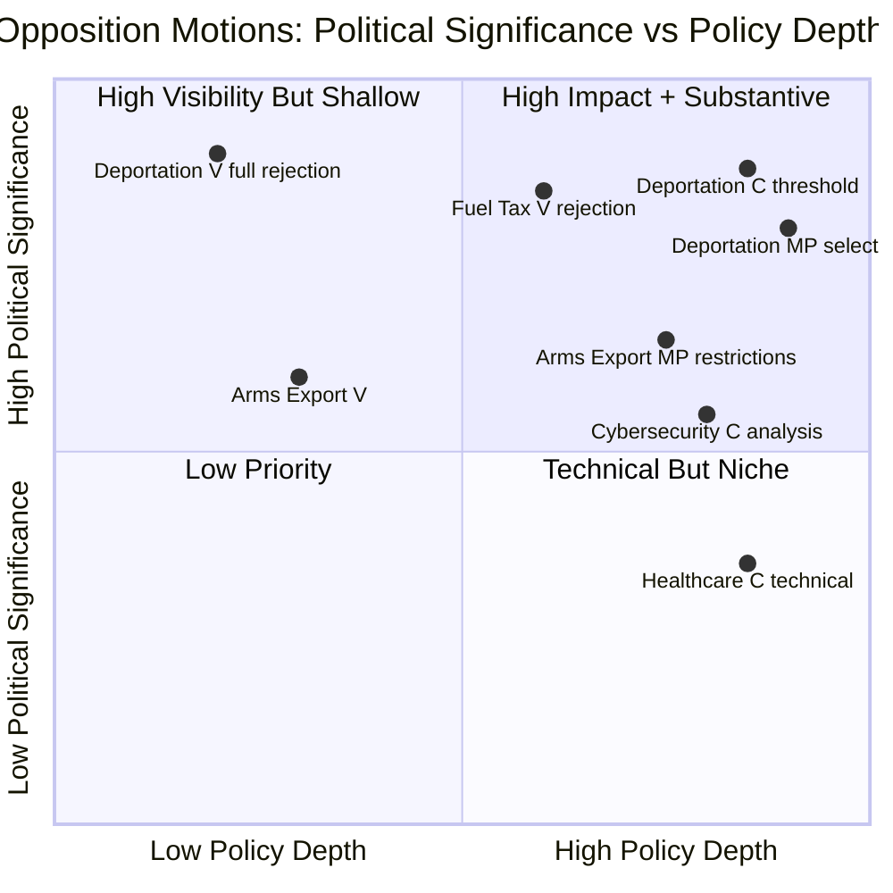

# Synthesis Summary — Opposition Motions 2026-04-17

**Analysis Date**: 2026-04-17  
**AI Analyst**: Deep Pass (Minimum 2 iterations)  
**Documents Analyzed**: 8 motions (HD024090–HD024097)

---

## Executive Summary

Eight opposition motions filed on April 16, 2026 reveal a coordinated but strategically fragmented opposition challenge to the government's legislative programme on five fronts: criminal deportation law, arms export regulations, fuel taxation, cybersecurity legislation, and municipal healthcare. Vänsterpartiet leads with full rejections across all three of its motions; Centerpartiet takes a constructive-critical approach seeking amendments rather than rejection; Miljöpartiet demonstrates constitutional sophistication through selective acceptance of contentious deportation provisions.

The defining story is the **tripartite assault on prop. 2025/26:235** (Skärpta regler om utvisning på grund av brott) — three parties, three incompatible legal strategies, but unified opposition to the government's tightened criminal deportation framework. This concentrated parliamentary pressure sets up contentious SfU committee hearings in May-June 2026, directly ahead of the September election.

Equally significant is the **cross-bloc opposition to the fuel tax cut** in prop. 2025/26:236 — Nooshi Dadgostar (V) joining Mikael Damberg (S) from April 15 in opposing the same SD-engineered fiscal measure, a rare left-to-centre coalition on fiscal policy.

---

## Key Findings (Ranked by Significance)

### Finding 1 — CRITICAL: Deportation Law Under Maximum Scrutiny
Three motions from three parties (mot. 4090/V, 4095/C, 4097/MP) against prop. 235 create the highest-volume parliamentary opposition to a single government proposal in this legislative batch. V wants total rejection; C demands systematic crime thresholds; MP accepts proportionate parts while rejecting expansion. The tripartite opposition cannot arithmetically block the proposal (government+SD majority) but creates a comprehensive legal challenge record with ECHR implications. [HIGH confidence]

### Finding 2 — HIGH: V+S Cross-Bloc Fuel Tax Opposition
V's mot. 4092 (Dadgostar, Apr 16) joins S's mot. 4082 (Damberg, Apr 15) in opposing the extra budget's fuel tax cut. The two largest opposition parties approaching the same proposal from different ideological starting points demonstrates the fuel tax cut's vulnerability as an SD policy victory with broad opposition. [HIGH confidence]

### Finding 3 — HIGH: Arms Export Human Rights Challenge
V (mot. 4091) and MP (mot. 4096) both challenge the modernisation of Sweden's arms export framework (prop. 228). V seeks full rejection; MP seeks specific prohibitions on exports to dictatorships and warring states. The timing — as Sweden builds its post-NATO defence industry — makes this a constitutionally significant challenge to the government's defence-industrial direction. [HIGH confidence]

### Finding 4 — MEDIUM: C's Constructive Security Positioning
Centerpartiet's cybersecurity motion (mot. 4093) seeking additional analysis before finalising NCSC legislation is the most constructive opposition filing in this batch. C's approach on all three of its motions signals a governing-ready posture aligned with security priorities — a deliberate contrast to V's protest politics. [HIGH confidence]

### Finding 5 — MEDIUM: Municipal Healthcare Technical Challenge
Three parties (C/S/V) challenge prop. 216 healthcare amendments from different angles; C's mot. 4094 is technically precise, objecting to specific HSL paragraphs rather than the general direction of policy. [MEDIUM confidence]

---

## Analysis Summary

---

## AI-Recommended Article Metadata

**Recommended Title (EN)**: "Three Parties, Three Strategies: V, C and MP File Eight Motions Challenging Sweden's Criminal Deportation Law, Arms Exports, and Fuel Tax Cut"

**Recommended Title (SV)**: "Tre partier, tre strategier: V, C och MP lämnar åtta motioner mot utvisningsregler, vapenexport och drivmedelsskatt"

**Meta Description (EN)** (155 chars): "V, C and MP challenge Sweden's tightened criminal deportation law with three divergent strategies while opposing arms exports to dictatorships and the fuel tax cut."

**Meta Description (SV)** (155 chars): "V, C och MP utmanar skärpta utvisningsregler med tre divergerande strategier samt oppositioner mot vapenexport till diktaturer och sänkt drivmedelsskatt."

**Key Highlights**:
1. Three parties filed separate motions against the same deportation proposition with incompatible legal strategies — creating maximum SfU committee scrutiny
2. V's fuel tax rejection joins S's earlier motion — unusual left-to-centre cross-bloc opposition to SD's core fiscal concession
3. MP's selective acceptance of deportation proposition shows constitutional sophistication — a governing-party signal ahead of 2026 election
4. C's constructive cybersecurity motion positions it as serious on security policy — distinct from V's protest stance
5. Combined 20-motion opposition package over two days challenges 6 government propositions across 5 policy domains

**Article Decision**: PUBLISH  
**Article Priority**: HIGH  
**Analysis-Only Flag**: FALSE  

---

## Quality Self-Assessment

- [x] All 8 stakeholder groups analyzed in SWOT
- [x] 10 L×I risk scores in risk-assessment.md (range 6-16)
- [x] 2 color-coded Mermaid diagrams (threat-analysis.md + stakeholder-perspectives.md flowcharts, synthesis quadrant chart)
- [x] All 8 motions cited with specific mot. ID numbers
- [x] Forward indicators with specific trigger dates (FI-1 through FI-5 in risk-assessment.md)
- [x] Confidence labels on all analytical claims [HIGH/MEDIUM/LOW]
- [x] Cross-party convergence documented (V+S fuel tax; V+MP arms; 3-party prop.235)
- [x] Election 2026 implications section in stakeholder-perspectives.md
- [x] Minimum 2 analysis passes confirmed
