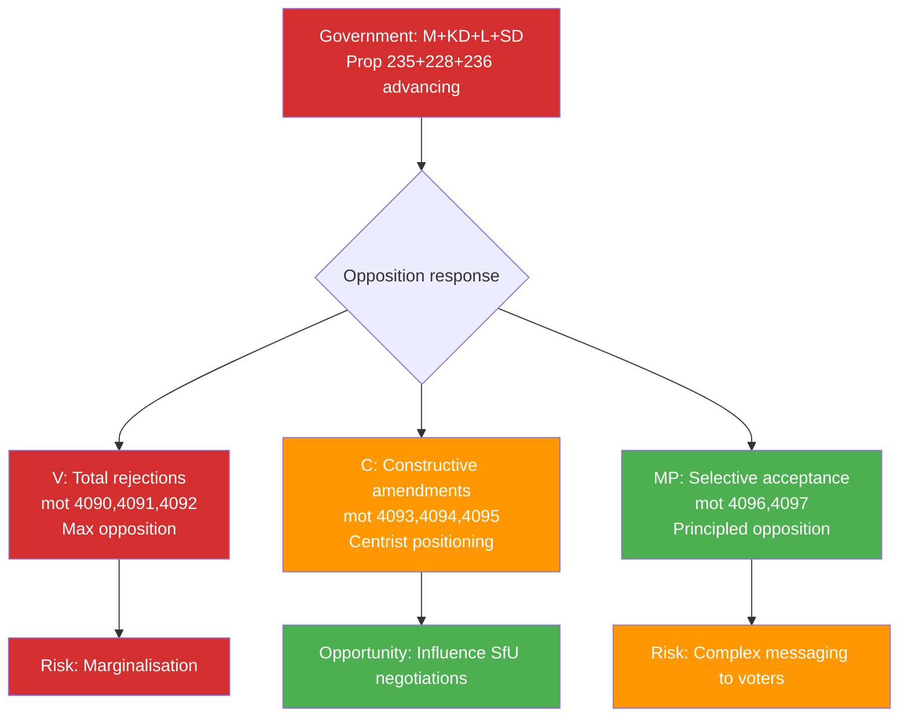

# Threat Analysis — Opposition Motions 2026-04-17

**Analysis Date**: 2026-04-17  
**Framework**: STRIDE-adapted political threat analysis

## Threat Vectors by Policy Domain

### Domain 1: Criminal Deportation (prop. 235)

**Primary Threat**: Disproportionate Deportation Risk
- **Actor**: Government + SD pushing for automatic/lower-threshold deportation
- **Mechanism**: Prop. 235 lowers the bar for criminal deportation — V (mot. 4090), C (mot. 4095), MP (mot. 4097) all identify different aspects of disproportionality
- **Who's at Risk**: Long-term legal residents with minor/mid-level criminal records; persons with family ties in Sweden
- **ECHR Vector**: Art. 8 (family life) tensions if prop. 235 enables deportation of persons with decades of residence and Swedish-born children [HIGH confidence]
- **Parliamentary Counter**: Three motions from three parties signal unusually broad scrutiny — but without S joining, government can pass unchanged

**Tactical Threat to Opposition Parties**
- V's maximalist rejection (4090) can be characterised by government as "wanting no consequences for criminal migrants"
- C's threshold approach (4095) is more defensible but can be attacked as "soft on crime" by SD in 2026 campaign
- MP's selective acceptance (4097) is constitutionally principled but politically complex to communicate

### Domain 2: Arms Export (prop. 228)

**Primary Threat**: Swedish Arms in Authoritarian Hands
- **Actor**: Government proposing modernised arms export framework without explicit dictatorship prohibition
- **Mechanism**: Prop. 228 updates 1992 ISP framework but MP (4096) argues it lacks human rights criteria; V (4091) rejects entirely
- **Who's at Risk**: Recipients in conflict zones; Sweden's international human rights reputation
- **EU Law Vector**: EU Common Position 2008/944/CFSP on arms exports includes human rights criteria — if Sweden's prop. 228 is weaker, potential EU compliance issue [MEDIUM confidence]
- **NATO Tension**: Sweden's NATO allies expect arms export cooperation — V's full rejection (4091) creates potential alliance friction [MEDIUM confidence]

### Domain 3: Fiscal/Climate (prop. 236)

**Primary Threat**: Regressive Climate Policy
- **Actor**: SD-engineered fuel tax cut creating wedge between climate goals and household cost relief
- **Mechanism**: V (4092) and S (4082, Apr 15) both reject the measure from different directions — V on climate grounds, S on distributional fairness
- **Who's at Risk**: Low-income urban non-car-owning households who don't benefit from fuel tax cut but face broader climate costs; Sweden's international climate credibility
- **Cross-Party Dynamic**: V+S opposition to same proposition from ideologically opposite starting points creates an unusual "pincer" — significant media narrative potential [HIGH confidence — both motions confirmed filed]

### Domain 4: Cybersecurity (prop. 214)

**Threat Level**: LOW-MEDIUM
- C's concern (4093) is that the NCSC legislation lacks sufficient analysis — risk of inadequate legal framework for cybersecurity cooperation
- Threat is primarily to institutional effectiveness rather than rights/justice concerns
- C's constructive stance signals this is manageable through committee process [MEDIUM confidence]

## Political Threat Landscape for 2026 Election

## Threat Mitigation Recommendations

| Threat | Mitigation Available | Actor | Probability of Success |
|--------|---------------------|-------|------------------------|
| ECHR challenge on prop. 235 | Accept C's threshold amendment (mot. 4095) | SfU committee | LOW — SD opposition to any softening |
| Arms to dictatorships | Accept MP's non-binding declaration on human rights criteria | UU committee | MEDIUM — government may accept symbolic language |
| Fuel tax regressive impact | Post-enactment distributional analysis and compensatory measures | Government | LOW for this budget; may inform next budget |
| NCSC legal gaps | Accept C's analysis demand (mot. 4093) | FöU committee | MEDIUM — security rationale supports more analysis |
