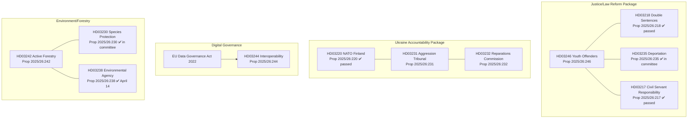

# Cross-Reference Map — Government Propositions April 16, 2026

**Analysis Date**: 2026-04-17  
**Method**: Legislative lineage, committee cross-reference, policy ecosystem mapping

---

## Legislative Lineage Map

---

## Committee Cross-References

### Justitieutskottet (JuU) — Overloaded Pipeline

| dok_id | Title | Status | Priority |
|--------|-------|--------|----------|
| HD03246 | Youth offenders | New — April 16 | HIGH |
| HD03218 | Double sentences | Passed April 9 | Complete |
| HD03217 | Civil servant responsibility | Committee | Ongoing |
| HD03235 | Stricter deportation | Committee | High |

**Risk**: JuU is managing 4 major criminal justice propositions simultaneously — capacity crunch risk.

### Utrikesutskottet (UU) — Ukraine Accountability Twin-Pack

| dok_id | Title | Status | 
|--------|-------|--------|
| HD03231 | Aggression Tribunal | New — April 16 |
| HD03232 | Reparations Commission | New — April 16 |
| HD03220 | NATO Finland | Passed April 9 |

**Observation**: Sweden has submitted 3 Ukraine/NATO-related propositions in one month — represents government's most active foreign policy legislative period since NATO accession in March 2024.

### Miljö- och jordbruksutskottet (MJU) — Environmental Policy Reform

| dok_id | Title | Status |
|--------|-------|--------|
| HD03242 | Active Forestry | New — April 16 |
| HD03230 | Species protection compensation | Committee April 8 |
| HD03238 | New environmental permitting agency | Passed April 14 |

**Observation**: The Kristersson government is systematically dismantling Sweden's previous environmental permitting architecture — three interconnected propositions creating a new framework.

---

## Policy Ecosystem Connections

### HD03246 → Social Policy Connection
- Connects to: cutting of preventive social services (budget 2026)  
- Risk: legislation creates punitive capacity without matching preventive investment

### HD03231/232 → Defence/Security
- Connects to: HD03220 (NATO Finland), Försvarspropositionen 2024-2030
- Pattern: Sweden is rapidly building its international security and accountability footprint post-NATO accession

### HD03242 → Energy/Industry
- Connects to: HD03240 (new electricity laws), Swedish forestry as renewable material source
- Synergy: sustainable forestry + green energy transition narrative

### HD03244 → EU Compliance Package
- Connects to: EU Data Governance Act, EU AI Act implementation
- Temporal: HD03244 is part of broader EU digital single market compliance by 2027

---

## Opposition Motion Connections

| Motion dok_id | Connects to | Content |
|--------------|-------------|---------|
| HD024090 | HD03235 | S motion: "Utvisning på grund av brott är för godtyckligt" |
| HD024092 | HD03236 | C/L motion on fuel tax cut limitations |

**Cross-reference insight**: The opposition motions (filed April 16 by S and others) show the political battle lines clearly — S is conceding ground on deportation/crime (motions focused on implementation detail) while fighting hard on forestry/environment (expected strong MJU minority reservations on HD03242).
