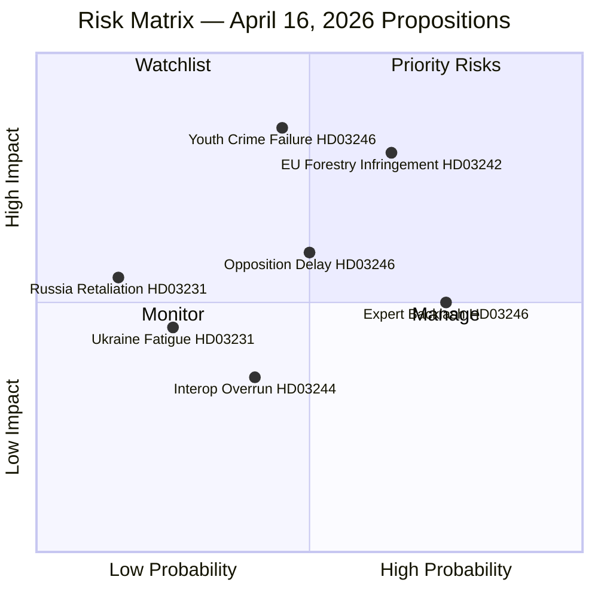

# Risk Assessment — Government Propositions April 16, 2026

**Analysis Date**: 2026-04-17  
**Risk Framework**: PESTLE + Legislative Pipeline Risk  
**Confidence Scale**: ⬛VERY LOW → 🟥LOW → 🟧MEDIUM → 🟩HIGH → 🟦VERY HIGH

---

## Portfolio Risk Matrix

---

## Risk Register

### Risk 1: Youth Crime Worsening After HD03246 Passage
- **Risk ID**: R-001
- **Proposition**: HD03246
- **Probability**: 🟧 MEDIUM (45%)
- **Impact**: 🟦 VERY HIGH
- **Risk Score**: 8.5/10 (Priority)
- **Description**: If Sweden's youth gang violence statistics worsen in Q1-Q2 2027 (post-passage), the Kristersson government will own the failure. Opposition will use this as evidence that punitive approaches to youth crime are counterproductive.
- **Mitigation**: Government should commission Brottsförebyggande rådet (Brå) rapid evaluation. Pair proposition with investment in BCS (Crime Prevention Councils) to avoid "punishment only" narrative.
- **Trigger Events**: Gang-related youth shootings increase; Brå quarterly crime statistics

### Risk 2: EU Infringement Risk for HD03242 (Forestry)
- **Risk ID**: R-002
- **Proposition**: HD03242
- **Probability**: 🟩 HIGH (65%)
- **Impact**: 🟩 HIGH
- **Risk Score**: 8/10 (Priority)
- **Description**: The active forestry framework significantly loosens species protection obligations in managed forests. EU Commission has already flagged Sweden for inadequate implementation of Habitats Directive Art. 6. HD03242 could escalate this to formal infringement proceedings before the European Court of Justice.
- **Mitigation**: Government must demonstrate "favorable conservation status" metrics still met. Legal compliance review by Lagrådet will be closely watched.
- **Trigger Events**: EU Commission Art. 258 letter; NGO infringement complaint; ECJ reference

### Risk 3: Expert/Civil Society Opposition to HD03246
- **Risk ID**: R-003
- **Proposition**: HD03246
- **Probability**: 🟩 HIGH (75%)
- **Impact**: 🟧 MEDIUM
- **Risk Score**: 6/10 (Watchlist)
- **Description**: BRIS, Rädda Barnen, UNICEF Sweden, and academic criminologists will mount a public opinion campaign against HD03246, citing UN CRC violations and research showing punitive youth justice increases adult recidivism. This could generate sustained negative media coverage.
- **Mitigation**: Government's pre-consultation (remissrunda) responses already incorporated some welfare considerations. Justice minister can argue "proportional consequences within a rehabilitation framework."

### Risk 4: Parliamentary Delay — HD03246 Committee Consideration
- **Risk ID**: R-004
- **Proposition**: HD03246
- **Probability**: 🟧 MEDIUM (50%)
- **Impact**: 🟧 MEDIUM
- **Risk Score**: 5.5/10 (Monitor)
- **Description**: The Justitieutskottet (JuU) is managing a heavy legislative agenda with HD03218 (doubled sentences), HD03217 (civil servant accountability), and HD03235 (deportation rules) also in the pipeline. There is a genuine risk HD03246 is pushed to autumn — past the election — if committee capacity is exhausted.
- **Mitigation**: Government should request fast-track (brådskande) treatment given electoral timeline.

### Risk 5: Sámi Conflict — HD03242 (Forestry)
- **Risk ID**: R-005  
- **Proposition**: HD03242
- **Probability**: 🟧 MEDIUM (40%)
- **Impact**: 🟧 MEDIUM
- **Risk Score**: 5/10 (Monitor)
- **Description**: Active forestry management may conflict with reindeer herding rights under the Sámi Parliamentary Act. Sametinget has historically challenged forestry permits in northern Sweden. International indigenous rights attention (UN EMRIP) could generate adverse press.
- **Mitigation**: Mandatory sametinget consultation period before implementation. Explicit carve-outs for traditional use areas.

### Risk 6: Ukraine Accountability Backlash (HD03231/232)
- **Risk ID**: R-006
- **Proposition**: HD03231, HD03232
- **Probability**: 🟥 LOW (25%)
- **Impact**: 🟧 MEDIUM
- **Risk Score**: 4/10 (Monitor)
- **Description**: Russia may use Sweden's tribunal accession as pretext for cyber operations against Swedish government systems or escalatory rhetoric. Ukraine fatigue in Swedish public opinion (currently minority sentiment but growing) could reduce cross-party consensus.
- **Mitigation**: Sweden's NCSC (National Cybersecurity Centre) should be briefed. Cross-party consultation with S already appears to have secured consent.

---

## Overall Risk Summary

**Highest Risk Propositions**: HD03246 (youth offenders) and HD03242 (forestry) carry the most political risk due to contested policy evidence and strong opposition.

**Lowest Risk**: HD03231 and HD03232 (Ukraine accountability) enjoy broad cross-party support and align with Sweden's NATO membership narrative.

**Systemic Risk**: The sheer volume of major justice legislation (HD03246, HD03218, HD03217, HD03235 all active simultaneously) risks system overload in Justitieutskottet and risks policy incoherence.
