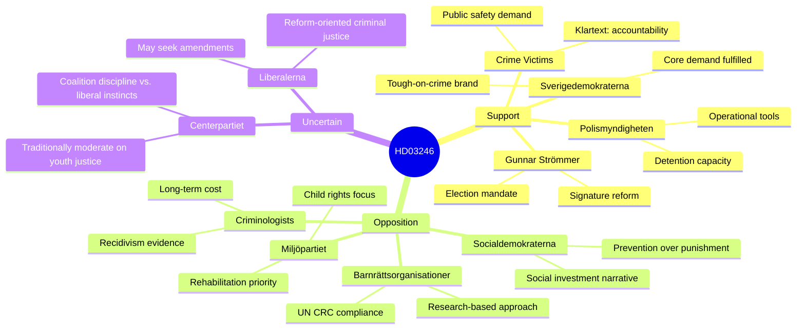

# Stakeholder Perspectives — Government Propositions April 16, 2026

**Analysis Date**: 2026-04-17  
**Coverage**: All 5 propositions, minimum 5 perspectives per major proposition

---

## HD03246 — Stricter Rules for Young Offenders

### Stakeholder Map

**Detailed Perspectives:**

**1. Justice Minister Gunnar Strömmer (M)**
> *"We cannot allow young people to continue committing serious crimes without real consequences. This proposition sends a clear signal that Swedish society will not accept that gang-related violence goes unpunished."*

Analysis: Strömmer is staking his ministerial reputation on HD03246. His argument is that early, consistent consequences disrupt the "criminal career pipeline" from youth offending to adult organized crime. The proposition strengthens both youth detention capacity and the follow-up framework post-sentence — an attempt to address the criticism that current rules are ineffective without being merely punitive.

**2. Sverigedemokraterna**
The SD coalition partner views HD03246 as fulfillment of a core Tidö agreement commitment. SD's criminal justice spokesperson has argued that Sweden needs "konsekvenstänkande" — a culture of consequences — starting from youth. This is an electoral asset for SD that they will feature prominently in their September 2026 campaign material. SD acceptance rate on the package: effectively guaranteed.

**3. Socialdemokraterna (S)**
S will critique HD03246 on substance while supporting the general goal of reducing youth crime. The S position, articulated by Ardalan Shekarabi (criminal justice spokesperson), is that the government is pursuing punishment without prevention: cutting welfare funding for social workers, youth activities (fritidsgårdar), and early intervention programs while simultaneously toughening sentences. S's counter-narrative: "you can't sentence your way out of a social crisis."

**4. Rädda Barnen / BRIS / UNICEF Sweden**
These organizations will file formal remiss responses arguing HD03246 violates Sweden's commitments under the UN Convention on the Rights of the Child (CRC), particularly Art. 40 on child-specific treatment in criminal justice. They will argue the proposition contradicts the CRC's emphasis on social reintegration over punishment. Media campaign likely through Aftonbladet and SVT's youth programming.

**5. Academic Criminologists (BRÅ affiliated)**
Research from Brottsförebyggande rådet (BRÅ) and criminology departments at Stockholm University and Malmö University consistently shows that early criminal labeling and incarceration of youth offenders increases adult recidivism by 15-30% compared to diversionary/rehabilitative approaches. Professors like Jerzy Sarnecki have been vocal critics of punitive youth justice.

**6. Swedish Police (Polismyndigheten / Polisförbundet)**
Operational support — police welcome the tools to detain persistent youth offenders more easily. The Police Union (Polisförbundet) has lobbied for stronger interventions with recidivist youth. However, operationally, expanded youth detention requires increased capacity at SiS (Statens institutionsstyrelse) youth homes, which are already overcrowded.

**7. SiS (Statens institutionsstyrelse)**
SiS manages Sweden's secure youth care facilities (Lvm-hem and youth detention). Their capacity is already strained, with reports of violence and staff shortages. HD03246 will likely increase placement demand without accompanying resource commitment — creating implementation risk.

---

## HD03231 + HD03232 — Ukraine Accountability Package

**Unified stakeholder analysis** (both propositions travel together):

**1. Foreign Minister Maria Malmer Stenergard (M)**
Sweden's accession to both the Special Tribunal (HD03231) and the Reparations Commission (HD03232) represents a major foreign policy statement: that Russia's leadership will face accountability for the 2022 invasion. Stenergard has positioned Sweden as a leading voice in the International Accountability for Ukraine coalition, building on Sweden's Ukraine aid contributions (currently 3rd largest per GDP in EU).

**2. Socialdemokraterna**
S broadly supports Ukraine accountability; former PM Stefan Löfven's government signed initial Swedish commitments to the Ukraine Accountability framework. S will vote for both propositions but may raise questions about financial exposure and budget implications.

**3. Sverigedemokraterna**
SD has traditionally been more skeptical of international institutions and Ukraine support. However, following Sweden's NATO accession, SD has moderated its position. The special tribunal and reparations commission are sufficiently tied to Russia accountability (an anti-Russia narrative) that SD will likely vote yes — though the party may note concerns about Swedish financial exposure.

**4. Vänsterpartiet**
V will raise questions about whether accountability mechanisms are sufficiently independent and whether they risk Swedish sovereignty delegation to international bodies. V historically skeptical of supranational legal bodies.

**5. Legal Scholars**
International law professors (Iain Cameron at Uppsala, Said Mahmoudi at Stockholm) have been strong advocates for establishing an aggression tribunal; HD03231 is seen as legally sound and consistent with the International Criminal Court's existing Kampala amendments on the crime of aggression.

---

## HD03244 — Public Administration Interoperability

**1. Minister Erik Slottner (KD, Finansdepartementet)**
This is Slottner's digitalization flagship — EU Data Governance Act compliance meets Swedish administrative modernization. The proposition creates legal obligations for government agencies to share data using standardized formats (API-first), reducing manual data exchange between 500+ public sector organizations.

**2. Swedish Municipalities (SKR — Sveriges Kommuner och Regioner)**
Mixed reaction: SKR supports the goal but is concerned about implementation costs. Smaller municipalities (under 10,000 inhabitants) may struggle to build API-compliant systems without state support. SKR will lobby for extended implementation timelines and earmarked state grants.

**3. IT Industry (IT&Telekomföretagen)**
Positive — standardized interoperability creates a large, predictable IT procurement market for Swedish tech companies. The proposition effectively mandates digital transformation across the public sector.

**4. Datainspektionen / IMY (Privacy Regulator)**
Will review GDPR compatibility carefully — data sharing between agencies creates privacy risks if not properly implemented. IMY has previously raised concerns about aggregation risks in cross-agency data flows.

**5. Civil Servants / Statsanställdas Förbund**
Neutral to positive — better data sharing reduces manual work. Some concern about monitoring of work performance through digital systems.

---

## HD03242 — Active Forestry Framework

**1. Minister Peter Kullgren (C)**
C's rural heartland vindication. Kullgren frames HD03242 as "returning forest management decisions to forest owners who know their land" rather than to remote bureaucrats implementing EU rules. This is C's contribution to the coalition's regulatory reform agenda.

**2. LRF / Skogsägarföreningar**
Enthusiastic support. LRF Skogsägarna (Forest Owner Associations) has campaigned for this framework for years, arguing that species protection legislation has locked productive forest land and cost owners hundreds of millions in lost timber revenue.

**3. Miljöpartiet**
Fierce opposition. MP leader Märta Stenevi has described HD03242 as "environmental vandalism." MP will make this a central election issue, targeting young urban voters concerned about biodiversity loss and climate.

**4. Environmental NGOs (Naturskyddsföreningen, WWF)**
Will pursue both political and legal avenues. Expect a campaign combining media pressure, EU complaint to the Commission, and Lagrådet concerns about compatibility with EU Habitats Directive.

**5. Sametinget (Sámi Parliament)**
Nuanced opposition. Sámi communities depend on forest ecosystems for reindeer herding. Active forestry (especially clear-cutting and drainage) can destroy traditional pastures. Sametinget will demand that traditional use rights (renbetesrätt) are explicitly protected before supporting the proposition.

**6. Skogsindustrierna**
Strong support. The trade association for Sweden's pulp, paper, and timber industry argues that a clear, predictable regulatory environment will attract investment in Swedish forestry — particularly as global demand for sustainable wood products increases.

**7. EU Commission / DG Environment**
This is the most consequential external stakeholder. The Commission's position on Swedish Habitats Directive compliance will determine whether HD03242 triggers infringement proceedings. Past precedent (Germany, Czech Republic) suggests the Commission will issue a formal warning before escalating.
