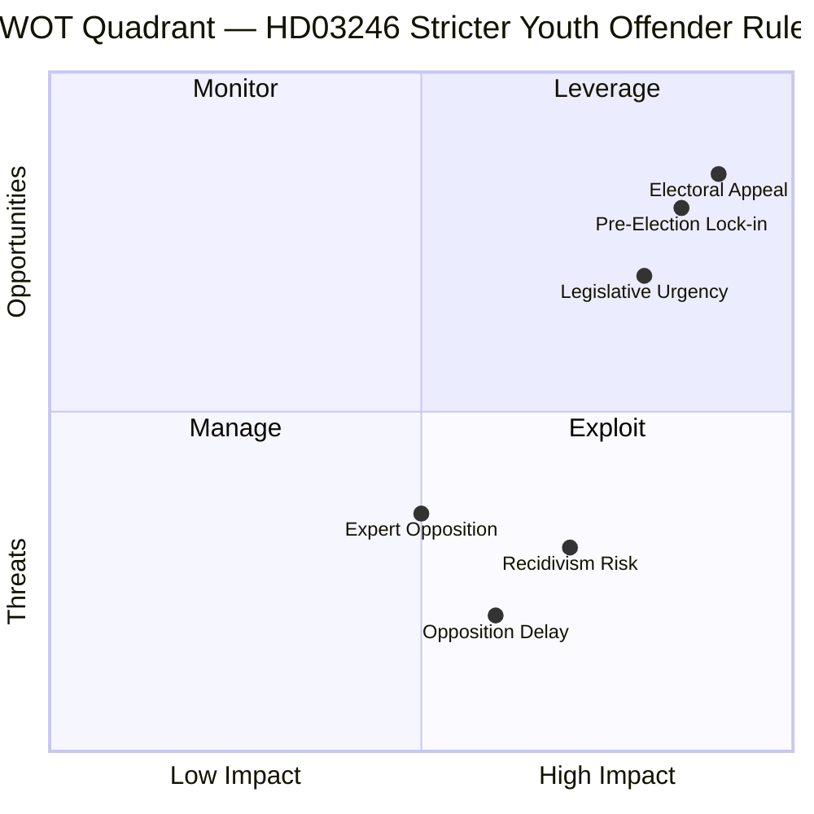
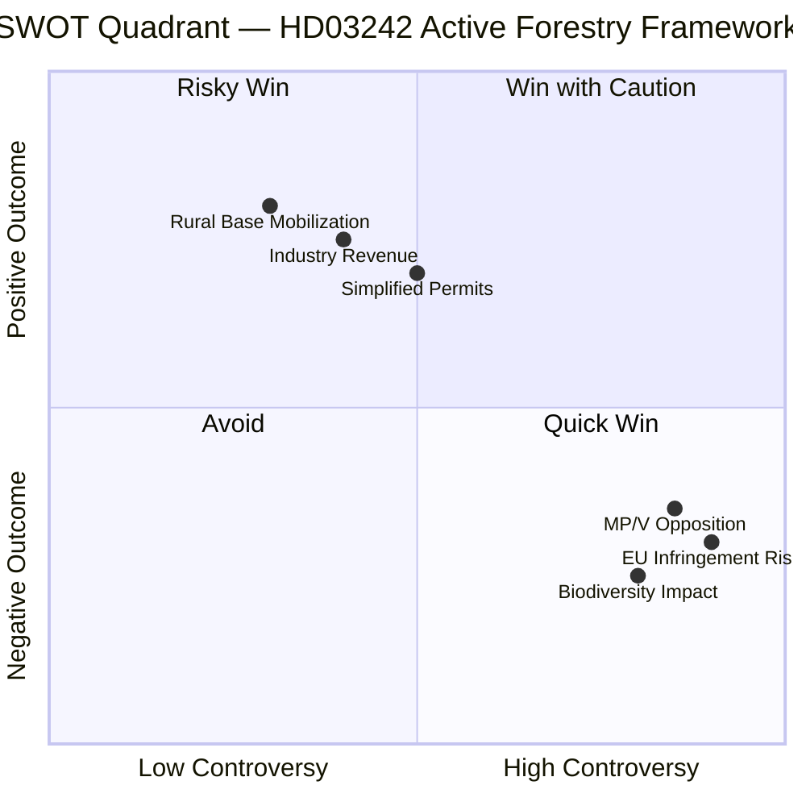

# SWOT Analysis — Government Propositions April 16, 2026

**Analysis Date**: 2026-04-17  
**Package**: 5 propositions across Justice, Foreign Policy, Digital Governance, Forestry  
**Context**: 5 months before September 2026 Swedish general election

---

## Overall Package SWOT

### 💪 STRENGTHS

1. **Electoral Coherence**: The package tells a single narrative — a government that is tough on crime (HD03246), principled in foreign affairs (HD03231/232), efficient in governance (HD03244), and pro-rural/business (HD03242). Every proposition reinforces the center-right coalition's core message.

2. **Legislative Momentum**: Tabling 5 propositions in one day signals government capacity and discipline. With 5 months to election day, the government can point to a completed legislative record.

3. **Cross-Coalition Coverage**: HD03246 satisfies SD's tough-on-crime demand; HD03231/232 reinforces M's foreign policy credibility; HD03244 serves KD's digitalization agenda; HD03242 gives C its rural/forestry victory.

4. **International Standing (HD03231/232)**: Sweden joining the Ukraine special tribunal and reparations commission positions Stockholm as a leader in international accountability — valuable given Sweden's recent NATO membership and desire to punch above its weight geopolitically.

5. **Youth Crime Urgency**: Gang violence and youth crime polling as #1-2 voter concern; HD03246 directly addresses the most electorally salient domestic issue.

### ⚠️ WEAKNESSES

1. **Youth Justice Severity Risk (HD03246)**: Criminologists and social work experts will argue increased punitiveness worsens recidivism. If implemented and crime rates don't drop before election, the government owns the failure.

2. **Forestry Legal Exposure (HD03242)**: The active forestry framework risks EU infringement proceedings under the Habitats Directive and Species Protection rules. Naturvårdsverket and environmental organizations will mount legal challenges.

3. **Interoperability Implementation Complexity (HD03244)**: Requiring 290 municipalities + 21 regions to achieve full data interoperability by 2028 is technically ambitious. Implementation delays or cost overruns will embarrass the government.

4. **Ukraine Financial Liability (HD03232)**: The reparations commission membership creates open-ended financial commitments that opposition may exploit as "blank check to Ukraine" in budget debates.

5. **Governance Bandwidth**: Five substantial propositions on one day places heavy demands on riksdag committee schedules, especially with spring budget (HD0399) already consuming parliamentary capacity.

### 🚀 OPPORTUNITIES

1. **Pre-Election Legislative Lock-In**: If the riksdag passes HD03246 before September 2026, the government can campaign on a delivered promise — not just a pledge.

2. **Ukraine Accountability Leadership (HD03231/232)**: Sweden can position itself as the driving force behind the first international criminal tribunal for aggression since WWII — a historic legacy for PM Kristersson.

3. **Digital Sweden Narrative (HD03244)**: Successfully framing interoperability as reducing bureaucracy and waste appeals to both business voters and public sector efficiency advocates.

4. **Forestry Sector Mobilization (HD03242)**: Swedish forestry employs ~65,000 people directly; the proposition energizes a key rural base that C and SD depend on in northern constituencies.

5. **Security Package Coherence**: The HD03246 + Ukraine propositions together allow the government to campaign on both domestic security AND international security — a rare double-win for conservative credibility.

### 🚨 THREATS

1. **S+MP+V Filibuster Risk**: The opposition can slow committee consideration of HD03246 and HD03242, pushing them past the election and turning them into future-coalition battlegrounds.

2. **EU Backlash (HD03242)**: If the European Commission issues a formal opinion against the forestry framework, it hands the opposition a "Sweden breaking EU rules" narrative.

3. **Ukraine Fatigue**: If public opinion shifts on Ukraine support (as seen in Hungary, Italy), HD03231/232 could become a liability rather than asset.

4. **Youth Crime Worsening**: If gang violence continues despite HD03246 passage, it undermines the government's law & order credentials — the opposite of the intended effect.

5. **KD Interoperability Overreach (HD03244)**: Privacy advocates and municipal autonomy defenders could frame HD03244 as government surveillance expansion, creating unexpected political friction.

---

## Proposition-Level SWOT: HD03246 (Youth Offenders)

**Stakeholder Perspectives (5+):**

1. **Justitieminister Gunnar Strömmer (M)**: Champion — this is his signature domestic reform. Argues that earlier, stricter interventions for youth offenders will break the pipeline from juvenile delinquency to organized crime. Personal reputation tied to outcome.

2. **Sverigedemokraterna**: Strong support — aligns with SD's "konsekvenstänkande" (consequences framework) for crime. Key coalition demand fulfilled. Will use passage in election campaign.

3. **Socialdemokraterna**: Critical but nuanced — S supports accountability but argues government is abandoning investment in social services that prevent crime. Shadow justice minister Ardalan Shekarabi will argue the proposition is "punishment without prevention."

4. **Barnrättsorganisationer (BRIS, Rädda Barnen)**: Strongly opposed — will cite UN Convention on the Rights of the Child (CRC), argue Sweden risks international criticism for treating children as adults in criminal process.

5. **Kriminologer (Stockholm University)**: Mixed to negative — research consensus shows early criminal labeling increases adult crime rates; punitive youth justice correlates with worse long-term outcomes.

6. **Police Authority (Polismyndigheten)**: Supportive — operational benefit from clearer tools for detaining recidivist youth; aligns with Polisförbundet demands.

7. **Swedish Courts (Domstolsverket)**: Procedural concerns — capacity implications for juvenile detention facilities and court system already under strain.

---

## Proposition-Level SWOT: HD03242 (Forestry)

**Stakeholder Perspectives (5+):**

1. **Peter Kullgren (C)**: Author — this is Centerpartiet's rural policy victory. Simplifying forestry permits removes what C describes as "bureaucratic obstacles" to sustainable Swedish timber production.

2. **Skogsägarföreningar (LRF Skogsägarna)**: Enthusiastic support — Sweden's 330,000 private forest owners will benefit from streamlined permit processes and clearer rules about species protection zones.

3. **Miljöpartiet**: Fierce opposition — MP will argue the proposition gutted effective biodiversity protections and could trigger EU proceedings. Will use this in election campaign targeting young urban voters.

4. **Vänsterpartiet**: Opposition — V aligns with environmental groups; argues corporate forestry interests benefit at expense of state owned Sveaskog stewardship obligations.

5. **Naturvårdsverket**: Likely formal remiss-objections — the agency will flag legal risks under EU Habitats Directive Art. 6; government will likely override objections.

6. **Skogsindustrin (Skogsindustrierna)**: Strong support — Swedish forestry sector contributes ~5% of exports; clearer rules reduce investment uncertainty.

7. **Sametinget (Sámi Parliament)**: Mixed to negative — forestry rules may conflict with traditional reindeer herding rights in northern forests; will demand consultation.
