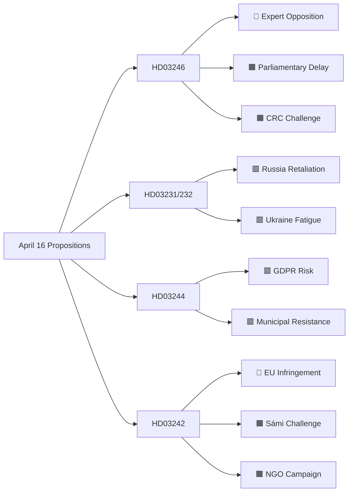

# Threat Analysis — Government Propositions April 16, 2026

**Framework**: STRIDE-adapted Political Threat Model  
**Analysis Date**: 2026-04-17

---

## Legislative Threat Assessment

### Threat 1: Opposition Delay / Filibuster (HD03246)

- **Type**: Political/Process
- **Actors**: S, V, MP in Justitieutskottet
- **Method**: Extended remiss hearings, motion of reservation, delayed committee report
- **Probability**: 🟧 MEDIUM-HIGH
- **Impact**: HIGH — delays election-season passage
- **Indicator**: JuU scheduling of HD03246 hearing date
- **Counter**: Government request brådskande (fast-track) treatment; cite electoral mandate

### Threat 2: EU Infringement Proceedings (HD03242)

- **Type**: Legal/External
- **Actors**: European Commission DG Environment
- **Method**: Art. 258 TFEU infringement procedure
- **Probability**: 🟩 HIGH (65% within 2 years)
- **Impact**: VERY HIGH — could force amendment or suspension
- **Indicator**: Commission Pilot process launch; formal notice letter
- **Counter**: Robust Lagrådet opinion; Nature Assessment Protocol built into new rules

### Threat 3: CRC Non-Compliance Claim (HD03246)

- **Type**: Legal/Human Rights
- **Actors**: Barnombudsmannen (Children's Ombudsman), BRIS, UNICEF
- **Method**: UN Committee on the Rights of the Child periodic review; domestic constitutional review request
- **Probability**: 🟧 MEDIUM
- **Impact**: MEDIUM — reputational damage; possible Lagrådet rejection
- **Indicator**: Lagrådet remiss response on CRC compatibility
- **Counter**: Government must demonstrate that interventions remain proportional and that rehabilitation is not abandoned

### Threat 4: Cybersecurity Escalation (HD03231/232)

- **Type**: Security/External
- **Actors**: Russian state-sponsored threat actors (APT29, Sandworm)
- **Method**: Cyber operations against Swedish government/parliamentary IT systems; information warfare
- **Probability**: 🟥 LOW-MEDIUM (30%)
- **Impact**: MEDIUM
- **Indicator**: Russian government statements; NCSC threat level increase
- **Counter**: NCSC/SÄPO coordination; diplomatic messaging via NATO channels

### Threat 5: Sámi Legal Challenge (HD03242)

- **Type**: Legal/Indigenous Rights
- **Actors**: Sametinget, individual Sámi communities, Minority Rights Group International
- **Method**: Administrative court challenge; UN EMRIP complaint; media campaign
- **Probability**: 🟧 MEDIUM (40%)
- **Impact**: MEDIUM
- **Counter**: Explicit renbetesrätt protection in final regulation; consultation protocol

### Threat 6: Privacy / GDPR Challenge (HD03244)

- **Type**: Legal/Regulatory
- **Actors**: IMY (Integritetsskyddsmyndigheten), civil liberties organizations
- **Method**: Formal review; GDPR complaint to Data Protection Board
- **Probability**: 🟥 LOW (25%) — well-prepared legislation
- **Impact**: MEDIUM — could require amendment
- **Counter**: Privacy impact assessments built into EU Data Governance Act framework

---

## Threat Landscape Summary

## Priority Threat Responses

| Priority | Threat | Owner | Response |
|----------|--------|-------|----------|
| 1 | EU infringement for HD03242 | Miljödepartementet + EU Affairs | Pre-emptive Art. 25 notification; nature assessment protocol |
| 2 | Youth crime failure post-HD03246 | Justice + Statistics Sweden (SCB) | Brå rapid evaluation mandate; dual narrative investment |
| 3 | Parliamentary delay HD03246 | Government Canslery | Fast-track request; cross-coalition consultation S |
| 4 | CRC challenge HD03246 | Barnombudsmannen liaison | Demonstrate proportionality; welfare provision parallel |
| 5 | Sámi conflict HD03242 | Sametinget consultation unit | Explicit statutory protection renbetesrätt |
