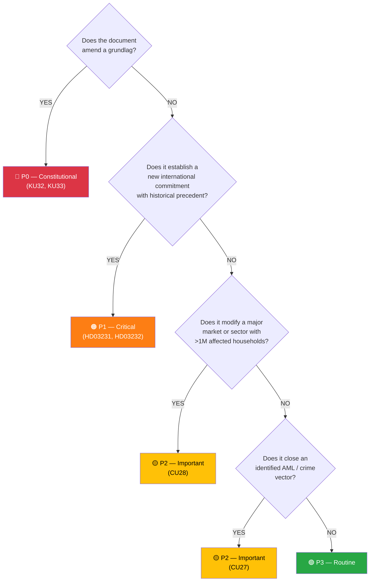

# Classification Results — Realtime Monitor 1434

| Field | Value |
|-------|-------|
| **CLS-ID** | CLS-2026-04-17-1434 |
| **Date** | 2026-04-17 14:34 UTC |
| **Methodology** | `analysis/methodologies/political-classification-guide.md` v3.0 |

---

## 🗂️ Document Classification (with Data Depth)

| Dok ID | Policy Area | Priority | Type | Committee | Sensitivity | Scope | Urgency | Grundlag? | Data Depth |
|--------|-------------|:-------:|:----:|:---------:|:----------:|:-----:|:-------:|:---------:|:----------:|
| **HD01KU33** | Constitutional Law / Press Freedom / Criminal Procedure | **P0 — Constitutional** | Betänkande | KU | Public-interest high | National + durable | Pre-election | **YES (TF)** | **L3 Intelligence** |
| **HD01KU32** | Constitutional Law / Media / Accessibility | **P0 — Constitutional** | Betänkande | KU | Public | National + durable | Pre-election | **YES (TF + YGL)** | **L3 Intelligence** |
| **HD03231** | Foreign Policy / International Criminal Law / Ukraine | P1 — Critical | Proposition | UU | Public-interest high | International | H1 2026 | No | **L2 Strategic** |
| **HD03232** | Foreign Policy / Reparations / Ukraine | P1 — Critical | Proposition | UU | Public-interest high | International | H1 2026 | No | **L2 Strategic** |
| HD01CU28 | Housing Policy / Financial Markets / AML | P2 — Important | Betänkande | CU | Public | Sector | 2027 | No | **L2 Strategic** |
| HD01CU27 | Property Law / AML / Organised Crime | P2 — Important | Betänkande | CU | Public | Sector | H2 2026 | No | **L2 Strategic** |

### Sensitivity Decision Tree (Mermaid)

---

## 🗺️ Policy Domain Mapping

| Domain | Documents | Weighted Weight |
|--------|-----------|:---------------:|
| **Constitutional Law / Press Freedom / Democratic Infrastructure** | HD01KU33, HD01KU32 | **HIGHEST** (DIW-weighted lead) |
| Ukraine / Foreign Policy / International Criminal Law | HD03231, HD03232 | HIGH |
| Housing / Property / AML | HD01CU28, HD01CU27 | MEDIUM |
| Criminal Justice / Organised Crime | HD01KU33 (partial), HD01CU27 | MEDIUM (cross-cutting) |
| Disability Rights / EU Compliance | HD01KU32 | MEDIUM |

---

## 🇪🇺 EU, Council of Europe & International Linkages

| Document | International Linkage | Treaty / Instrument | Urgency |
|----------|-----------------------|---------------------|:-------:|
| **HD01KU32** | EU Accessibility Act | Directive 2019/882 (in force Jun 2025) | **HIGH** |
| **HD01KU33** | Venice Commission / RSF Index | Council of Europe press-freedom benchmarks | **MEDIUM** (post-entry-into-force monitoring) |
| **HD03231** | Special Tribunal for Crime of Aggression | Council of Europe framework; Rome Statute aggression gap | **HIGH** |
| **HD03232** | International Compensation Commission | Hague Convention Dec 2025; UNGA 2022 reparations resolution | **HIGH** |
| HD01CU27 | EU AML Directive (AMLD6) | EU AML framework | MEDIUM |

---

## 🎯 Publication Implications

| Classification Signal | Article Impact |
|----------------------|----------------|
| Two P0 Constitutional docs in same run | Lead MUST be constitutional |
| Two P1 Critical foreign-policy docs | MUST have prominent dedicated section |
| Grundlag + historic foreign-policy in same day | Coverage-completeness mandate: no omissions |
| Lagrådet yttrande pending | Uncertainty signal to flag in article |

---

## 🗄️ Data Depth Levels Applied

| Document | Priority | Depth Tier | Per-Doc File |
|----------|:-------:|:----------:|--------------|
| HD01KU33 | P0 | **L3 — Intelligence** | `HD01KU32-KU33-analysis.md` (combined) |
| HD01KU32 | P0 | **L3 — Intelligence** | `HD01KU32-KU33-analysis.md` (combined) |
| HD03231 | P1 | **L2+ — Strategic** | `HD03231-analysis.md` |
| HD03232 | P1 | **L2+ — Strategic** | `HD03232-analysis.md` |
| HD01CU28 | P2 | **L2 — Strategic** | `HD01CU27-CU28-analysis.md` (combined) |
| HD01CU27 | P2 | **L2 — Strategic** | `HD01CU27-CU28-analysis.md` (combined) |

**Depth-Tier Content Floor**:
- **L3 Intelligence**: 6-lens analysis; cross-party matrix; international comparison; evidence table; threat vectors; interpretive frontier analysis; indicator library; scenario tree
- **L2+ Strategic**: 6-lens analysis; SWOT Mermaid + TOWS; named-actor stakeholder table; evidence table; indicator library; forward scenarios; precedent benchmarks
- **L2 Strategic**: SWOT Mermaid; named-actor table; evidence table; indicator library; implementation-risk table

---

## 📅 Retention & Review Cadence

| Artefact | Retention | Review Cadence | Trigger Events |
|----------|-----------|:--------------:|----------------|
| All analysis files | Permanent (public archive) | Quarterly (or event-driven) | See triggers below |
| `executive-brief.md` | Permanent | On next Lagrådet yttrance publication | Lagrådet ruling |
| `risk-assessment.md` | Permanent | Bi-weekly during legislative tempo | R1/R2/R11 indicator fires |
| `scenario-analysis.md` | Permanent | Event-driven (major signals) | Any scenario indicator fires |
| `comparative-international.md` | Permanent | Annual (RSF/FH/V-Dem cycle) | Index-publication dates |
| `methodology-reflection.md` | Permanent | One-off reference artefact | Methodology change |
| `documents/*-analysis.md` | Permanent | On kammarvote; post-implementation | Voting + operational milestones |

### Trigger Events Requiring Re-Analysis

| Trigger | Owner | Files to Re-Review |
|---------|-------|--------------------|
| Lagrådet yttrance on KU33 | Analyst on duty | risk-assessment, swot-analysis, documents/HD01KU32-KU33, synthesis-summary, executive-brief, scenarios |
| Kammarvote on KU33 (first reading) | Analyst | documents/HD01KU32-KU33, stakeholder-perspectives, synthesis-summary |
| Kammarvote on HD03231/HD03232 | Analyst | documents/HD03231, documents/HD03232, threat-analysis |
| Russian hybrid-warfare event attributable | Analyst | threat-analysis, risk-assessment |
| 2026 election result | Analyst | ALL files (full re-derivation of post-election scenarios) |

---

## 🔐 Access-Control Impact

Classification **Public** means:
- All files publishable on `github.com/Hack23/riksdagsmonitor`
- No personnummer, no non-public contact info, no privileged source information
- All analyst claims traceable to open-source citations
- No information that would compromise SÄPO / MSB / FRA operational tradecraft
- No specific named individuals accused of wrongdoing absent public record

Classification **Internal** (none in this run) would apply to:
- Source-protected intelligence
- Pre-disclosure embargoed material
- Internal editorial drafts

Classification **Restricted** (none) would apply to:
- Threat information that could enable adversary action if published
- Defensive-tradecraft details beyond open-source availability

---

**Classification**: Public · **Next Review**: 2026-04-24
