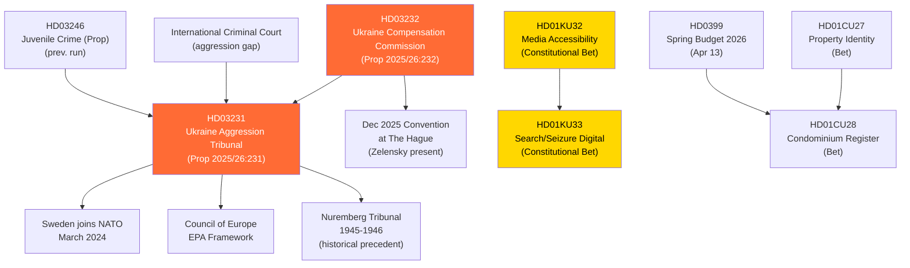

# Cross-Reference Map — Realtime Monitor 1434
**Date**: 2026-04-17

---

## Document Linkage Graph

---

## Thematic Clusters

### Cluster A: Ukraine Accountability
- HD03231 + HD03232 (this run)
- Sweden's NATO accession (March 2024)
- Previous Ukraine aid propositions throughout 2024-2025
- Spring budget 2026 (contains Ukraine-related expenditures)

### Cluster B: Constitutional Reform
- HD01KU32 + HD01KU33 (this run, first reading)
- Second reading required post-2026 election
- Part of 2026 constitutional agenda

### Cluster C: Property/Housing Transparency
- HD01CU28 + HD01CU27 (this run)
- Connected to organized crime prevention (HD03246 juvenile crime context)
- Anti-money-laundering policy framework

---

## Contextual Timeline

| Date | Event | Significance |
|------|-------|-------------|
| Feb 24, 2022 | Russia's full-scale invasion of Ukraine | Trigger event |
| Nov 2022 | UNGA resolution on reparations mechanism | Foundation for HD03232 |
| Mar 2024 | Sweden joins NATO | Security context |
| 2025 | Sweden joins core group working on tribunal | Path to HD03231 |
| Mar 2026 | Sweden signs letter of intent for tribunal | Immediate predecessor |
| Dec 16, 2025 | Compensation commission convention adopted (Zelensky) | HD03232 origin |
| Apr 16, 2026 | Both propositions submitted to Riksdag | THIS RUN |
| Apr 17, 2026 | Constitutional betänkanden published | THIS RUN |
