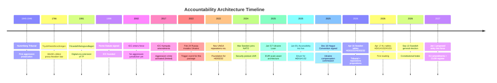

# Cross-Reference Map — Realtime Monitor 1434

| Field | Value |
|-------|-------|
| **XREF-ID** | XRF-2026-04-17-1434 |
| **Date** | 2026-04-17 14:34 UTC |

---

## 🕸️ Document Linkage Graph (Constitutional Lead + Ukraine Context)

```mermaid
graph TD
    %% Constitutional cluster (LEAD)
    HD01KU33["HD01KU33<br/>Search/Seizure Digital<br/>🏛️ LEAD"]
    HD01KU32["HD01KU32<br/>Media Accessibility<br/>📜 CO-LEAD"]

    %% Constitutional context
    TF1766["📜 TF 1766<br/>world's oldest press<br/>freedom law"]
    YGL1991["📜 YGL 1991<br/>broadcast/digital<br/>fundamental law"]
    RF8_14["⚖️ 8 kap. 14 § RF<br/>two-reading rule"]
    EAA["🇪🇺 EU Accessibility<br/>Act 2019/882"]
    LAGRADET["⚖️ Lagrådet<br/>yttrande pending"]
    ELECT2026["🗳️ Election<br/>September 2026"]

    %% Ukraine cluster
    HD03231["HD03231<br/>Ukraine Special<br/>Tribunal (Prop)"]
    HD03232["HD03232<br/>Compensation Commission<br/>(Prop)"]
    NUREMBERG["⚖️ Nuremberg<br/>Trials 1945-46"]
    NATO["🛡️ Sweden NATO<br/>March 2024"]
    HAGUE_DEC25["🇺🇦 Hague Convention<br/>Dec 16 2025<br/>(Zelensky present)"]
    CoE["🏛️ Council of<br/>Europe framework"]
    G7["🌐 G7 Ukraine<br/>Loan Jan 2025"]
    EUROCLEAR["🏦 Euroclear<br/>EUR 191B frozen<br/>Russian assets"]
    ICC["⚖️ ICC<br/>aggression-jurisdiction<br/>gap"]

    %% Housing cluster
    HD01CU28["HD01CU28<br/>Bostadsrätts-<br/>register"]
    HD01CU27["HD01CU27<br/>Lagfart + Ombildning"]
    GANG["🕵️ Gäng-agenda<br/>Prop 2025/26:100"]
    AMLD6["🇪🇺 EU AMLD6"]

    %% Prior run cross-refs
    HD03246["HD03246<br/>Juvenile Crime<br/>(prev. run)"]
    HD0399["HD0399<br/>Spring Budget 2026<br/>(Apr 13)"]

    %% Relations — Constitutional
    TF1766 --> HD01KU33
    TF1766 --> HD01KU32
    YGL1991 --> HD01KU32
    RF8_14 --> HD01KU33
    RF8_14 --> HD01KU32
    EAA --> HD01KU32
    LAGRADET -.reviews.-> HD01KU33
    LAGRADET -.reviews.-> HD01KU32
    HD01KU33 -.2nd reading.-> ELECT2026
    HD01KU32 -.2nd reading.-> ELECT2026

    %% Relations — Ukraine
    NUREMBERG -.precedent.-> HD03231
    NATO --> HD03231
    HAGUE_DEC25 --> HD03232
    CoE --> HD03231
    ICC -.gap filled by.-> HD03231
    HD03232 -.companion.-> HD03231
    G7 --> HD03232
    EUROCLEAR --> HD03232

    %% Relations — Housing
    GANG --> HD01CU27
    GANG --> HD01CU28
    AMLD6 --> HD01CU27
    HD03246 -.continuation.-> GANG

    %% Budget context
    HD0399 -.fiscal context.-> HD03231
    HD0399 -.fiscal context.-> HD01CU28

    %% Cross-cluster rhetorical tension
    HD01KU33 -.rhetorical tension<br/>press freedom at home<br/>vs accountability abroad.-> HD03231

    style HD01KU33 fill:#dc3545,color:#fff
    style HD01KU32 fill:#dc3545,color:#fff
    style HD03231 fill:#fd7e14,color:#fff
    style HD03232 fill:#fd7e14,color:#fff
    style HD01CU28 fill:#ffc107,color:#000
    style HD01CU27 fill:#ffc107,color:#000
    style TF1766 fill:#6f42c1,color:#fff
    style YGL1991 fill:#6f42c1,color:#fff
    style RF8_14 fill:#6f42c1,color:#fff
    style NUREMBERG fill:#6f42c1,color:#fff
    style ELECT2026 fill:#0d6efd,color:#fff
```

---

## 🧱 Thematic Clusters

### Cluster A — Constitutional Reform (LEAD)
- **HD01KU33 + HD01KU32** (this run, first reading)
- Constitutional mechanics: TF (1766), YGL (1991), RF 8 kap. 14 §
- EU driver: Accessibility Act (EAA 2019/882)
- **Second reading required post-Sep-2026 election** — structurally embeds KU33/KU32 in 2026 valrörelse
- Institutional review: Lagrådet yttrande pending

### Cluster B — Ukraine Accountability
- **HD03231 + HD03232** (this run, propositions)
- Institutional pillars: Council of Europe, Nuremberg precedent, ICC gap, Hague Convention Dec 2025
- Financial architecture: G7 Ukraine Loan (Jan 2025), Euroclear EUR 191B, Russian assets ~EUR 260B
- Security context: NATO accession (March 2024)

### Cluster C — Property / AML
- **HD01CU28 + HD01CU27** (this run)
- Policy lineage: gäng-agenda (Prop 2025/26:100), juvenile-crime proposition (HD03246)
- EU context: AMLD6
- Fiscal context: Spring budget 2026 (HD0399)

---

## ⏱️ Contextual Timeline — Nuremberg → Rome → Hague → Stockholm → 2027

---

## 🔗 Cross-Cluster Interference (Rhetorical)

| Tension | Description | Opposition Exploit Vector |
|---------|-------------|---------------------------|
| **Constitutional × Ukraine** | Government championing aggression-tribunal (implicitly valorises journalists documenting Russian war crimes) while narrowing TF at home (KU33) | "Sweden defends press freedom abroad while compressing it at home" — V/MP/NGO talking point |
| **Constitutional × Housing** | AML/anti-crime rationale frames KU33 carve-out while CU27/CU28 expand registries — together suggest a coherent surveillance-adjacent trajectory | Privacy/V talking point — "mission creep" |

---

**Classification**: Public · **Next Review**: 2026-04-24
