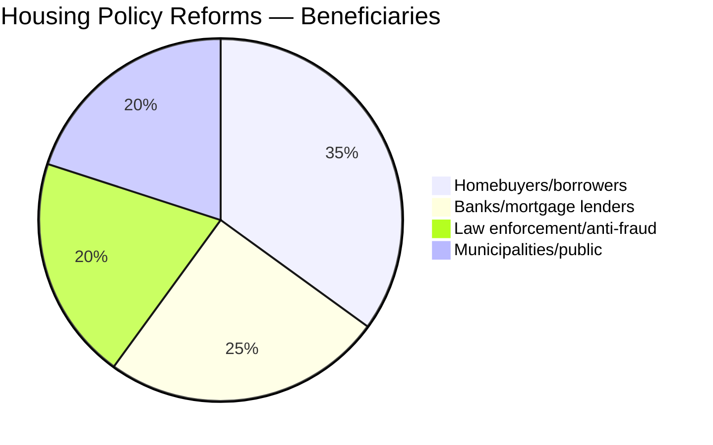

# Document Intelligence Analysis: HD01CU27 & HD01CU28

## HD01CU28: Ett register för alla bostadsrätter
**Betänkande 2025/26:CU28** | Civilutskottet | Date: 2026-04-17 | Score: 6/10

## HD01CU27: Identitetskrav vid lagfart och åtgärder mot kringgåenden av bostadsrättslagen
**Betänkande 2025/26:CU27** | Civilutskottet | Date: 2026-04-17 | Score: 6/10

---

## 1. Political Significance

### HD01CU28 — National Condominium Register
- Creates a **new national register** for all *bostadsrätter* (cooperative apartments/condominiums)
- Register will contain: property data, owner (bostadsrättshavare), association (bostadsrättsförening), and **mortgage pledges (pantsättningar)**
- Key reform: replaces notification to housing association for pledges with formal registration — similar to property deeds register
- Goals: (1) modernize the pledge/mortgage system, (2) improve consumer protection, (3) create a transparent housing/credit market, (4) simplify administrative procedures
- Effective: register setup Jan 1, 2027; other provisions when government determines

**Context**: Sweden has ~2 million bostadsrätter (one of the most common forms of housing). The lack of a unified register has been criticized for creating opacity in the credit/mortgage market and enabling fraud.

### HD01CU27 — Identity Requirements for Property Transfers
- **New requirement**: Lagfart (property title transfer) applications for physical persons must include personnummer (national ID number) or samordningsnummer
- Legal entities must provide organisationsnummer
- **Anti-fraud measure**: Enables police/tax authority to track property ownership more effectively
- **Anti-money laundering**: Property ownership has been a vector for organized crime money laundering
- **Condominium conversion reform**: 2/3 majority of tenants required for ombildning (rental → condo conversion), but new rule: tenant must have been registered (folkbokförd) at the address for ≥ 6 months to count in the majority calculation
- This closes a loophole where "ghost tenants" were used to manufacture artificial majorities
- Effective: July 1, 2026

---

## 2. Political Analysis

---

## 3. SWOT Analysis

| Category | HD01CU28 (Register) | HD01CU27 (Identity) |
|----------|---------------------|---------------------|
| **Strength** | Major transparency improvement in housing market | Directly combats property fraud and money laundering |
| **Strength** | Modernizes pledge system — cleaner credit market | Closes ghost-tenant conversion loophole |
| **Weakness** | Implementation complexity — 2M bostadsrätter to register | Some privacy concerns re: centralized ID data |
| **Opportunity** | Foundation for digital property market | Tool for law enforcement against organized crime in real estate |
| **Threat** | Data security — centralized sensitive financial data | Risk of mission creep in government surveillance |

---

## 4. Evidence Table

| Claim | Source | Confidence | Impact |
|-------|--------|-----------|--------|
| CU approves government proposal for national register | HD01CU28 | HIGH | HIGH — 2M bostadsrätter affected |
| Register effective Jan 1, 2027 | HD01CU28 summary | HIGH | Timeline |
| Personnummer required for lagfart | HD01CU27 | HIGH | MEDIUM — anti-fraud |
| 6-month residency requirement for conversion majority | HD01CU27 | HIGH | MEDIUM — closes loophole |
| Effective date July 1, 2026 | HD01CU27 | HIGH | Imminent |

---

## 5. Cross-References
- Spring budget 2026 (HD0399): housing market is a key economic issue
- Anti-money laundering policy: connects to government's organized crime agenda
- HD03246 (Skärpta regler för unga lagöverträdare): part of the same legislative sprint
