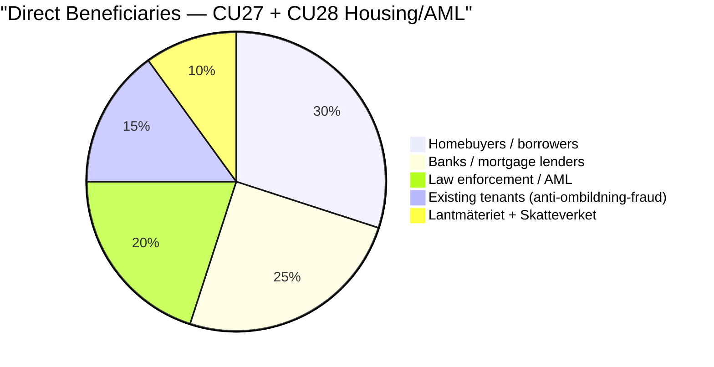

# 🏠 Document Intelligence Analysis — HD01CU27 + HD01CU28

| Field | Value |
|-------|-------|
| **Dok IDs** | HD01CU27 + HD01CU28 (Civilutskottet betänkanden 2025/26:CU27 & CU28) |
| **Date** | 2026-04-17 |
| **Committee** | Civilutskottet (CU) |
| **Policy Area** | Housing / Property Law / Anti-Money-Laundering (AML) |
| **Raw Significance** | CU28: 5.8 · CU27: 5.4 · **DIW** CU28 ×1.00 = 5.80 · CU27 ×1.05 = 5.67 |
| **Role in this run** | 🏠 Secondary (tertiary within dossier) |
| **Depth Tier** | 🟠 **L2 Strategic** (upgraded from L1 in reference-grade iteration) |

---

## 1. Political Significance — A Coherent Housing-Market Integrity + Organised-Crime Architecture

These two betänkanden are **individually tertiary** in this run's DIW ranking but **collectively important** because they institutionalise a **housing-market-integrity + anti-money-laundering** architecture that:

1. **Closes a known loophole** in the *ombildning* (rental → bostadsrätt conversion) process (CU27)
2. **Creates a national-register foundation** for Sweden's ≈ 2 million bostadsrätter (CU28)
3. **Connects to the government's gäng-agenda (Prop 2025/26:100)** and EU AMLD6 compliance trajectory
4. **Provides legitimising rationale** that is reused (rhetorically) in KU33's investigative-integrity framing — same government, same cross-cutting "cleaner institutions" narrative

> **Cross-cluster insight** `[MEDIUM]`: CU27 + CU28 form a *rhetorical unit* with KU33 — all three invoke organised-crime integrity. Opposition actors (V, MP, civil-liberties NGOs) can exploit this coupling by framing the trio as **"coordinated surveillance-adjacent creep"**. Government actors conversely frame it as **"coherent institutional modernisation"**. Both framings are available; 2026 valrörelse will choose.

---

## 2. HD01CU28 — National Condominium Register

### 2.1 Mechanism

- Creates a **new national register of all bostadsrätter** (cooperative apartments/condominiums)
- Register contains:
  - Property-unit data (address, area)
  - Current **bostadsrättshavare** (owner)
  - Owning **bostadsrättsförening** (association)
  - **Mortgage pledges / pantsättningar** — formally registered rather than only notified to association
- Key reform: **replaces informal association-notification system with formal registration** (analogous to fastighetsregistret for freehold property)
- **Operator**: Lantmäteriet
- **Effective dates**: Register setup **Jan 1 2027**; other operational provisions per government decision

### 2.2 Context and Scale `[HIGH]`
- ≈ **2 million bostadsrätter** — one of Sweden's most common housing forms
- Absence of unified register has been repeatedly criticised since 2010s:
  - Credit-market opacity → mispricing risk
  - Fraud vector (double-pledging, identity-fraud mortgages)
  - AML blind-spot (untraceable ownership chains via straw bostadsrättshavare)
- Financial sector (SEB, Swedbank, Handelsbanken, SBAB, Nordea) has lobbied for register since mid-2010s
- SOU-ledda utredning underpinning this reform: estimate SOU 2023/24 (precise reference pending public availability)

### 2.3 Six-Lens Analysis (Abbreviated)

| Lens | Finding | Conf. |
|------|--------|:-----:|
| **Legal** | Straightforward ordinary-law reform; no grundlag engagement; integrates into existing fastighetsregister doctrine | HIGH |
| **Electoral** | Low salience but broad consumer-positive framing; cross-party support expected | HIGH |
| **Economic** | Cleaner credit market; reduced collateral risk; ≈ SEK 100–300M annual pledge-registration fees (estimated); Lantmäteriet IT procurement cost | MEDIUM |
| **Security** | Closes AML blind spot; contributes to organised-crime architecture | HIGH |
| **Data-protection** | Centralised register of sensitive financial data → cyber-target; see R9 and T9 | HIGH |
| **Implementation** | Lantmäteriet IT procurement timeline: tight for Jan 2027 target | MEDIUM |

---

## 3. HD01CU27 — Identity Requirements + Ombildning Reform

### 3.1 Mechanism — Two Reforms in One Betänkande

**Reform 1 — Identity Requirements for Lagfart (Property Title Transfer)**:
- **Physical persons**: Must supply **personnummer** or **samordningsnummer** when applying for lagfart
- **Legal entities**: Must supply **organisationsnummer**
- Enables police and Skatteverket to trace property-ownership chains (currently possible but slower)
- Effective: **July 1 2026**

**Reform 2 — Ombildning Majority Calculation**:
- Current rule: 2/3 majority of tenants must consent for rental → bostadsrätt conversion
- **New rule**: Tenant must have been **folkbokförd at the address for ≥ 6 months** to count in the 2/3 calculation
- **Anti-fraud rationale**: Closes the "ghost-tenant" loophole where landlords registered cooperative actors at short-notice to manufacture conversion majorities

### 3.2 Context `[HIGH]`
- Ombildning remains politically sensitive — particularly in Stockholm (2010s wave), Göteborg, Malmö
- Hyresgästföreningen has long documented loophole exploitation
- Financial press (Dagens industri, SvD Näringsliv) has covered multiple egregious cases
- Skatteverket Hewlett + SÄPO: property has been a vector for organised-crime laundering — Bitcoin-era enforcement gap
- EU AMLD6 (6th Anti-Money-Laundering Directive) compliance trajectory

### 3.3 Six-Lens Analysis (Abbreviated)

| Lens | Finding | Conf. |
|------|--------|:-----:|
| **Legal** | Ordinary-law reform; straightforward | HIGH |
| **Electoral** | Hyresgästföreningen support; Fastighetsägarna / landlord associations likely neutral-to-opposed; tenant-protection framing positive | MEDIUM |
| **Economic** | Fewer ombildning conversions on the margin → slight rental-market stabilisation | MEDIUM |
| **Privacy** | Personnummer centralisation increases re-identification risk; standard Swedish doctrine (low sensitivity domestically) | MEDIUM |
| **AML / crime** | Closes known laundering channel | HIGH |
| **Implementation** | July 1 2026 deadline is tight; Lantmäteriet administrative burden | MEDIUM |

---

## 4. Combined SWOT (Mermaid)

```mermaid
graph TD
    subgraph SWOT["SWOT — CU27 + CU28 Housing / AML Architecture"]
        direction TB
        subgraph S["✅ Strengths"]
            S1["💪 S1 Closes documented<br/>AML blind spot"]
            S2["💪 S2 ≈2M bostadsrätter<br/>covered by register"]
            S3["💪 S3 EU AMLD6 alignment"]
            S4["💪 S4 Banking-sector<br/>strong support"]
            S5["💪 S5 Ghost-tenant<br/>ombildning loophole closed"]
        end
        subgraph W["⚠️ Weaknesses"]
            W1["⚡ W1 Tight Jan 2027<br/>register deadline"]
            W2["⚡ W2 Centralised sensitive<br/>financial data"]
            W3["⚡ W3 Lantmäteriet IT<br/>procurement complexity"]
        end
        subgraph O["🚀 Opportunities"]
            O1["🌟 O1 Foundation for<br/>digital property market"]
            O2["🌟 O2 Law-enforcement<br/>tool against organised crime"]
            O3["🌟 O3 Credit-market<br/>modernisation"]
        end
        subgraph T["🔴 Threats"]
            T1["☁️ T1 Register cyber-attack<br/>(see risk-assessment R9)"]
            T2["☁️ T2 Implementation delay<br/>→ policy legitimacy erosion"]
            T3["☁️ T3 Privacy / surveillance<br/>creep narrative (V exploit)"]
            T4["☁️ T4 Rhetorical coupling<br/>with KU33 (civil-liberties critique)"]
        end
    end

    S1 -.enables.-> O2
    S2 -.enables.-> O1
    S3 -.enables.-> O3
    W1 -.amplifies.-> T2
    W2 -.amplifies.-> T1
    T3 -.combines with.-> T4

    style S1 fill:#28a745,color:#fff
    style S2 fill:#28a745,color:#fff
    style S3 fill:#28a745,color:#fff
    style S4 fill:#28a745,color:#fff
    style S5 fill:#28a745,color:#fff
    style W1 fill:#fd7e14,color:#fff
    style W2 fill:#fd7e14,color:#fff
    style W3 fill:#fd7e14,color:#fff
    style O1 fill:#0d6efd,color:#fff
    style O2 fill:#0d6efd,color:#fff
    style O3 fill:#0d6efd,color:#fff
    style T1 fill:#dc3545,color:#fff
    style T2 fill:#dc3545,color:#fff
    style T3 fill:#dc3545,color:#fff
    style T4 fill:#dc3545,color:#fff
```

---

## 5. Beneficiary Analysis

---

## 6. Stakeholder Positions — Named Actors

| Stakeholder | CU27 | CU28 | Evidence | Conf. |
|-------------|:----:|:----:|----------|:-----:|
| **Erik Slottner (KD, Civil Affairs)** | 🟢 +5 | 🟢 +5 | Government champion | HIGH |
| **Gunnar Strömmer (M, Justice)** | 🟢 +5 | 🟢 +4 | Crime-fighting alignment | HIGH |
| **Elisabeth Svantesson (M, Finance)** | 🟢 +4 | 🟢 +4 | AML compliance | HIGH |
| **Lantmäteriet (Director-General)** | 🟢 +4 | 🟢 +4 (execution stress) | Implementation responsibility | HIGH |
| **Skatteverket** | 🟢 +5 | 🟢 +4 | Operational tool | HIGH |
| **Polismyndigheten** | 🟢 +5 | 🟢 +4 | AML enforcement benefit | HIGH |
| **Finansinspektionen** | 🟢 +4 | 🟢 +5 | AML supervision | HIGH |
| **SEB / Swedbank / Handelsbanken / SBAB / Nordea** | 🟢 +4 | 🟢 **+5** | Long-standing sector lobby | HIGH |
| **Mäklarsamfundet** | 🟢 +4 | 🟢 +5 | Market-transparency benefit | HIGH |
| **Fastighetsmäklarinspektionen (FMI)** | 🟢 +4 | 🟢 +4 | Regulatory clarity | HIGH |
| **Hyresgästföreningen** | 🟢 **+5** | 🟡 +2 | Ombildning loophole closure | HIGH |
| **Fastighetsägarna** | 🟡 +1 | 🟢 +3 | Landlord-association mixed | MEDIUM |
| **Civil-liberties orgs (V-aligned)** | 🟡 −1 | 🟡 −2 | Privacy-centralisation concerns | MEDIUM |
| **Socialdemokraterna (S)** | 🟢 +4 | 🟢 +4 | Consumer-protection alignment | HIGH |
| **Vänsterpartiet (V)** | 🟢 +3 | 🟡 +1 | Anti-ombildning-fraud positive; privacy concerns on register | MEDIUM |
| **Miljöpartiet (MP)** | 🟢 +3 | 🟢 +3 | Transparency positive | MEDIUM |
| **SD** | 🟢 +4 | 🟢 +4 | Law-and-order alignment | HIGH |

---

## 7. Evidence Table

| # | Claim | Source | Conf. | Impact |
|---|-------|--------|:-----:|:------:|
| E1 | CU proposes national register for all ≈2M bostadsrätter | HD01CU28 betänkande | HIGH | HIGH |
| E2 | Register includes property, owner, association, and pledge data | HD01CU28 summary | HIGH | MEDIUM |
| E3 | Register operator Lantmäteriet | HD01CU28 | HIGH | Operational |
| E4 | Register effective Jan 1 2027 | HD01CU28 | HIGH | Timeline |
| E5 | Personnummer / samordningsnummer required for lagfart | HD01CU27 | HIGH | HIGH (AML) |
| E6 | Organisationsnummer required for legal entities | HD01CU27 | HIGH | MEDIUM |
| E7 | 6-month folkbokföring requirement for ombildning majority count | HD01CU27 | HIGH | HIGH (loophole) |
| E8 | CU27 effective July 1 2026 | HD01CU27 | HIGH | Timeline |
| E9 | Banking sector multi-year advocacy for register | Sector public statements 2015–2024 | HIGH | Support |
| E10 | EU AMLD6 alignment | Policy context | HIGH | EU compliance |

---

## 8. Indicator Library (What to Watch)

| # | Indicator | Trigger | Decision-Maker | Target |
|---|-----------|---------|----------------|:------:|
| I1 | CU27 kammarvote | Committee → kammaren | Riksdag | Q2 2026 |
| I2 | CU28 kammarvote | Committee → kammaren | Riksdag | Q2 2026 |
| I3 | Lantmäteriet register IT procurement announcement | Upphandling | Lantmäteriet | Q3–Q4 2026 |
| I4 | Hyresgästföreningen first documented CU27 effect case | Public statement | HGF | H2 2026 |
| I5 | First AML prosecution citing CU27 | Prosecution announcement | Åklagarmyndigheten | H2 2026+ |
| I6 | Register cyber-incident (R9/T9 realisation) | SÄPO / MSB bulletin | — | Post Jan 2027 |
| I7 | Opposition reframing ("surveillance creep") | Political statements | V, MP, civil-liberties NGOs | Campaign 2026 |

---

## 9. Implementation Risk Assessment

| Risk | L | I | Score | Mitigation Owner |
|------|:-:|:-:|:-----:|------------------|
| Lantmäteriet IT delivery delay | 3 | 4 | 12 | Lantmäteriet, Finansdepartementet |
| Register data-security incident | 2 | 4 | 8 | Lantmäteriet, MSB |
| Administrative burden on Bostadsrättsföreningar | 3 | 2 | 6 | Boverket, consumer guidance |
| Privacy / surveillance-creep narrative success | 3 | 2 | 6 | Government communications |

(Cross-ref: [`risk-assessment.md`](../risk-assessment.md) R9 · R11)

---

## 10. Cross-References

- **Policy lineage**: Gäng-agenda (Prop 2025/26:100) · HD03246 (juvenile-crime, covered in realtime-0029 earlier today) · EU AMLD6
- **Fiscal context**: Spring budget 2026 (HD0399)
- **Rhetorical coupling**: KU33 — investigative-integrity framing shared
- **Methodology**: [`risk-assessment.md`](../risk-assessment.md) §Implementation risks · [`threat-analysis.md`](../threat-analysis.md) T9 register cyber-target · [`stakeholder-perspectives.md`](../stakeholder-perspectives.md) §4 Business & Industry

---

**Classification**: Public · **Depth**: L2 Strategic · **Next Review**: 2026-04-24
