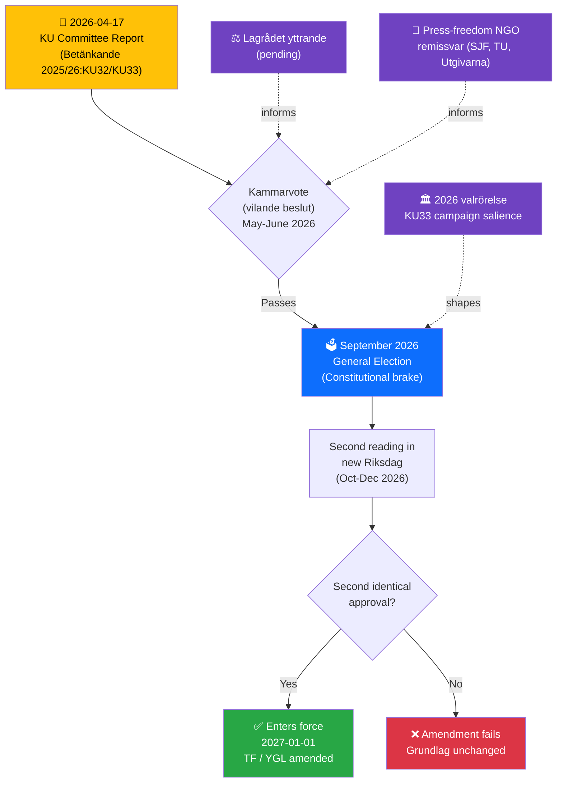
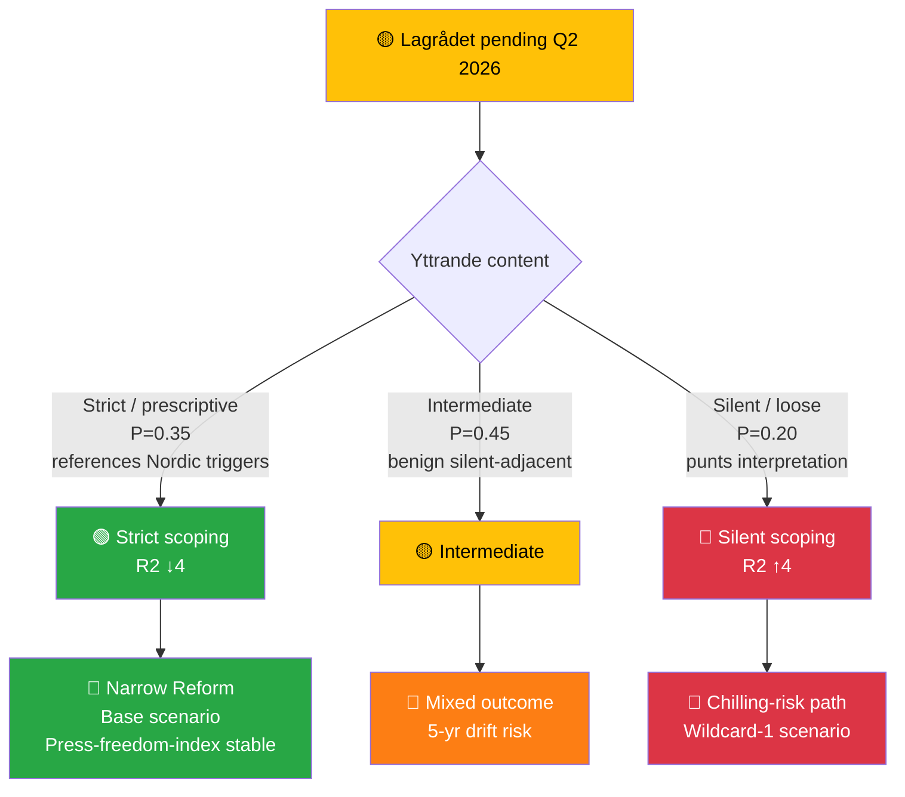

# Document Intelligence Analysis — HD01KU32 & HD01KU33

| Field | Value |
|-------|-------|
| **HD01KU32** | Betänkande 2025/26:KU32 — *Tillgänglighetskrav för vissa medier* |
| **HD01KU33** | Betänkande 2025/26:KU33 — *Insyn i handlingar som inhämtas genom beslag och kopiering vid husrannsakan* |
| **Committee** | Konstitutionsutskottet (KU) |
| **Reading** | **First reading (vilande)** under 8 kap. 14 § Regeringsformen |
| **Effective (if adopted)** | Proposed 2027-01-01, conditional on second reading in post-2026-election Riksdag |
| **Raw Significance** | 7/10 each · **DIW Weighted**: 9.8 (KU33) / 8.25 (KU32) |
| **Role** | 🏛️ **LEAD** (KU33) · 📜 **CO-LEAD** (KU32) |

---

## 1. Political Significance — Why These Are the Lead Story

Sweden's **Tryckfrihetsförordningen (TF)** is the world's **oldest freedom-of-the-press law** (1766 — ten years before the United States Declaration of Independence, two decades before the U.S. First Amendment, and 83 years before France's 1849 press law). It is a **grundlag** — one of four constitutional laws of the realm. The **Yttrandefrihetsgrundlagen (YGL, 1991)** extends equivalent protections to modern broadcast and digital media.

> **Two-reading requirement (8 kap. 14 § Regeringsformen)**: A grundlag amendment requires **two identical votes by two separately-elected Riksdags**, with at least one **general election** between them. The first reading (today) is called the *vilande beslut* — it "rests" until the post-election Riksdag either ratifies or rejects.

This mechanism is a deliberate constitutional brake: it forces every grundlag amendment to survive a democratic mandate change. The **2026 election campaign will therefore be partly a referendum on KU32 and KU33.**

### HD01KU32 — Media Accessibility (EU EAA grundlag accommodation)

- **Mechanism**: Amends TF and YGL to permit tillgänglighetskrav (accessibility requirements) to be imposed via **ordinary law** on products/services that fall within the grundlag-protected sphere.
- **Three operative elements**:
  1. **Product information**: Accessibility requirements on packaging / labelling of grundlag-protected products
  2. **Digital media**: Accessibility requirements (format, information structure, functional properties) on **e-books** and **e-handel (e-commerce) services**
  3. **Must-carry**: Network operators can be required to transmit accessibility services (captions, audio description, sign-language interpretation) for a wider class of broadcasters than the current public-service trio (SVT, SR, UR)
- **EU driver**: **European Accessibility Act (Directive 2019/882)** — full application since June 2025
- **Beneficiary scale**: ~1.5 million Swedes with disabilities (Myndigheten för delaktighet baseline)

### HD01KU33 — Search/Seizure Digital Evidence (TF transparency narrowing)

- **Mechanism**: Amends TF so that **digital recordings seized, copied, or taken over during husrannsakan** (criminal search) are **no longer "allmän handling"** — i.e., fall outside offentlighetsprincipen.
- **Exception**: If seized material is **formally incorporated as evidence** (*formellt tillförd bevisning*) in the investigation, it **retains "allmän handling"** status.
- **Rationale**: Current law creates a perverse incentive — material seized at the earliest investigative stage can technically become publicly accessible before it has even been reviewed for evidentiary value, potentially compromising investigations and sources.
- **Constitutional significance**: This is the **first substantive narrowing of TF's offentlighetsprincip** in the digital-evidence domain in years. Although scoped to a specific context (seized digital material), it modifies a text dating to **1766**.

---

## 2. Constitutional Timeline (Mermaid)

---

## 3. Detailed SWOT (Both Amendments)

| Dimension | HD01KU32 (Accessibility) | HD01KU33 (Search/Seizure) | Conf. |
|-----------|--------------------------|---------------------------|:-----:|
| **Strength** | Discharges binding EU obligation (EAA 2019/882); unifies coalition; disability-rights delivery | Solves real investigative-integrity problem in gäng-era prosecutions; narrow carve-out preserves transparency when material becomes evidence | HIGH |
| **Weakness** | Establishes precedent that EU obligations can expand ordinary-law intrusion into grundlag sphere | Interpretive boundary of "*formellt tillförd bevisning*" underspecified; narrow future interpretation could systemically shield police operations from offentlighetsprincipen | HIGH / MEDIUM |
| **Opportunity** | Modernises grundlag for digital accessibility without triggering broader overhaul; Nordic benchmark leadership | Strengthens investigative output → gäng-agenda policy coherence; paired with CU27/CU28 AML architecture | MEDIUM |
| **Threat** | Precedent risk: future legislation cites KU32's EU-obligation template to narrow TF/YGL in other digital domains (platform regulation, AI content, national security) | Campaign weaponisation (V/MP, press-freedom NGOs, possibly S); source-chilling effect on investigative journalism; RSF/Freedom House index downgrade | MEDIUM / HIGH |

---

## 4. "Formellt tillförd bevisning" — The Critical Interpretive Frontier

The **single most important question** in KU33 is how Swedish legal institutions will interpret *"formellt tillförd bevisning"* ("formally incorporated as evidence"). Three interpretive postures are plausible:

| Posture | Description | Effect | Likelihood |
|---------|-------------|--------|:----------:|
| **Strict** (press-friendly) | Material considered "incorporated" once referred to in any protokoll/stämningsansökan/tjänsteanteckning | Narrow carve-out; most material retains allmän handling status relatively quickly | MEDIUM |
| **Intermediate** | Material incorporated upon formal inclusion in förundersökningsprotokoll | Substantial volume excluded during multi-year investigations | HIGH (default) |
| **Narrow** (police-friendly) | Material incorporated only upon inclusion in stämningsansökan or as bevis i rättegång | Large volumes of seized digital material permanently outside offentlighetsprincipen | MEDIUM |

**Recommendation (for press-freedom advocates)**: Focus remissvar and Lagrådet engagement on **locking a strict or intermediate interpretation into legislative history**. This is the leverage point that transforms KU33 from "press-freedom regression" to "narrow, proportionate reform."

---

## 5. Stakeholder Perspectives (Named Actors)

| Stakeholder | HD01KU32 | HD01KU33 | Evidence |
|-------------|:--------:|:--------:|----------|
| **KU (proposing)** | 🟢 Supports | 🟢 Supports | Committee record |
| **Gov ministers** — Gunnar Strömmer (M, Justice) | 🟡 Neutral | 🟢 **Strongly supports** (prosecution rationale) | Ministerial portfolio |
| **Johan Pehrson (L, party leader)** | 🟢 Supports | 🟡 Watches press-freedom impact | L liberal-identity risk |
| **V** — Nooshi Dadgostar (party leader) | 🟢 Supports | 🔴 Opposes (expected) | V press-freedom doctrine |
| **MP** — Daniel Helldén (språkrör) | 🟢 Strongly supports | 🔴 Opposes (expected) | Grundlag-protection doctrine |
| **S** — Magdalena Andersson (party leader) | 🟢 Supports | 🟡 **Divided** — position critical | S press-freedom historical vs law-and-order wing |
| **Journalistförbundet (SJF)** | 🟢 Supports | 🔴 **Strong concern** | Professional press-freedom mandate |
| **TU / Utgivarna** | 🟡 Neutral | 🔴 **Strong concern** | Publisher mandate |
| **Polismyndigheten** | 🟡 Neutral | 🟢 **Strongly supports** | Operational beneficiary |
| **Åklagarmyndigheten** | 🟡 Neutral | 🟢 Strongly supports | Prosecution effectiveness |
| **DHR / FUB / SRF** (disability NGOs) | 🟢 **Enthusiastically supports** | 🟡 Neutral | KU32 accessibility gain |
| **Lagrådet** | Pending | Pending | Yttrande expected Q2 2026 |

---

## 6. Evidence Table (with Confidence Labels)

| # | Claim | Source | Confidence | Impact |
|---|-------|--------|:----------:|:------:|
| E1 | KU proposes first reading (vilande) of two grundlag amendments | HD01KU32, HD01KU33 betänkanden | HIGH | HIGH |
| E2 | TF / YGL changes require two votes across a general election | 8 kap. 14 § Regeringsformen | HIGH | Context |
| E3 | KU33 removes allmän handling status from digital material seized at husrannsakan | HD01KU33 summary text | HIGH | HIGH (press freedom) |
| E4 | KU33 preserves allmän handling status when material is formellt tillförd bevisning | HD01KU33 summary text | HIGH | HIGH (mitigation) |
| E5 | KU32 enables accessibility requirements via ordinary law on e-books, e-handel, broadcasters | HD01KU32 summary text | HIGH | MEDIUM |
| E6 | EAA 2019/882 is the EU obligation driver for KU32 | HD01KU32 rationale; EAA text | HIGH | MEDIUM |
| E7 | Proposed entry-into-force 2027-01-01 conditional on post-2026-election ratification | Both betänkanden | HIGH | Timeline |
| E8 | Sweden's TF dates to 1766 — world's oldest press-freedom law | TF archival record | HIGH | Framing |
| E9 | Lagrådet yttrande pending | Lagrådet process | HIGH | Risk signal |

---

## 7. Forward Indicators (With Triggers and Dates)

| # | Indicator | Trigger | Decision-Maker | Target |
|---|-----------|---------|----------------|:------:|
| F1 | **Lagrådet yttrande** published | Formal delivery | Lagrådet | Q2 2026 |
| F2 | Kammarvote (vilande beslut) | KU → kammaren schedule | Riksdag | May-June 2026 |
| F3 | Press-freedom NGO joint statement | Remissvar or public statement | SJF, TU, Utgivarna, PK | Pre-vote |
| F4 | S leadership definitive position on KU33 | Andersson speech / partistämma | S | Q2-Q3 2026 |
| F5 | 2026 valrörelse press-freedom salience | Media coverage tracking | — | Aug-Sep 2026 |
| F6 | **Post-election Riksdag composition** — KU33 2nd-reading prospects | Valmyndigheten preliminary | Voters | 2026-09-13 |
| F7 | Second reading in new Riksdag | Kammarvote | Next Riksdag | Oct-Dec 2026 |
| F8 | Entry into force (or rejection) | Kungörelse | Gov + Riksdag | 2027-01-01 |

---

## 8. Cross-References

- **Grundlag text**: [Tryckfrihetsförordningen (TF, 1766)](https://www.riksdagen.se/sv/dokument-lagar/dokument/svensk-forfattningssamling/tryckfrihetsforordning-19491105_sfs-1949-105) · [Yttrandefrihetsgrundlagen (YGL, 1991)](https://www.riksdagen.se/sv/dokument-lagar/dokument/svensk-forfattningssamling/yttrandefrihetsgrundlag-19911469_sfs-1991-1469) · 8 kap. 14 § [Regeringsformen](https://www.riksdagen.se/sv/dokument-lagar/dokument/svensk-forfattningssamling/kungorelse-1974152-om-beslutad-ny-regeringsform_sfs-1974-152)
- **EU driver**: Directive 2019/882 (European Accessibility Act)
- **Historical TF amendments**: Last major changes — 2018/19 (digital-adjacent) and 2010 (YGL technology neutrality)
- **Related current package**: HD01CU27, HD01CU28 (AML/housing) · HD03231, HD03232 (Ukraine accountability)
- **Methodologies**: [political-swot-framework](../../../../methodologies/political-swot-framework.md) · [political-risk-methodology](../../../../methodologies/political-risk-methodology.md) · [political-threat-framework](../../../../methodologies/political-threat-framework.md)

---

## 9. International Comparison — Digital-Evidence Transparency Regimes

| Country | Regime | RSF 2025 | Parallel to KU33? |
|---------|--------|:--:|------------------|
| 🇳🇴 Norway | Offentleglova §24 — exempt during investigation, auto-disclosable post-closure | **1** | **Equivalent** |
| 🇩🇰 Denmark | Offentlighedsloven §30 — exempt during investigation | **3** | **Equivalent** |
| 🇸🇪 Sweden (pre-KU33) | TF 1766 + offentlighetsprincipen — allmän handling from seizure | **4** | Baseline |
| 🇳🇱 Netherlands | Woo — strong investigation exemptions | **4** | **Equivalent** |
| 🇫🇮 Finland | Openness Act §24(1) — exempt until investigation concluded | **5** | **Equivalent** |
| 🇮🇪 Ireland | FOI Act §§31, 32 — investigation exemptions | **7** | **Equivalent** |
| 🇩🇪 Germany | IFG + §4 investigation exception | 10 | More restrictive |
| 🇫🇷 France | *Secret de l'instruction* — strict confidentiality (criminally enforceable) | 21 | More restrictive |
| 🇬🇧 UK | PACE 1984 + Contempt of Court Act — strict confidentiality | 23 | More restrictive |
| 🇺🇸 US | FOIA (b)(7)(A) investigation exemption | 45 | More restrictive + weaker press freedom |

> **Interpretive insight** `[HIGH]`: The Nordic democracies that rank **higher** than Sweden on press freedom (Norway #1, Denmark #3, Finland #5) all operate **equivalent regimes** to what KU33 proposes. This evidence refutes the strongest "KU33 = press-freedom regression" framing. However, the **statutory clarity** of their triggers (Norway: post-closure; Finland: investigation concluded) exceeds "formellt tillförd bevisning" — the interpretive weakness is Sweden-specific. The comparative recommendation is that Lagrådet or a second-reading amendment should **benchmark against Norway's post-closure trigger** or Finland's "investigation concluded" trigger for clearer statutory anchoring.

(Full comparative analysis: [`../comparative-international.md`](../comparative-international.md) §Section 1)

---

## 10. Lagrådet-Scenario Branching Tree

---

**Classification**: Public · **Analysis Level**: L3 (Intelligence) · **Next Review**: 2026-04-24
