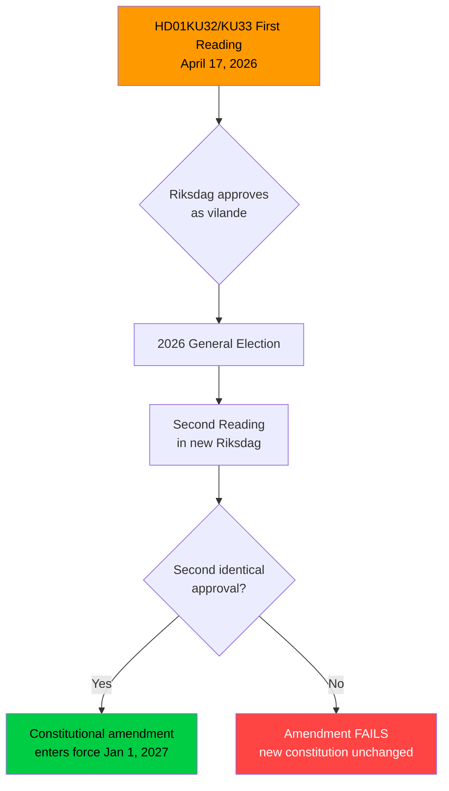

# Document Intelligence Analysis: HD01KU32 & HD01KU33

**HD01KU32** - Tillgänglighetskrav för vissa medier (Betänkande 2025/26:KU32)  
**HD01KU33** - Insyn i handlingar som inhämtas genom beslag och kopiering vid husrannsakan (Betänkande 2025/26:KU33)  
**Committee**: Konstitutionsutskottet (KU)  
**Date**: 2026-04-17  
**Significance Score**: 7/10

---

## 1. Political Significance

Both HD01KU32 and HD01KU33 represent **constitutional amendments** (grundlagsändringar) to the Tryckfrihetsförordningen (TF - Freedom of the Press Act) and/or Yttrandefrihetsgrundlagen (YGL - Fundamental Law on Freedom of Expression). These are among the most significant legislative acts possible in Sweden's constitutional framework.

**Constitutional requirement**: Under Chapter 8 of the Swedish Instrument of Government, changes to any of Sweden's four fundamental laws require:
1. A vote in one Riksdag (with simple majority sufficient)
2. A general election must take place
3. A second identical vote in the newly elected Riksdag

This is the FIRST of the two required readings. The final adoption will come after the 2026 elections.

### HD01KU32: Media Accessibility Requirements
- Enables accessibility requirements (for people with disabilities) to be imposed through ordinary legislation on products/services covered by fundamental law protection (e-books, e-commerce, broadcasting)
- Expands scope for mandatory content accessibility features (captions, audio descriptions) beyond public service broadcasters
- Implements EU accessibility directive obligations
- Political framing: disability rights + EU compliance

### HD01KU33: Search & Seizure Digital Materials
- Removes the status of "public record" (allmän handling) from digital materials seized during police searches (husrannsakan)
- Applies to: digital recordings seized, copied, or taken over during criminal investigations
- **Exception**: if a seized recording is incorporated into the investigation as evidence, it retains public record status
- Effective date proposed: January 1, 2027 (pending second reading after election)
- Purpose: balance investigative integrity vs. press freedom/transparency

---

## 2. Political Analysis — Constitutional Amendments

---

## 3. SWOT Analysis

| Category | HD01KU32 (Accessibility) | HD01KU33 (Search/Seizure) |
|----------|------------------------|--------------------------|
| **Strength** | EU compliance; disability rights | Improved investigative integrity |
| **Weakness** | May limit fundamental law protections | Risk of limiting press transparency |
| **Opportunity** | More accessible digital media market | More effective criminal investigations |
| **Threat** | Constitutional risk if overreach | Chilling effect on whistleblowers |

---

## 4. Stakeholder Perspectives

| Stakeholder | HD01KU32 | HD01KU33 |
|-------------|---------|---------|
| **KU (proposing)** | Supports EU compliance | Supports police effectiveness |
| **Press/Media** | Mixed: supports accessibility, wary of precedent | Concerned — limits public access to seized materials |
| **Civil liberties** | Supportive — disability access | Critical — restricts transparency |
| **Government/Police** | Neutral/positive | Strongly supportive |
| **EU institutions** | Strongly supportive | Neutral |

---

## 5. Evidence Table

| Claim | Source | Confidence | Impact |
|-------|--------|-----------|--------|
| KU proposes first reading of constitutional amendments | HD01KU32, HD01KU33 summaries | HIGH | HIGH — constitutional change |
| Changes require two readings across election | HD01KU32/33 summaries explicitly state this | HIGH | Context |
| HD01KU33: seized digital materials not public records | HD01KU33 summary | HIGH | MEDIUM — press freedom implications |
| HD01KU32: e-books/e-commerce accessibility | HD01KU32 summary | HIGH | MEDIUM — EU compliance |
| Effective date Jan 1, 2027 (conditional) | Both summaries | HIGH | Timeline |

---

## 6. Cross-References

- Sweden's Tryckfrihetsförordningen (1766, world's oldest freedom of the press law)
- EU Accessibility Act (European Accessibility Act 2019)
- Sweden's 2022 constitutional amendments (last major constitutional changes)
