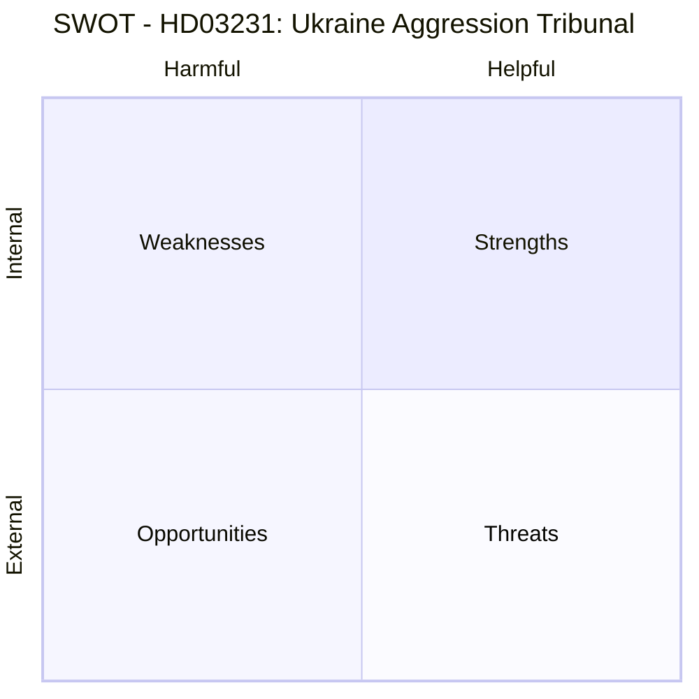

# Document Intelligence Analysis: HD03231

**Title**: Sveriges anslutning till den utvidgade partiella överenskommelsen för den särskilda tribunalen för aggressionsbrottet mot Ukraina  
**Type**: Proposition (Prop. 2025/26:231)  
**Date**: 2026-04-16  
**Department**: Utrikesdepartementet  
**Minister**: Maria Malmer Stenergard (M)  
**Countersigned by**: PM Ulf Kristersson  
**Significance Score**: 9/10

---

## 1. Political Significance

Sweden formally proposes to become a **founding member** of the Special Tribunal for the Crime of Aggression against Ukraine. This is the first criminal tribunal established since the Nuremberg trials specifically to prosecute the **crime of aggression** (the "crime against peace"). The tribunal will be seated in The Hague and will have jurisdiction to prosecute Russian political and military leaders responsible for the illegal invasion of Ukraine.

Key developments:
- Sweden has been part of the core working group since Russia's full-scale invasion in February 2022
- In March 2026, Sweden was among the first states to sign the letter of intent
- Through this proposition, Sweden would become a founding member of the Expanded Partial Agreement (EPA)
- The tribunal operates under the Council of Europe framework

**FM Stenergard's statement** (direct quote): *"Ryssland måste ställas till svars för sitt aggressionsbrott mot Ukraina. Annars riskerar vi en värld där anfallskrig lönar sig. Sverige tar nu nästa steg för att ansluta sig till en särskild tribunal för att åtala och döma ryska politiska och militära ledare för aggressionsbrottet, något som inte skett sedan Nürnbergrättegångarna."*

---

## 2. Analytical Framework — Six Lenses

### 2.1 Constitutional/Legal Lens
- The proposition requires parliamentary approval (riksdagen vote)
- Sweden joining an international agreement entailing jurisdictional obligations requires statutory authorization
- The tribunal's jurisdiction covers the crime of aggression as defined under international law
- Potential legal immunities for sitting heads of state remain a contested issue in international criminal law

### 2.2 Electoral/Political Lens
- **Coalition position**: M-KD-L government with SD parliamentary support — all likely supportive given Sweden's strong pro-Ukraine consensus across party lines
- **Opposition**: S (Social Democrats), V (Left Party), MP (Green Party) all expected to support
- **Risk of opposition**: V may raise concerns about Swedish neutrality traditions, but has consistently supported Ukraine
- **SD**: Despite nationalist positioning, SD has broadly supported Ukraine aid; unlikely to oppose
- **Political consensus**: This is one of the rare policy areas with all-party support in Sweden

### 2.3 Geopolitical/Security Lens
- Sweden (NATO member since March 2024) deepening commitment to rules-based international order
- Message to Russia: military aggression has legal consequences
- The tribunal complements the ICC's existing jurisdiction but fills a specific gap: the ICC cannot currently try sitting heads of state for aggression due to the Assembly of States Parties limitation
- This creates a parallel track: ICC for war crimes/crimes against humanity, Special Tribunal for the crime of aggression itself
- Connects to Sweden's broader Ukraine policy package (military aid, sanctions, reconstruction)

### 2.4 Historical Lens
- First tribunal specifically targeting crime of aggression since the International Military Tribunal at Nuremberg (1945-1946) and Tokyo (1946-1948)
- Nuremberg comparison is explicit in FM Stenergard's statement — politically deliberate framing
- This represents a significant evolution of international criminal law since the Rome Statute (1998)
- Sweden's role: early advocate, founding member — enhances Sweden's reputation as champion of international law

### 2.5 Economic/Fiscal Lens
- Financial contributions to the tribunal expected (assessed contributions under Council of Europe framework)
- Sweden's contribution amount not specified in proposition summary, but likely in SEK tens of millions annually
- Cost-benefit: limited direct fiscal impact vs. significant signaling value
- Reparations mechanism (HD03232) has potentially much larger financial implications for Russia

### 2.6 Risk Assessment Lens
- **Diplomatic risk**: Russia has explicitly condemned the tribunal; Sweden's membership may invite further Russian pressure/retaliation
- **Legal risk**: Questions about tribunal's effectiveness if key states (US, China, Russia) refuse to participate
- **Domestic risk**: Very low — strong cross-party consensus
- **Reputational risk**: LOW — enhances Sweden's international standing

---

## 3. SWOT Analysis

| Category | Entry | Evidence |
|----------|-------|---------|
| **Strength** | Historic leadership — founding member status | Sweden among first signatories Mar 2026 (HD03231 summary) |
| **Strength** | Cross-party consensus in Riksdag | All 8 parties historically supported Ukraine; no opposition expected |
| **Strength** | NATO alignment — demonstrates rules-based commitment | Consistent with Sweden's post-NATO accession foreign policy (March 2024) |
| **Weakness** | Tribunal effectiveness dependent on non-member cooperation | US, China not expected to join; limits enforcement capacity |
| **Weakness** | No guarantee Russia will accept or comply | Russia has rejected ICC jurisdiction historically |
| **Opportunity** | Sets global precedent for criminalizing wars of aggression | Closes the Nuremberg gap in modern international criminal law |
| **Opportunity** | Strengthens Sweden's position in international institutions | Enhanced credibility as champion of international law |
| **Threat** | Russian diplomatic/cyber retaliation | Russia has targeted Swedish infrastructure and institutions since 2022 |
| **Threat** | Geopolitical complication if US withdraws from multilateralism | Changes in US foreign policy could undermine tribunal's legitimacy |

---

## 4. Stakeholder Perspectives

| Stakeholder | Position | Evidence / Rationale |
|-------------|----------|---------------------|
| **Government (M/KD/L)** | Strong support — proposing legislation | PM Kristersson + FM Stenergard countersigned HD03231 |
| **SD** | Expected support — follows Ukraine consensus | SD has generally supported Ukraine measures despite Russia-skeptic domestic base |
| **Social Democrats (S)** | Strong support — Ukraine solidarity is bipartisan | S led Sweden's initial Ukraine response 2022-2022 |
| **V (Left)** | Support with potential sovereignty concerns | V has consistently voted for Ukraine aid packages |
| **MP (Greens)** | Strong support — international law advocates | Consistent pro-international law position |
| **Ukrainian Government** | Strongly supportive — convention signed with Zelensky Dec 2025 | Convention adopted at diplomatic conference in The Hague, Dec 16, 2025 |
| **Russia** | Hostile — has condemned all accountability mechanisms | Russia has refused ICC jurisdiction, will refuse this tribunal |
| **Council of Europe / EU** | Supportive — Council of Europe is the framework body | Agreement between Ukraine and Council of Europe signed 2025 |
| **International Criminal Court (ICC)** | Complementary — fills gap in ICC's aggression jurisdiction | ICC's aggression jurisdiction limited post-2017 amendment |
| **Civil Society** | Strongly supportive — war crimes accountability advocates | Swedish civil society has been vocal in Ukraine support |

---

## 5. Evidence Table

| Claim | Source | Confidence | Impact |
|-------|--------|-----------|--------|
| Sweden joining tribunal as founding member | HD03231 proposition | HIGH | Major — international law precedent |
| Tribunal seated at The Hague | HD03231 summary + press release | HIGH | Medium — operational detail |
| March 2026: Sweden signed letter of intent | Press release (Stenergard) | HIGH | Context — timeline |
| First aggression tribunal since Nuremberg | FM Stenergard quote | HIGH | HIGH — historical significance |
| Convention adopted Dec 16, 2025 with Zelensky | Press release | HIGH | Context |
| Sweden part of core group since Feb 2022 | Press release | HIGH | Context — Sweden's role |

---

## 6. Cross-References

- **HD03232**: Companion proposition — International Compensation Commission for Ukraine (reparations mechanism)
- **NATO accession** (March 2024): Context — Sweden's international security positioning
- **Sweden's military aid to Ukraine**: Prior propositions throughout 2024-2025
- **ICC Aggression jurisdiction**: Rome Statute amendment (2017); limited by Assembly of States Parties
- **Nuremberg Tribunal** (1945): Historical precedent explicitly invoked by FM Stenergard
