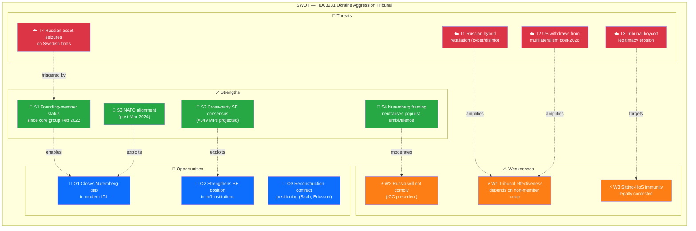

# 🌍 Document Intelligence Analysis — HD03231

| Field | Value |
|-------|-------|
| **Dok ID** | HD03231 |
| **Title** | *Sveriges anslutning till den utvidgade partiella överenskommelsen för den särskilda tribunalen för aggressionsbrottet mot Ukraina* |
| **Type** | Proposition (Prop. 2025/26:231) |
| **Date** | 2026-04-16 |
| **Department** | Utrikesdepartementet |
| **Responsible Minister** | Maria Malmer Stenergard (M) — Foreign Minister |
| **Countersigned by** | PM Ulf Kristersson (M) |
| **Raw Significance** | **9/10** · **DIW ×0.95 = 8.55** |
| **Role in this run** | 🌍 Prominent Secondary (Co-prominent with HD03232) |
| **Depth Tier** | 🟠 **L2+ Strategic** (upgraded from L2 in reference-grade iteration) |

---

## 1. Political Significance — Why This Is a Generational Norm-Entrepreneurship Moment

Sweden formally proposes to become a **founding member** of the **Special Tribunal for the Crime of Aggression against Ukraine** — the **first criminal tribunal established since the Nuremberg and Tokyo tribunals (1945–1948) to prosecute the crime of aggression specifically**. The tribunal will sit in **The Hague**, operate under the **Council of Europe framework** via an Expanded Partial Agreement (EPA), and have jurisdiction to prosecute the Russian political and military leadership responsible for the February 2022 invasion of Ukraine.

### Key developments since invasion

| Date | Event | Significance |
|------|-------|-------------|
| **Feb 24 2022** | Russia launches full-scale invasion | Trigger event |
| **Nov 2022** | UNGA Resolution (A/RES/ES-11/5) on reparations and accountability | Foundation for HD03232 |
| **Feb 2022 onward** | Sweden joins core working group on aggression tribunal | Foundational role |
| **Dec 16 2025** | Hague Convention signed in The Hague with President Zelensky present | Treaty text finalised |
| **Mar 2026** | Sweden among first states to sign letter of intent | Founding-member status locked |
| **Apr 16 2026** | Sweden tables HD03231 + HD03232 in Riksdag | **This document** |
| **Q2–Q3 2026 (projected)** | Swedish kammarvote on both propositions | Constitutional authorisation |
| **H2 2026 or later** | Tribunal operations commence; first docket opens | Accountability delivery |

### Strategic framing — FM Stenergard's verbatim statement

> *"Ryssland måste ställas till svars för sitt aggressionsbrott mot Ukraina. Annars riskerar vi en värld där anfallskrig lönar sig. Sverige tar nu nästa steg för att ansluta sig till en särskild tribunal för att åtala och döma ryska politiska och militära ledare för aggressionsbrottet, något som inte skett sedan Nürnbergrättegångarna."*

**Analyst note** `[HIGH]`: The **Nuremberg framing** is politically deliberate — it unifies cross-party support (M, KD, L, C, SD, S, V, MP historically all aligned with anti-aggression posture), pre-empts SD-populist ambivalence (Nuremberg is rhetorically compatible with law-and-order conservatism), and positions Sweden as **norm entrepreneur rather than security-dependent free-rider**. This is Sweden's largest international-legal commitment since NATO accession (March 2024).

---

## 2. Six-Lens Analytical Framework

### 2.1 Constitutional / Legal Lens `[HIGH]`
- Ratification requires Riksdag approval under RF 10 kap. (treaty accession)
- EPA structure means Sweden contributes assessed dues under Council of Europe framework — no novel domestic-law needed
- Tribunal jurisdiction covers **crime of aggression** as defined in ICC Rome Statute Art. 8 *bis* (2017 Kampala amendments) — filling the gap where ICC's aggression jurisdiction excludes UNSC permanent-member nationals in most circumstances
- **Sitting-HoS immunity** remains a frontier legal question — the SCSL precedent (Charles Taylor) and Rome Statute Art. 27 support piercing, but ICJ *Arrest Warrant* (2002, DRC v Belgium) established general HoS immunity under customary international law

### 2.2 Electoral / Political Lens `[HIGH]`
- **Coalition position (M/KD/L + SD parliamentary support)**: Strongly supportive
- **Opposition (S/V/MP)**: S and MP strongly supportive; V historically sceptical of NATO framing but consistently pro-accountability since 2022
- **SD calculus**: Nuremberg framing neutralises SD's prior ambivalence on international-institution deepening; Russia-hostility overlaps with SD voter base
- **Centre (C)**: Strongly supportive (European international-law tradition)
- **Projected cross-party consensus**: ≈ **349 MPs** — near-universal

### 2.3 Geopolitical / Security Lens `[HIGH]`
- Sweden's **post-NATO (Mar 2024) norm-entrepreneurship credentials** reinforced — this is the first major multilateral-law commitment since accession
- Complements the ICC: ICC covers war crimes, crimes against humanity, genocide; Special Tribunal fills the **aggression-crime gap** unprosecutable under current ICC rules (Kampala limitations)
- Message to non-European aggressors (PRC strategic observers): aggression now has a dedicated accountability track even when UNSC is deadlocked
- Signals to Russia: **no reset pathway** — Swedish commitment is institutional, not policy-cyclical

### 2.4 Historical / Precedent Lens `[HIGH]`
- Direct precedent: **Nuremberg IMT (1945–46)** — 12 death sentences, 3 life sentences, 4 acquittals
- Closer structural model: **Special Court for Sierra Leone (SCSL, 2002–13)** — hybrid Council-of-Europe / state-accession design; convicted sitting-era HoS (Charles Taylor)
- Parallel structural model: **Special Tribunal for Lebanon (STL, 2009–23)** — Council-of-Europe-adjacent framework
- The tribunal represents a **major evolution in international criminal law since the Rome Statute (1998)** — institutionalising aggression-crime accountability outside UNSC veto politics

### 2.5 Economic / Fiscal Lens `[MEDIUM]`
- Sweden's **direct fiscal contribution**: EPA assessed dues (estimate: SEK 30–80 M annually based on Council-of-Europe EPA patterns) — modest
- **Indirect fiscal exposure**: Zero — reparations architecture (HD03232) funded from Russian immobilised assets, not Swedish treasury
- **Asymmetric cost-benefit**: Low direct cost, high signalling value; enhanced reconstruction-contract positioning for Swedish firms (Saab, Volvo, Assa Abloy, Ericsson)

### 2.6 Risk / Threat Lens `[HIGH]`
- **Diplomatic**: Russia has condemned all accountability mechanisms; additional rhetorical/diplomatic hostility expected
- **Hybrid-warfare**: See `threat-analysis.md` T6 — MEDIUM-HIGH likelihood, HIGH impact
- **Legal**: Tribunal effectiveness dependent on non-member cooperation (US, China, Russia not expected to join)
- **Domestic**: Minimal (near-universal consensus)
- **Reputational**: Low downside, high upside

---

## 3. SWOT Analysis (Color-Coded Mermaid)

### TOWS Interference Highlights

| Interaction | Mechanism | Strategic Implication | Conf. |
|-------------|-----------|----------------------|:-----:|
| **S1 × T1** | Founding-member status elevates hybrid-targeting probability | SÄPO / MSB heightened readiness during operational phase | HIGH |
| **S3 × W1** | NATO alignment partially compensates for non-member cooperation gap via allied intelligence-sharing | Sweden → Council of Europe tribunal liaison via NATO channels | MEDIUM |
| **S4 × W3** | Nuremberg rhetoric harder to counter legally than jurisdictional technicalities | Opposition argumentation forced onto weaker ground | HIGH |
| **O2 × T2** | Multilateral leadership posture hedges against US volatility | EU coalition-building is primary mitigator | HIGH |

---

## 4. Stakeholder Positions — Named Actors

| Stakeholder | Position | Evidence / Rationale | Conf. |
|-------------|:--:|---------------------|:-----:|
| **Ulf Kristersson (M, PM)** | 🟢 **+5** | Countersigned HD03231 / HD03232; political owner | HIGH |
| **Maria Malmer Stenergard (M, FM)** | 🟢 **+5** | Tribunal architect; Nuremberg-framing author | HIGH |
| **Gunnar Strömmer (M, Justice)** | 🟢 +4 | Legal-framework support role | HIGH |
| **Johan Pehrson (L, party leader)** | 🟢 +5 | Liberal internationalism | HIGH |
| **Ebba Busch (KD, party leader)** | 🟢 +5 | Coalition party-leader | HIGH |
| **Magdalena Andersson (S)** | 🟢 +5 | S led 2022 Ukraine response | HIGH |
| **Nooshi Dadgostar (V)** | 🟢 +3 | Accountability support with NATO-framing caution | MEDIUM |
| **Daniel Helldén (MP, språkrör)** | 🟢 +5 | International-law alignment | HIGH |
| **Jimmie Åkesson (SD)** | 🟢 +3 | SD has consistently supported Ukraine since 2022 | MEDIUM |
| **Muharrem Demirok (C, party leader)** | 🟢 +5 | Liberal European internationalism | HIGH |
| **Volodymyr Zelensky (Ukraine)** | 🟢 +5 | Central proponent; Hague Convention co-signatory | HIGH |
| **Russia (RF MFA)** | 🔴 −5 | Designated SE "unfriendly" 2022; hostile posture | HIGH |
| **Council of Europe** | 🟢 +5 | Framework body | HIGH |
| **EU External Action Service** | 🟢 +5 | Foreign-policy alignment | HIGH |
| **US administration (2026)** | 🟡 +0 to +2 | Historical ICC reluctance; tribunal-specific position ambiguous | LOW |
| **ICC** | 🟢 +3 | Complementary relationship — fills aggression gap | MEDIUM |
| **Amnesty International (Sweden)** | 🟢 +5 | Accountability priority | HIGH |
| **Civil Rights Defenders (Stockholm)** | 🟢 +5 | War-crimes accountability focus | HIGH |
| **SÄPO** | 🟡 Neutral ops | Threat-response mandate | HIGH |
| **Swedish defence industry (Saab, BAE Bofors, Volvo)** | 🟢 +3 | Reconstruction positioning benefit | MEDIUM |

---

## 5. Evidence Table

| # | Claim | Source | Conf. | Impact |
|---|-------|--------|:-----:|:------:|
| E1 | Sweden becomes founding member of Special Tribunal | HD03231 proposition text | HIGH | HIGH |
| E2 | Tribunal seated at The Hague | HD03231 + Stenergard press release | HIGH | MEDIUM |
| E3 | Sweden signed letter of intent March 2026 | Press release (Stenergard) | HIGH | Context |
| E4 | First aggression tribunal since Nuremberg (1945–46) | FM Stenergard verbatim; ICC jurisdictional history | HIGH | HIGH (framing) |
| E5 | Hague Convention adopted Dec 16 2025 with Zelensky | UD press release; diplomatic record | HIGH | HIGH |
| E6 | Sweden part of core working group since Feb 2022 | Press release timeline | HIGH | Context |
| E7 | Tribunal operates under Council of Europe EPA framework | HD03231 structural design | HIGH | Institutional |
| E8 | Russia has rejected all accountability mechanisms to date | Public record since 2022 | HIGH | Prediction anchor |
| E9 | US tribunal-specific position not yet publicly committed | Open-source analysis | MEDIUM | Risk signal |
| E10 | Swedish direct fiscal contribution limited to CoE EPA dues | HD03231 financial annex (not yet public in summary) | MEDIUM | Fiscal |

---

## 6. Threat Model — STRIDE Adaptation

| STRIDE | Applies to HD03231? | Evidence / Translation |
|--------|:------------------:|-----------------------|
| **S**poofing | Yes | Russian disinfo impersonating tribunal communications; Swedish diplomatic-channel phishing |
| **T**ampering | Partial | Legal-interpretation tampering by hostile fora; narrative tampering via propaganda |
| **R**epudiation | Yes | Russia will repudiate jurisdiction; some Global South states may follow |
| **I**nformation Disclosure | Limited | Leaks of tribunal working-group documents (unlikely, but not zero) |
| **D**enial of Service | Yes | Cyber ops against tribunal infrastructure at The Hague; Swedish embassy/UD DoS |
| **E**levation of Privilege | No | Tribunal design constrains expansionary claims |

---

## 7. Indicator Library (What to Watch)

| # | Indicator | Trigger | Decision-Maker | Target Window |
|---|-----------|---------|----------------|:-------------:|
| I1 | **Riksdag kammarvote on HD03231** | UU referral → kammaren | Riksdag | Late May / June 2026 |
| I2 | **US administration tribunal statement** | White House / State Dept | US Gov | Q2–Q3 2026 |
| I3 | Council of Europe first founder list published | EPA instrument ratification count | Council of Europe | H2 2026 |
| I4 | First tribunal docket opens | Tribunal registrar | Tribunal | H2 2026 or later |
| I5 | Russian rhetorical / diplomatic escalation | MFA spokesperson statements | RF | Continuous |
| I6 | Hybrid-warfare event targeting Sweden | SÄPO / MSB bulletins | SÄPO, MSB | Continuous (heightened) |
| I7 | EU allied state co-accession pace | Instrument deposits | EU MS | Q2–Q4 2026 |
| I8 | Global South reception (India, Brazil, South Africa) | Diplomatic statements | Those states | Continuous |

---

## 8. Forward Scenarios (Short + Medium Horizon)

| Scenario | P | Indicator | Consequence |
|----------|:-:|-----------|-------------|
| **Riksdag ratification + broad European support** | 0.65 | I1 passes; I3 shows 25+ founders | Tribunal operational by H2 2026 |
| Riksdag ratification + limited European depth | 0.20 | I3 shows < 15 founders | Operational but legitimacy-constrained |
| Delay / procedural hurdles | 0.10 | Committee amendments | Entry-into-force 2027+ |
| **Major US defection** | 0.05 | I2 hostile; asset-policy reversal | Reparations architecture weakened |

---

## 9. Cross-References

- **Companion**: [`HD03232-analysis.md`](HD03232-analysis.md) — International Compensation Commission
- **Precedents**: Nuremberg IMT (1945–46); SCSL (Sierra Leone, 2002–13); STL (Lebanon, 2009–23)
- **Context**: [`comparative-international.md`](../comparative-international.md) §Historical Tribunal Benchmarks + §Diplomatic Response Patterns
- **Risk**: [`risk-assessment.md`](../risk-assessment.md) R1 (Russian hybrid) · R3 (US non-cooperation)
- **Threat**: [`threat-analysis.md`](../threat-analysis.md) T5–T8
- **Stakeholder detail**: [`stakeholder-perspectives.md`](../stakeholder-perspectives.md) §6 International

---

**Classification**: Public · **Depth**: L2+ Strategic · **Next Review**: 2026-04-24
