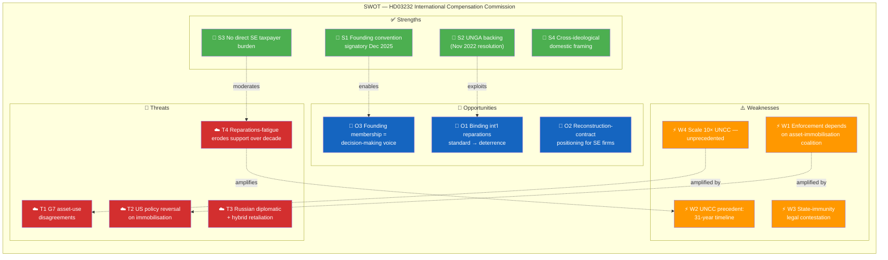
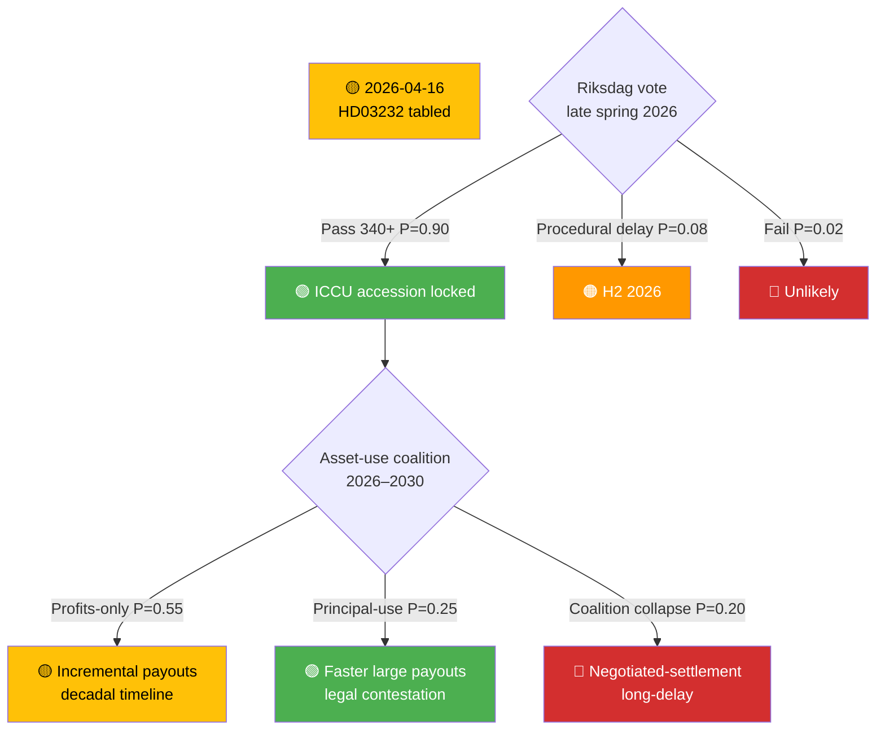

# 🤝 Document Intelligence Analysis — HD03232

| Field | Value |
|-------|-------|
| **Dok ID** | HD03232 |
| **Title** | *Sveriges tillträde till konventionen om inrättande av en internationell skadeståndskommission för Ukraina* |
| **Type** | Proposition (Prop. 2025/26:232) |
| **Date** | 2026-04-16 |
| **Department** | Utrikesdepartementet |
| **Responsible Minister** | Maria Malmer Stenergard (M) — Foreign Minister |
| **Countersigned by** | PM Ulf Kristersson (M) |
| **Raw Significance** | **8/10** · **DIW ×0.95 = 7.60** |
| **Role in this run** | 🤝 Prominent Secondary (Co-prominent with HD03231) |
| **Depth Tier** | 🟠 **L2+ Strategic** |

---

## 1. Political Significance — Reparations Architecture for the Largest Inter-State Compensation Claim Since WWII

Sweden proposes to accede to the convention establishing an **International Compensation Commission for Ukraine** (the "Hague Compensation Commission" / ICCU). The commission is the institutional mechanism through which **Russia can be held financially liable for the full-scale damages caused by its illegal invasion**. It is the **companion instrument** to HD03231 (Special Tribunal) — together they constitute the Ukraine accountability architecture: **criminal accountability of individuals** (tribunal) + **financial accountability of the state** (commission).

### Origins and foundation

| Date | Event | Significance |
|------|-------|-------------|
| **Feb 24 2022** | Russia launches full-scale invasion | Damages begin accumulating |
| **Nov 14 2022** | UNGA Resolution A/RES/ES-11/5 on reparations | Political foundation |
| **May 2023** | Council of Europe Register of Damage established in The Hague | Claims-registration pre-commission |
| **2024** | World Bank RDNA3 estimates USD 486B+ damages (continues to grow) | Scale anchor |
| **Jan 2025** | G7 Ukraine Loan mechanism launches (profits from immobilised Russian assets) | Precursor asset-use architecture |
| **Dec 16 2025** | Hague Convention adopted at diplomatic conference (Zelensky present) | Treaty finalised |
| **Apr 16 2026** | Sweden tables HD03232 | **This document** |
| **H2 2026 – H1 2027** | Projected commission operational start | Claims-adjudication phase |

### Strategic framing — FM Stenergard's statement

> *"Genom skadeståndskommissionen kan Ryssland hållas ansvarigt för de skador som dess folkrättsvidriga handlingar har orsakat. Det ukrainska folket måste få upprättelse."*

**Analyst note** `[HIGH]`: The **"upprättelse" (vindication/restoration)** framing is doctrinally important — it positions the commission within the **ius cogens reparations doctrine** (state responsibility for internationally wrongful acts) rather than as mere transactional transfer. This distinguishes ICCU from G7-profit distribution and grounds it in customary international law.

---

## 2. Six-Lens Analytical Framework

### 2.1 Constitutional / Legal Lens `[HIGH]`
- Riksdag approval required for treaty accession (RF 10 kap.)
- ICCU is a **treaty-based international organisation** with claims-registration → adjudication → awards → enforcement pipeline
- **Critical legal question**: enforcement mechanism. Options:
  1. **Asset-repurposing**: Transfer of Russian immobilised sovereign assets (EUR 260B+; EUR 191B at Euroclear Belgium) — legally contested under **state immunity** (UN Convention on Jurisdictional Immunities of States)
  2. **Profits-only distribution**: Ongoing G7 approach — 0.5–3% annual yield on immobilised assets
  3. **Post-settlement negotiation**: Part of future peace-settlement package
- Sweden's accession locks in Swedish **voice in enforcement-mechanism selection**

### 2.2 Electoral / Political Lens `[HIGH]`
- **Consensus issue**: Same near-universal support as HD03231 (≈349 MPs projected)
- **Populist-positive framing**: "Russia pays, not Swedish taxpayers" — aligns with SD, C, M, KD messaging
- **Progressive framing**: UN-backed mechanism, international law, victim restoration — aligns with S, V, MP, C messaging
- **Rare cross-ideological policy**: Both left and right can champion without compromise
- Expected Riksdag vote: late spring / early summer 2026

### 2.3 Geopolitical / Security Lens `[HIGH]`
- Reparations mechanism designed to **complement** the tribunal (criminal accountability) with **structural financial accountability**
- **Immobilised Russian sovereign assets (≈ EUR 260B)**: The primary source contemplated. Distribution:
  - **EUR 191B** at Euroclear (Belgium) — the largest single concentration
  - EUR 25–30B in G7 + Switzerland + Canada
  - Balance distributed across EU member states
- G7 Ukraine Loan (Jan 2025) uses **profits** from immobilised assets — this is the first institutional use; HD03232 potentially extends to principal use
- Sweden's membership strengthens its voice in how the mechanism handles asset-use decisions — particularly **EU-internal cleavage** between asset-seizure hawks (Poland, Baltic states, Finland) and state-immunity cautious (Germany, France, Belgium)

### 2.4 Historical / Precedent Lens `[HIGH]`
- **Most direct precedent: UN Compensation Commission (UNCC) for Iraq/Kuwait, 1991–2022**
  - Paid out ≈ USD 52.4B over **31 years**
  - Funded from 5–30% of Iraqi oil-export revenues (UNSC Res 687/705/1956)
  - Processed 2.7M claims
  - **Lesson**: Decadal timeline, political sustainability challenges, but ultimately delivered
- **Post-WWII German reparations**: Multiple tracks (Versailles-revisited, bilateral agreements, forced-labour fund); provide institutional templates
- **Iran–US Claims Tribunal (1981–)**: Algiers Accords model; still active after 40+ years
- Ukraine damages (USD 486B+ World Bank 2024) are ≈ 10× the Iraq–Kuwait figure — **unprecedented scale**

### 2.5 Economic / Fiscal Lens `[HIGH]`
- **Sweden's own contribution to ICCU**: Administrative costs only (modest — SEK 10–40M annually estimate based on analogous UN/CoE administrative commissions)
- **Reparations fund source**: Russian state (immobilised assets + future Russian obligations) — **not Swedish taxpayers**
- **Total damages (World Bank RDNA3, 2024)**: USD 486B+; continues to rise
- **Swedish indirect upside**: Reconstruction-contract positioning for Swedish firms (Skanska, NCC, Peab, ABB Sweden, Ericsson, Volvo Construction Equipment) — early-accession status strengthens lobbying position
- **Fiscal risk**: Zero direct exposure; indirect exposure only if Sweden later contributes to bridging financing (political choice)

### 2.6 Risk / Threat Lens `[HIGH]`
- **Legal**: Russia will refuse participation; enforcement depends on asset-repurposing coalition sustainability
- **Diplomatic**: Russian retaliation parallel to HD03231
- **Political (in Sweden)**: Very low (consensus)
- **Long-term**: Decadal timeline risk — UNCC precedent is 31 years
- **Institutional**: Commission bureaucracy may under-deliver relative to claim volume
- **Coalition**: G7 disagreements on asset-use could undermine funding

---

## 3. SWOT Analysis (Color-Coded Mermaid)

### TOWS Interference Highlights

| Interaction | Mechanism | Strategic Implication | Conf. |
|-------------|-----------|----------------------|:-----:|
| **S3 × T4** | Zero-taxpayer framing inoculates against Swedish reparations-fatigue | Narrative discipline: keep "Russia pays" in public messaging | HIGH |
| **W4 × O2** | Unprecedented-scale claims → unprecedented-scale reconstruction contracts | Industrial strategy opportunity — Swedish firms should prepare | HIGH |
| **W1 × T2** | Compound coalition-fragility risk | Nordic + EU + UK axis critical as US hedge | HIGH |
| **S1 × O3** | Founding membership locks in decision-making voice through decadal timeline | Institutional persistence pays off across political cycles | MEDIUM |

---

## 4. Stakeholder Positions — Named Actors

| Stakeholder | Position | Evidence / Rationale | Conf. |
|-------------|:--:|---------------------|:-----:|
| **Ulf Kristersson (M, PM)** | 🟢 **+5** | Countersigned HD03232 | HIGH |
| **Maria Malmer Stenergard (M, FM)** | 🟢 **+5** | Champion; signed Dec 2025 Hague Convention | HIGH |
| **Elisabeth Svantesson (M, Finance Minister)** | 🟢 +4 | Fiscal framing support | HIGH |
| **Johan Pehrson (L, party leader)** | 🟢 +5 | Liberal internationalism | HIGH |
| **Ebba Busch (KD, party leader)** | 🟢 +5 | Coalition support | HIGH |
| **Magdalena Andersson (S)** | 🟢 +5 | Former PM; led 2022 Ukraine response | HIGH |
| **Jimmie Åkesson (SD)** | 🟢 +3 | "Russia pays" framing aligns with SD messaging | MEDIUM |
| **Nooshi Dadgostar (V, party leader)** | 🟢 +4 | Accountability support | HIGH |
| **Daniel Helldén (MP)** | 🟢 +5 | International-law focus | HIGH |
| **Volodymyr Zelensky (Ukraine)** | 🟢 +5 | Central proponent | HIGH |
| **G7 finance ministers** | 🟢 +4 to +5 | G7 Ukraine Loan precedent; varied on principal-use | HIGH |
| **European Commission (von der Leyen)** | 🟢 +4 | Continued asset-immobilisation advocacy | HIGH |
| **Belgian government (Euroclear host)** | 🟡 +1 to +3 | Legal-exposure concerns on principal-use | MEDIUM |
| **German Finance Ministry** | 🟡 +2 | State-immunity caution | MEDIUM |
| **US Treasury** | 🟡 +0 to +3 | Position-dependent on 2026+ administration | LOW |
| **Russia (RF MFA)** | 🔴 −5 | Calls mechanism "illegal" | HIGH |
| **UN Secretary-General** | 🟢 +4 | UNGA resolution author | HIGH |
| **World Bank** | 🟢 +4 | RDNA3 damages-estimate provider | HIGH |
| **ICRC (Geneva)** | 🟡 +2 | Victim-focus alignment; cautious on political frames | MEDIUM |
| **Swedish construction / reconstruction firms** | 🟢 +4 | Long-horizon contract opportunity | MEDIUM |

---

## 5. Evidence Table

| # | Claim | Source | Conf. | Impact |
|---|-------|--------|:-----:|:------:|
| E1 | Hague Convention adopted Dec 16 2025 with Zelensky present | UD press release; diplomatic record | HIGH | HIGH |
| E2 | UNGA Resolution Nov 2022 establishes political basis | A/RES/ES-11/5 | HIGH | Institutional |
| E3 | Sweden signed at Dec 16 2025 conference (founding signatory) | UD; HD03232 | HIGH | HIGH |
| E4 | Total Ukraine damages USD 486B+ | World Bank RDNA3 (2024); continues rising | HIGH | Scale anchor |
| E5 | Immobilised Russian sovereign assets ≈ EUR 260B | EU + G7 reports | HIGH | Funding source |
| E6 | EUR 191B concentrated at Euroclear Belgium | Euroclear disclosures | HIGH | Operational |
| E7 | G7 Ukraine Loan (Jan 2025) uses profits, not principal | G7 communiqué Jan 2025 | HIGH | Precedent |
| E8 | UNCC precedent: USD 52.4B over 31 years | UN records | HIGH | Benchmark |
| E9 | HD03232 is companion to HD03231 (criminal + civil accountability) | HD03231 / HD03232 | HIGH | Architecture |
| E10 | Sweden's direct fiscal contribution limited to administrative costs | HD03232 (inferred; full financial annex pending) | MEDIUM | Fiscal |

---

## 6. Bayesian Path Analysis (Conditional Scenarios)

---

## 7. Indicator Library (What to Watch)

| # | Indicator | Trigger | Decision-Maker | Target Window |
|---|-----------|---------|----------------|:-------------:|
| I1 | **Riksdag kammarvote on HD03232** | UU referral → kammaren | Riksdag | Late May / June 2026 |
| I2 | G7 finance-ministers statement on asset-use architecture | G7 communiqué | G7 FMs | Next summit |
| I3 | Belgian parliament asset-principal legislation | Legislative action | Belgian parliament | Q3–Q4 2026 |
| I4 | First ICCU claim adjudicated | Commission registrar | ICCU | H2 2026 / 2027 |
| I5 | US Treasury asset-policy statement | Public guidance | US Gov | Continuous |
| I6 | Russian diplomatic response (note verbale) | MFA | RF | Continuous |
| I7 | Ukrainian war-damage baseline update | World Bank RDNA4 | World Bank | 2026–2027 |
| I8 | EU member state ratification count | Deposits with depositary | EU MS | H2 2026 |

---

## 8. Scenario Snapshot

| Scenario | P | Key Trigger | Consequence |
|----------|:-:|-------------|-------------|
| **Profits-distribution (baseline)** | 0.55 | Current G7 approach persists | Incremental payouts; decadal timeline; broad legitimacy |
| **Principal-use breakthrough** | 0.25 | Belgian legislative change + G7 coordination | Faster large payouts; heightened legal contestation |
| **Coalition fragility** | 0.15 | US policy shift 2026+ | Reduced asset pool; political fragmentation |
| **Commission stall** | 0.05 | Structural dysfunction | Process-without-delivery failure mode |

---

## 9. Cross-References

- **Companion**: [`HD03231-analysis.md`](HD03231-analysis.md) — Special Tribunal for Aggression
- **Precedents**: UNCC (Iraq–Kuwait, 1991–2022, USD 52.4B over 31 years); Iran–US Claims Tribunal (1981–); Post-WWII German reparations tracks
- **Comparative context**: [`comparative-international.md`](../comparative-international.md) §Historical Compensation-Commission Benchmarks
- **Risk**: [`risk-assessment.md`](../risk-assessment.md) R6 (reparations fatigue) · R8 (Russian asset retaliation)
- **Threat**: [`threat-analysis.md`](../threat-analysis.md) T5–T8
- **Related documents**: Council of Europe Register of Damage (2023); G7 Ukraine Loan (Jan 2025)

---

**Classification**: Public · **Depth**: L2+ Strategic · **Next Review**: 2026-04-24
