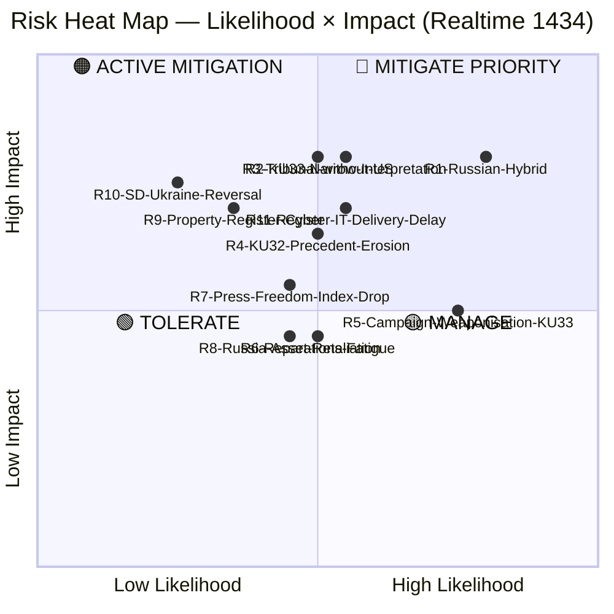
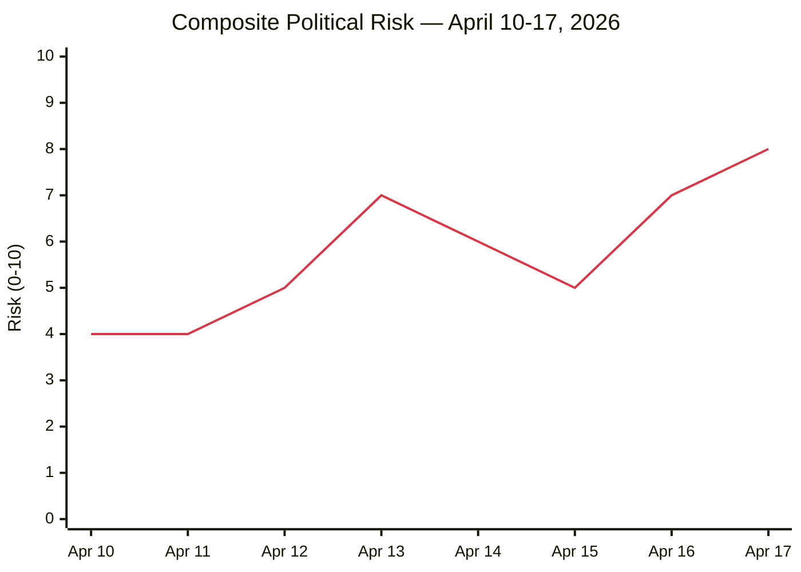
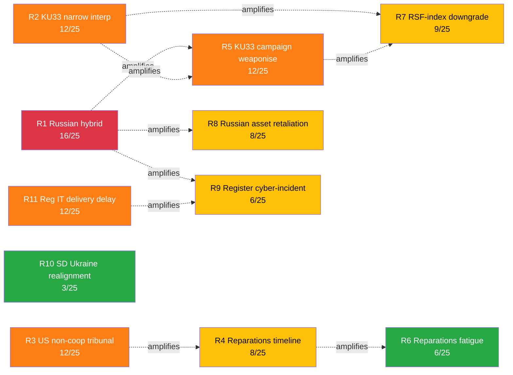

# Risk Assessment — Realtime Monitor 1434

| Field | Value |
|-------|-------|
| **RISK-ID** | RSK-2026-04-17-1434 |
| **Analysis Date** | 2026-04-17 14:34 UTC |
| **Methodology** | `analysis/methodologies/political-risk-methodology.md` v3.0 |
| **Scope** | Constitutional Reforms (PRIMARY) · Ukraine Accountability (SECONDARY) · Housing/AML (TERTIARY) |
| **Validity Window** | Valid until 2026-04-24 |

---

## 🎯 Aggregate Risk Landscape

---

## 🗂️ Risk Register

| Risk ID | Risk Description | Cluster | Likelihood (1-5) | Impact (1-5) | Score | Confidence | Status | Mitigation Owner |
|:-------:|-----------------|:-------:|:----------------:|:------------:|:-----:|:----------:|:------:|------------------|
| **R1** | Russian hybrid retaliation (cyber, disinformation, sabotage) against Sweden as tribunal founding member | Ukraine | 4 | 4 | **16** | HIGH | 🔴 MITIGATE | SÄPO, MSB, NATO StratCom COE |
| **R2** | KU33's "formellt tillförd bevisning" interpretation drifts narrow under a future government — systemic transparency loss | Constitutional | 3 | 4 | **12** | MEDIUM | 🔴 MITIGATE | Lagrådet, KU (legislative history), Riksdag ombudsman |
| **R3** | Tribunal (HD03231) effectiveness collapses if US refuses cooperation | Ukraine | 3 | 4 | **12** | MEDIUM | 🟠 ACTIVE | UD, EU External Action Service, Council of Europe |
| **R4** | KU32's EU-obligation template reused to justify further grundlag compression (digital platforms, AI content, national security) | Constitutional | 3 | 3-4 | **10** | MEDIUM | 🟠 ACTIVE | KU, Riksdag constitutional scholars |
| **R5** | KU33 weaponised in 2026 valrörelse — polarises press freedom into partisan wedge; second-reading coalition fractures | Constitutional | 4 | 3 | **12** | HIGH | 🟠 ACTIVE | Party leaders, party-strategy teams |
| **R6** | Reparations commission (HD03232) takes decades → political fatigue erodes Ukraine support | Ukraine | 3 | 3 | **9** | MEDIUM | 🟡 MANAGE | Commission secretariat, UD |
| **R7** | International press-freedom index (RSF, Freedom House) downgrades Sweden after TF amendments | Constitutional | 3 | 3 | **9** | MEDIUM | 🟡 MANAGE | UD, Sida, press-freedom diplomacy |
| **R8** | Russia seizes assets of Swedish firms in retaliation | Ukraine | 3 | 3 | **9** | MEDIUM | 🟡 MANAGE | Kommerskollegium, EU sanctions policy |
| **R9** | Lantmäteriet register (HD01CU28) IT procurement delayed or suffers data-security breach | Housing | 2 | 4 | **8** | MEDIUM | 🟢 TOLERATE | Lantmäteriet, MSB, Finansdepartementet |
| **R10** | SD reverses Ukraine support in 2026 campaign (populist realignment) | Ukraine | 1-2 | 4 | **7** | LOW | 🟢 TOLERATE | Coalition monitoring, cross-party statesmanship |
| **R11** | Lantmäteriet register (HD01CU28) IT delivery delay or procurement slippage → 2027 rollout misses statutory deadline | Housing | 3 | 4 | **12** | MEDIUM | 🟠 ACTIVE | Lantmäteriet, Finansdepartementet, MSB |
| **R12** | KU32 accessibility implementation cost exceeds impact assessment → business pushback | Constitutional | 2 | 2 | **4** | LOW | 🟢 TOLERATE | MPRT, Näringsdepartementet |

---

## 🔴 Priority Risks (Score ≥ 12) — Deep Dive

### R1 — Russian Hybrid Warfare (Score 16, HIGH Confidence)

**Context**: Russia has conducted hybrid operations against NATO members following Ukraine-support decisions. Sweden's NATO accession (March 2024) combined with founding-member status in the aggression tribunal and reparations commission creates enhanced targeting.

**Evidence**:
- Nordic data-cable sabotage events (Baltic Sea, 2023-2024) `[HIGH]`
- Disinformation campaigns targeting Swedish NATO debates 2022-2024 `[HIGH]`
- Russia's "unfriendly state" designation of Sweden (2022) `[HIGH]`
- Historical pattern: tribunal-supporting states face targeted information operations `[MEDIUM]`

**Trajectory**: Rising. Likelihood increases as Sweden's role shifts from supporter to founder.

**Mitigation status**: NATO Article 5 deterrence, SÄPO reinforcement, MSB civil defence doctrine updates. Below-threshold hybrid operations remain persistent.

**Key indicators to watch**:
- SÄPO annual report (released H1 2026)
- MSB cyber-incident bulletins
- Nordic infrastructure events (cables, power, logistics)

### R2 — KU33 Narrow-Interpretation Entrenchment (Score 12, MEDIUM Confidence)

**Context**: HD01KU33 preserves "allmän handling" status for seized digital material **only** when it is *formellt tillförd bevisning*. The interpretive boundary of "formally incorporated" is **legislatively underspecified** in the public summary. A future government (or shift in prosecutorial practice) could apply a narrow test, functionally shielding large volumes of seized material from offentlighetsprincipen.

**Evidence**:
- HD01KU33 textual analysis — carve-out relies on undefined threshold `[HIGH]`
- Förvaltningsrätt doctrine permits wide administrative discretion absent explicit statutory definition `[MEDIUM]`
- Historical TF narrowings (e.g., 2016 Panama Papers debates) illustrate interpretation drift `[MEDIUM]`

**Why this is a constitutional risk, not merely administrative**: TF is a grundlag. Once narrowed, restoring the original scope requires another two-reading/cross-election constitutional amendment — a decade-scale reversal window.

**Mitigation status**:
- **Pre-vote** (H1 2026): Lagrådet review can scope interpretation; KU committee record can lock legislator intent.
- **Post-vote** (2027-): JO/JK oversight; annual press-freedom reporting; NGO litigation in förvaltningsdomstol.

**Bayesian update trigger**: If Lagrådet yttrande is silent on the interpretive test, update likelihood 3 → 4 (score to 16).

### R3 — Tribunal Effectiveness Without US (Score 12, MEDIUM Confidence)

**Context**: The International Criminal Court illustrates the effectiveness cost of US non-participation. Public US statements on HD03231 have been cautious. The tribunal can still operate as a legitimacy platform and set precedent, but enforcement against high-value defendants becomes dependent on arrest-state cooperation.

**Evidence**:
- ICC experience with 124 states parties, major absences `[HIGH]`
- Recent US reticence on similar jurisdictional innovations `[MEDIUM]`

**Mitigation**: EU coalition-building; Council of Europe framework provides legitimacy backstop; G7 asset-policy coordination.

### R5 — KU33 Campaign Weaponisation (Score 12, HIGH Confidence)

**Context**: V/MP have strong press-freedom commitments and will foreground KU33 in the 2026 campaign. S's leadership has signalled mixed positions — if the S leadership moves against KU33, the second-reading coalition fractures.

**Evidence**:
- V/MP historical voting pattern on grundlag changes `[HIGH]`
- 2026 opinion polling — campaign-issue salience `[MEDIUM]`
- Media commentary projecting press-freedom prominence `[MEDIUM]`

**Mitigation**: Cross-party statesmanship; early Lagrådet yttrande; NGO engagement by government to pre-empt legitimate concerns.

---

## 📉 Risk Trend — 7-Day

**Readings**:
- Apr 13 — Spring budget package elevates fiscal/policy risk
- Apr 16-17 — Ukraine propositions + KU betänkanden compound into highest reading of week

---

## 🔄 Bayesian Update Rules

| Observable Signal | Direction | Risk Affected | Magnitude |
|-------------------|:---------:|:-------------:|:---------:|
| Lagrådet yttrande strict on KU33 | ↓ | R2 | −4 |
| Lagrådet yttrande silent on KU33 interpretation | ↑ | R2 | +4 |
| S-leadership statement supporting KU33 | ↓ | R5 | −3 |
| S-leadership statement opposing KU33 | ↑ | R5 | +3 |
| US public statement supporting HD03231 | ↓ | R3 | −4 |
| Nordic cable-sabotage or cyber event | ↑ | R1 | +2 |
| RSF Sweden score unchanged post-amendment | ↓ | R7 | −2 |

---

## 🧮 Bayesian Prior / Posterior Illustration — Risk R2 (KU33 Narrow Interpretation)

| Step | State | Likelihood Source | Score |
|------|-------|-------------------|:-----:|
| **Prior (today, 2026-04-17)** | Lagrådet pending; interpretation underspecified | Analyst base rate from 2008 FRA-lagen + 2010 TF amendment history | **12 / 25 (HIGH)** |
| Update 1 — Lagrådet strict yttrande | Posterior after strict scoping | P(narrow \| strict) ≈ 0.25 | **8 / 25 (MED)** |
| Update 2 — S-leader pro-KU33 speech | Posterior after centrist-left endorsement | P(narrow \| endorsement) ≈ 0.20 | **5 / 25 (LOW)** |
| Update 1' — Lagrådet silent | Posterior after silent Lagrådet | P(narrow \| silent) ≈ 0.55 | **16 / 25 (CRIT)** |
| Update 2' — V/MP gain > +2pp in polling | Posterior after left-bloc electoral surge | P(narrow \| surge) ≈ 0.40 + KU33 fails 2nd reading | **10 / 25 MED but R5 ↑ 16/25 CRIT** |

> **Interpretation** `[HIGH]`: Risk R2 is **most sensitive to Lagrådet yttrande content**. The expected posterior after strict yttrande drops R2 by 4 points; silent yttrande raises R2 by 4 points. This makes the Lagrådet yttrande the single most consequential upcoming monitoring indicator — it can move a risk by ± 33% of its scale in a single trigger.

---

## 🕸️ Risk Interconnection Graph

**Compound-risk findings** `[HIGH]`:
- **R1 is the super-spreader**: a major Russian hybrid event amplifies R5, R8, R9 simultaneously (three-way cascade)
- **R2 is the interpretive pivot**: R2 drives both R5 (campaign) and R7 (RSF-index) — strict Lagrådet scoping breaks the cascade
- **R3 and R4 co-vary**: US tribunal non-cooperation directly extends the compensation-commission timeline

---

## 🪜 ALARP Ladder (As Low As Reasonably Practicable)

| Risk Tier | Score Band | ALARP Status | Action Requirement |
|-----------|:----------:|:-----------:|--------------------|
| **Critical (red)** | 16–25 | ❌ UNACCEPTABLE without treatment | Immediate mitigation plan; executive review; published watch-list |
| **High (orange)** | 12–15 | ⚠️ ALARP — treatment required | Documented mitigation; Bayesian update cadence defined |
| **Medium (yellow)** | 7–11 | 🟡 ALARP — monitor | Owner assigned; quarterly review |
| **Low (green)** | 1–6 | ✅ Accept | Monitor through standard bulletins |

### Applied to this run

| Risk | Score | Tier | Treatment Status |
|------|:----:|:----:|-----------------|
| R1 Russian hybrid | 16 | 🔴 Critical | SÄPO / MSB active posture; partnership with Nordic/Baltic services; ALARP reached with active mitigation |
| R2 KU33 narrow interpretation | 12 | 🟠 High | Lagrådet engagement; press-freedom NGO remissvar; strict-interpretation legislative-record lobbying |
| R3 US non-cooperation tribunal | 12 | 🟠 High | EU coalition-building; UK + Nordic engagement; diplomatic insurance |
| R5 KU33 campaign weaponisation | 12 | 🟠 High | Government narrative discipline; Nordic-comparison framing preparation |
| R11 Register IT delivery delay | 12 | 🟠 High | Lantmäteriet procurement oversight; Riksrevisionen audit scheduling |
| R7 RSF-index downgrade | 9 | 🟡 Medium | Monitor; early-indicator reporting |
| R4 Reparations timeline slip | 8 | 🟡 Medium | Institutional-continuity investment |
| R8 Russian asset retaliation | 8 | 🟡 Medium | Swedish business continuity planning |
| R9 Register cyber-incident | 6 | 🟢 Low | MSB baseline controls |
| R6 Reparations fatigue | 6 | 🟢 Low | Standard political messaging |
| R10 SD Ukraine realignment | 3 | 🟢 Low | Standard political monitoring |

---

## 🚀 Risk Velocity (Rate of Change)

| Risk | Current Trajectory | Expected Velocity (next 90 days) | Trigger |
|------|:-----:|:-----:|---------|
| R1 Russian hybrid | ↗ Rising | +1–3 | HD03231 + HD03232 public profile raising |
| R2 KU33 narrow interp | Stable | Pivotal ± 4 | Lagrådet yttrande |
| R3 US non-coop | Uncertain | ± 2 | US domestic political cycle |
| R5 KU33 campaign | Stable | ↗ +1–3 as Sep 2026 approaches | Campaign calendar |
| R7 RSF-index | Stable | Stable | Announcement cycle (Apr 2027) |
| R11 Register IT | Stable | Pivotal ± 3 | Q3 2026 procurement milestone |

---

**Classification**: Public · **Next Review**: 2026-04-24 · **Methodology**: `analysis/methodologies/political-risk-methodology.md`
