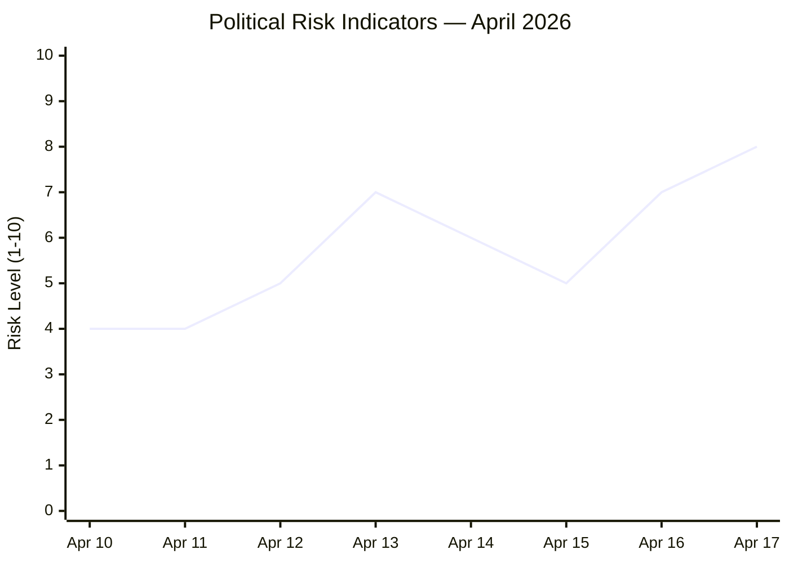

# Risk Assessment — Realtime Monitor 1434
**Date**: 2026-04-17 | **Methodology**: Political Risk Framework v3.0

---

## Risk Matrix

| Risk ID | Risk Description | Likelihood | Impact | Score | Mitigation |
|---------|-----------------|-----------|--------|-------|-----------|
| R1 | Russian hybrid retaliation (cyber/disinformation) against Sweden following tribunal membership | HIGH (4/5) | HIGH (4/5) | 16 | SÄPO monitoring; NATO Article 5 deterrence; critical infrastructure hardening |
| R2 | Tribunal effectiveness undermined if US does not join | MEDIUM (3/5) | HIGH (4/5) | 12 | EU coalition-building; Council of Europe framework provides legitimacy |
| R3 | Constitutional amendments (KU33) cited as press freedom regression | MEDIUM (3/5) | MEDIUM (3/5) | 9 | KU oversight; second reading provides democratic check |
| R4 | Reparations commission takes decades; political fatigue undermines Ukraine support | MEDIUM (3/5) | MEDIUM (3/5) | 9 | Regular progress reports; interim payments from immobilized asset profits |
| R5 | Property register implementation delays or data security breach | LOW (2/5) | HIGH (4/5) | 8 | Phased rollout; Jan 2027 deadline; Lantmäteriet (land registry) expertise |
| R6 | SD reverses Ukraine support ahead of 2026 elections | LOW (2/5) | HIGH (4/5) | 8 | Cross-party commitment codified in international treaties |
| R7 | Russia seizes assets of Swedish companies in retaliation | MEDIUM (3/5) | MEDIUM (3/5) | 9 | Existing reciprocal measures; EU solidarity |

---

## Highest Priority Risks (Score ≥ 12)

### R1 — Russian Hybrid Warfare (Score: 16)
**Context**: Russia has conducted hybrid operations against NATO members following Ukraine support decisions. Sweden's NATO membership (March 2024) and now formal legal challenge to Russian leadership creates enhanced targeting risk.

**Historical evidence**: 
- Nordic data cable sabotage incidents (2024)
- Disinformation campaigns targeting Swedish NATO debates  
- Systematic harassment of Swedish officials

**Mitigation status**: Sweden's NATO membership significantly enhances collective deterrence. SÄPO (Swedish Security Service) has been reinforced. However, below-threshold hybrid operations remain a persistent risk.

### R2 — Tribunal Effectiveness Without US (Score: 12)
**Context**: The International Criminal Court has demonstrated that tribunals without universal membership face significant enforcement limitations. The US under successive administrations has been reluctant to join the ICC; similar reluctance expected for this tribunal.

**Counterfactual**: Even with US non-participation, the tribunal can operate as a legitimacy platform and set legal precedents — similar to how the ICC operates. The political and moral significance outweighs pure enforcement effectiveness.

---

## Risk Trend: 7 days

*Risk spike April 13 (spring budget package); elevated April 16-17 (Ukraine accountability propositions)*
