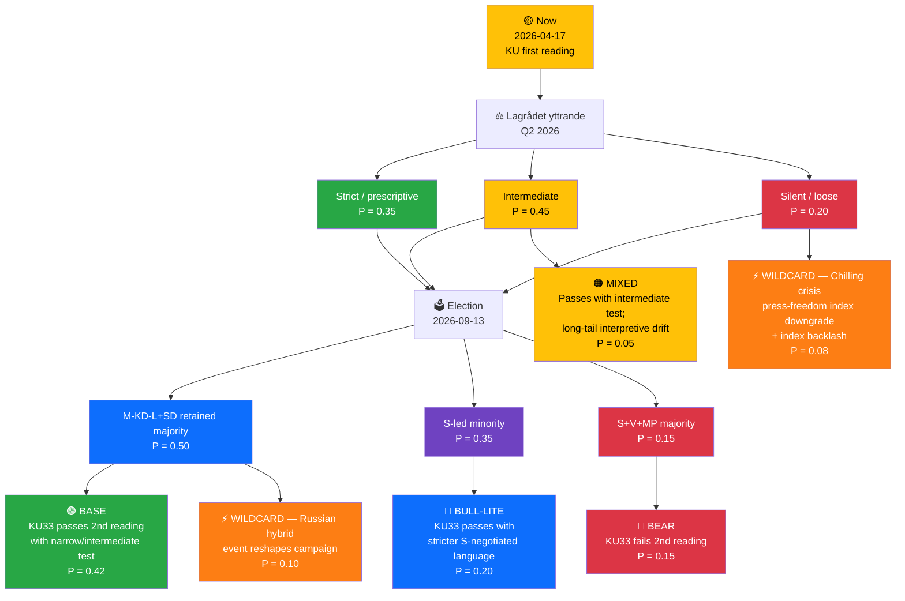

# 🔀 Scenario Analysis — Realtime Monitor 1434

| Field | Value |
|-------|-------|
| **SCN-ID** | SCN-2026-04-17-1434 |
| **Framework** | Alternative-futures analysis (ACH-informed) + Bayesian scenario weighting |
| **Horizon** | Short (Q2 2026) · Medium (post-2026 election) · Long (2027–2030) |
| **Methodology** | `analysis/methodologies/political-risk-methodology.md` §Scenario Generation · `political-swot-framework.md` §Scenario-Branching TOWS |

> **Purpose**: Structured alternative-futures reasoning to stress-test the dominant narrative, surface wildcards, and assign prior probabilities analysts can update as forward indicators fire.

---

## 🧭 Master Scenario Tree

> Probabilities are **analyst priors** expressed in a zero-sum tree. They will be Bayesian-updated as Lagrådet and polling signals arrive.

---

## 📖 Scenario Narratives

### 🟢 BASE — "Narrow, Proportionate Reform" (P = 0.42)

**Setup**: Lagrådet yttrande calibrates the interpretation; government retains majority; S leadership endorses amendment; second reading passes.

**Key signals confirming this scenario:**
- Lagrådet explicitly scopes "formellt tillförd bevisning" as *intermediate* (incorporation into förundersökningsprotokoll) `[HIGH]`
- S party-stämma adopts "moderate reform" language
- RSF Sweden score unchanged
- Opinion polling: KU33 < 10 % campaign salience

**Consequences:**
- HD01KU32 + KU33 enter force 2027-01-01
- Gäng-prosecution tempo improves; measurable investigation-integrity gains within 18 months
- TF narrative internationally: "Sweden modernises world's oldest press-freedom law responsibly"
- Press-freedom NGO posture shifts to **monitoring** rather than litigation
- Cross-cluster rhetorical tension dissipates — government can credibly advocate press freedom abroad while pointing to narrow, investigation-specific scope at home

**Confidence**: HIGH — this is the DIW-consistent central projection.

---

### 🔵 BULL-LITE — "Cross-Party Constitutional Statesmanship" (P = 0.20)

**Setup**: S takes leadership, negotiates **stricter interpretive language** into the amendment before second reading. Amendment passes with S+M+KD+L+C joint stamp.

**Key signals:**
- Andersson party-leader speech frames KU33 as "principled conservatism around Swedish transparency values"
- Joint KU/Justitieutskottet report narrows carve-out further
- Press-freedom NGOs publicly endorse the revised language

**Consequences:**
- **Best-case democratic outcome**: amendment passes with broad, multi-generational legitimacy
- Constitutional-craftsmanship precedent that **strengthens** rather than compresses grundlag architecture
- International press-freedom index score unchanged or improved

**Watch**: S-internal dynamics (Tage Erlander / Olof Palme tradition vs law-and-order wing).

---

### 🔴 BEAR — "Second-Reading Collapse" (P = 0.15)

**Setup**: Left bloc gains in Sep 2026 election; V+MP+S-left majority blocks KU33 at second reading.

**Key signals:**
- V/MP campaign traction; press-freedom campaign NGOs mobilise attentive voters (0.5–1.5 pp shift)
- S leadership opposes KU33 publicly
- Lagrådet silent on interpretive test, hardening press-freedom opposition
- Media editorial lines unify against

**Consequences:**
- KU amendments fall; government loses significant political capital
- **Opportunity**: Swedish democracy demonstrates constitutional resilience — positive international framing
- **Cost**: police / prosecutors lose policy win; gäng-agenda loses KU33 component
- HD01KU32 may still pass separately (accessibility non-controversial) through ordinary-law pathway
- Opposition governing in 2026–2030 faces coalition-composition challenges on Ukraine, housing, defence

---

### 🟠 MIXED — "Interpretive Drift" (P = 0.05)

**Setup**: Lagrådet ambivalent; amendment passes; over 5+ years narrow interpretation entrenches in förvaltningsdomstol.

**Key signals:**
- Förvaltningsrätt rulings systematically favour police discretion
- NGO litigation fails; JO annual reports flag pattern
- Gradual international index erosion

**Consequences**: Long-tail democratic-infrastructure harm without acute crisis — the **slow-rot scenario** that's hardest to counter politically.

**Why this scenario matters**: It is the most likely path for S4 × T1 interference to become T4 (systemic chilling).

---

### ⚡ WILDCARD 1 — "Chilling Crisis" (P = 0.08)

**Trigger**: A high-profile case emerges (2026–2028) where investigative journalism was materially blocked by KU33 interpretation.

**Cascade:**
1. Case becomes international headline (SVT+ FT + The Guardian)
2. RSF downgrades Sweden by ≥ 3 places
3. KU launches granskning / independent review
4. Constitutional reconsideration placed on 2030 election agenda
5. Riksdag passes **counter-amendment** restoring broader "allmän handling" scope

**Probability reasoning**: Moderate baseline × chilling-effect prior; elevated if Lagrådet leaves language loose.

---

### ⚡ WILDCARD 2 — "Russian Hybrid Escalation Reshapes Campaign" (P = 0.10)

**Trigger**: Major cyber / sabotage / disinformation event attributable to Russia during 2026 campaign — e.g., attack on Swedish government infrastructure, Nordic energy / data cable, or large-scale disinformation op.

**Cascade:**
1. Campaign agenda shifts decisively to security / defence
2. KU33 recedes from press-freedom framing; reframed as national-security tool
3. Second reading passes with broader than expected coalition
4. Tribunal (HD03231) gains legitimacy as "necessary response"
5. Sweden advocates expanded NATO hybrid-defence doctrine

**Probability reasoning**: Historical pattern after Sweden's NATO accession + tribunal founding-member status; SÄPO 2024 assessment signals elevated baseline.

---

## 🧮 Scenario Probabilities — Rolled Up

| Outcome | Probability |
|---------|:---------:|
| KU33 enters force in any form | **0.67** (Base 0.42 + Bull-Lite 0.20 + Mixed 0.05) |
| KU33 enters force with strict / narrow-test lock-in | **0.55** (Base 0.42 × strict-interpretation share + Bull-Lite 0.20) |
| KU33 fails in post-election Riksdag | **0.15** |
| Press-freedom-index downgrade within 3 years | **0.25** |
| Russian hybrid event reshapes campaign | **0.10** |
| Tribunal achieves first case by 2028 | **0.55** |
| Tribunal stalled or boycotted | **0.30** |

---

## 🎯 Monitoring Indicators (What Flips Priors)

| Indicator | Direction | Prior-Update Magnitude |
|-----------|:---------:|:---------------------:|
| Lagrådet yttrande strict | ↑ Base, Bull-Lite | +0.15 combined |
| Lagrådet silent on interpretation | ↑ Mixed, Wildcard-1 | +0.10 combined |
| S party-leader pro-KU33 speech | ↑ Base, Bull-Lite | +0.10 |
| S party-leader anti-KU33 speech | ↑ Bear | +0.10 |
| RSF/Freedom House downgrade | ↑ Wildcard-1 | +0.05 |
| Nordic cable / cyber event | ↑ Wildcard-2 | +0.05–0.10 |
| Opinion polling: press-freedom > 10 % campaign salience | ↑ Bear | +0.05 |
| US public tribunal endorsement | N/A for KU; ↓ Tribunal-stalled | −0.10 |
| Ukraine HD03231 commencement date slips > 6 months | ↑ Tribunal-stalled | +0.10 |

---

## 🛠️ Scenario-Driven Editorial & Policy Implications

| Scenario | Editorial Framing Implication | Policy Implication |
|----------|-------------------------------|-------------------|
| BASE | Frame as *"narrow, proportionate reform"*; foreground Lagrådet role | Government should pre-publish interpretive guidance |
| BULL-LITE | Frame as *"constitutional craftsmanship moment"*; credit cross-party S | S/M joint statesmanship opportunity |
| BEAR | Frame as *"democratic brake working as designed"* | Opposition needs clear alternative investigative-integrity plan |
| MIXED | Frame as *"interpretive vigilance required"*; JO centrality | NGO litigation fund activation |
| WILDCARD-1 | Frame as *"chilling crisis"* — accountability lens | Counter-amendment drafting begins |
| WILDCARD-2 | Frame as *"hybrid war changes calculus"*; national-security lens | SÄPO / MSB doctrinal updates |

---

## 📎 Cross-References
- [`synthesis-summary.md`](synthesis-summary.md) §Red-Team Box informs low-probability path consideration
- [`risk-assessment.md`](risk-assessment.md) §Bayesian Update Rules drive scenario priors
- [`swot-analysis.md`](swot-analysis.md) §TOWS S4×T1 interference explains Mixed pathway
- [`comparative-international.md`](comparative-international.md) provides Base-scenario benchmarks

---

**Classification**: Public · **Next Review**: 2026-04-24 · **Methodology**: Scenario analysis v1.0
