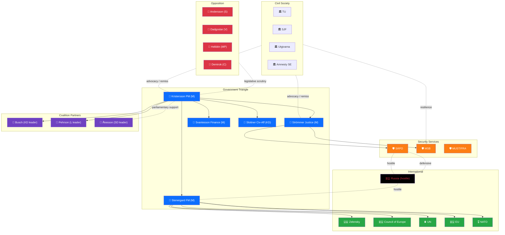
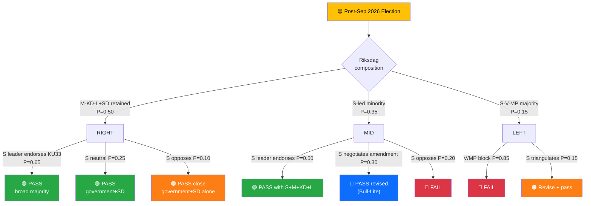

# Stakeholder Perspectives — Realtime Monitor 1434

| Field | Value |
|-------|-------|
| **STK-ID** | STK-2026-04-17-1434 |
| **Analysis Date** | 2026-04-17 14:34 UTC |
| **Framework** | 6-lens stakeholder matrix (power × interest × position × capacity × resource × time-horizon) |
| **Primary Focus** | Constitutional Press-Freedom Reforms (LEAD) · Ukraine Accountability · Housing/AML |
| **Methodology** | `analysis/methodologies/political-stakeholder-framework.md` |

---

## 📊 Stakeholder Position Matrix (Quantified, 0–10)

| Stakeholder | Power | Interest | KU33 Position (−5 to +5) | Ukraine Props Position | Evidence |
|-------------|:----:|:-------:|:------------------------:|:----------------------:|----------|
| **Government (M/KD/L)** | 10 | 10 | +5 | +5 | Kristersson, Stenergard co-sign; M-KD-L party statements |
| **SD (parliamentary support)** | 8 | 8 | +4 (AML/gäng alignment) | +3 (Nuremberg framing) | SD law-and-order + Nuremberg-compatible rhetoric |
| **Socialdemokraterna (S)** | 9 | 9 | **0 to −2** (divided) | +5 | Historical press-freedom doctrine vs law-and-order bloc internal tension |
| **Vänsterpartiet (V)** | 6 | 9 | **−4** | +3 (accountability only) | V's Riksdag press-freedom record 2018-2025 |
| **Miljöpartiet (MP)** | 4 | 9 | **−4** | +5 | MP's grundlag-protection doctrine |
| **Centerpartiet (C)** | 5 | 7 | +2 (cautious) | +5 | C liberal-centrist profile |
| **Journalistförbundet (SJF)** | 5 | 10 | **−5** | 0 | Historical TF-protection stance |
| **Utgivarna / TU** | 5 | 10 | **−4** | 0 | Publisher-editor professional mandate |
| **Amnesty Sweden** | 3 | 8 | −3 (privacy/access concerns) | +5 | International accountability priority |
| **Polismyndigheten** | 7 | 8 | **+5** | +2 | Operational beneficiary |
| **Åklagarmyndigheten** | 7 | 8 | +5 | +3 | Prosecution effectiveness |
| **Lantmäteriet** | 6 | 6 | 0 | 0 | Executes CU28 register Jan 2027 |
| **Handikappförbund (DHR/FUB)** | 3 | 9 (KU32) | **+5 (KU32)** | +1 | KU32 accessibility beneficiary |
| **Lagrådet** | 8 | 10 | Pending | Pending | Review in progress |
| **Ukraine (Zelensky gov)** | 7 (in Ukraine context) | 10 | 0 | **+5** | Co-architect of Hague Convention Dec 2025 |
| **Russia (RF gov)** | 8 (hostile) | 10 | 0 | **−5** | Designated SE "unfriendly" 2022 |
| **EU institutions** | 9 | 9 | +2 (EAA compliance) | +5 | EU foreign-policy alignment |
| **Council of Europe** | 7 | 10 | +1 | +5 | Tribunal framework body |
| **US administration** | 10 (global) | 6 | 0 | **0 to +2** (ambiguous) | Historical ICC reluctance |
| **Sweden public (polling)** | 4 | 5 | 0 (low awareness) | +4 (60-70% support since 2022) | Novus/SOM polling patterns |

---

## 🏛️ 1. Citizens & Swedish Public

**Position on LEAD (KU33/KU32)**: Low public awareness of grundlag mechanics; amendments typically salient only to attentive publics (~15%) `[MEDIUM]`. Press-freedom framing in 2026 campaign will raise awareness asymmetrically — V/MP electorates mobilise faster than median voter.

**Position on Ukraine Accountability**: Strong support — polling consistently **60-70%+ support for Ukraine aid** since 2022 (SOM Institute, Novus) `[HIGH]`. Nuremberg framing resonates.

**Position on Housing (CU27/CU28)**: Direct impact on ~2M bostadsrätter households; generally positive consumer-protection reception `[MEDIUM]`.

**Electoral implications**: KU33 risks becoming a **second-order campaign issue** that shifts attentive-voter preferences at the margin — V/MP could gain 0.5-1.5 pp each; S faces internal tension over whether to counter-position.

---

## 🏛️ 2. Government Coalition (M / KD / L)

**Position**: Strongly supportive of all measures — proposing and defending them.

**Narrative**: The package demonstrates "governing competence across domains — constitutional reform, foreign-policy leadership, housing-market modernisation, everyday-life simplification."

**Risk exposure**:
- KU33 = primary exposure — press-freedom NGOs, V/MP, possibly S will frame as regression
- L is the internal coalition partner most sensitive to press-freedom concerns (liberal identity)
- Ukraine = low exposure (universal consensus)

**Key individuals**:
- **Ulf Kristersson (M, PM)**: Co-signed Ukraine propositions HD03231/232; final political owner of both KU amendments
- **Maria Malmer Stenergard (M, FM)**: Champion of tribunal; Nuremberg-framing architect; press release 2026-04-16 is a political capital investment
- **Johan Pehrson (L, party leader, Minister of Labour)**: Watch for liberal-identity pushback internally on KU33
- **Ebba Busch (KD, party leader, Energy)**: KD law-and-order alignment supports KU33
- **Gunnar Strömmer (M, Justice)**: Minister responsible for KU33's investigative-integrity rationale
- **Erik Slottner (KD, Civil Affairs)**: Housing/register execution

---

## 🏛️ 3. Opposition Bloc (S / V / MP)

**Socialdemokraterna (S)**:
- **Ukraine**: Strongly supportive — S led Sweden's 2022 Ukraine response under PM Magdalena Andersson `[HIGH]`
- **KU33**: **Divided** — S's press-freedom doctrine (Tage Erlander, Olof Palme, Hans Blix era) vs S's law-and-order wing; party-leader statement will be diagnostic `[MEDIUM]`
- **Housing**: Supportive of consumer/tenant protection

**V (Left Party)**:
- **Ukraine**: Supportive of accountability, historically sceptical of NATO/military framing `[HIGH]`
- **KU33**: **Strongly against** likely at second reading — expected campaign talking point `[HIGH]`
- **Housing**: Supportive of tenant-protection elements

**MP (Greens)**:
- **Ukraine**: Strong support — international law and human rights align `[HIGH]`
- **KU32**: **Enthusiastic** — EU accessibility + disability rights `[HIGH]`
- **KU33**: **Strongly against** — grundlag protection doctrine `[HIGH]`
- **Housing**: Positive framing on transparency

**Key individuals**:
- **Magdalena Andersson (S, party leader)**: Position on KU33 will decide coalition fracture dynamics
- **Nooshi Dadgostar (V, party leader)**: Campaign voice on KU33
- **Daniel Helldén (MP, språkrör)**: Grundlag-protection advocate

---

## 🏢 4. Business & Industry

**Real estate sector** (Mäklarsamfundet, FMI): Broadly supportive of CU28 condominium register (reduces market uncertainty and mispricing risk). `[HIGH]`

**Banks & mortgage lenders** (SEB, Swedbank, Handelsbanken, SBAB): Supportive — cleaner pledge/mortgage registration reduces collateral risk; AML compliance cost offset by data-quality gain. `[HIGH]`

**Defence industry** (Saab, BAE Bofors): Neutral on accountability measures; benefits from general Ukraine support sustaining procurement trajectory. `[MEDIUM]`

**Tech / publishing sector**: Interest in accessibility compliance (KU32 e-books, streaming, e-commerce); mixed — cost of implementation vs market-expansion opportunity. `[MEDIUM]`

**Media** (Bonnier, Schibsted, Stampen): **Concerned about KU33** — see risk of source-erosion affecting investigative desks. `[MEDIUM]`

---

## 🌐 5. Civil Society

**Press-freedom organisations** (TU, Utgivarna, SJF, Publicistklubben):
- KU33: **Strongly concerned** — pre-filing remissvar urged; will monitor Lagrådet yttrande closely `[HIGH]`
- Will advocate for **strict interpretation** of "formellt tillförd bevisning" in Riksdag legislative history
- Likely to publish joint statement during valrörelse 2026

**Disability-rights organisations** (DHR, FUB, Synskadades Riksförbund):
- KU32: **Enthusiastically supportive** — long-sought accessibility rights `[HIGH]`
- View as concrete human-rights progress

**War-crimes accountability NGOs** (Amnesty Sweden, Human Rights Watch Sweden):
- HD03231/232: **Enthusiastically supportive**; will advocate full Riksdag approval `[HIGH]`

**Tenant associations** (Hyresgästföreningen):
- CU27: Supportive of six-month folkbokförd rule — closes ombildning ghost-tenant loophole `[HIGH]`

---

## 🌍 6. International Actors

| Actor | Ukraine Props Position | KU33 Position | Notes |
|-------|:----------------------:|:-------------:|-------|
| **Ukraine (Zelensky gov)** | 🟢 Central proponent | 🟡 Neutral | Hague Convention signed Dec 16 2025 with Zelensky present |
| **Council of Europe** | 🟢 Framework body | 🟡 Neutral | Tribunal legitimacy backstop; Venice Commission may later comment on KU33 |
| **EU institutions** | 🟢 Strongly supportive | 🟡 Neutral (supportive of KU32 via EAA) | Foreign-policy alignment; EAA compliance box ticked |
| **NATO allies** | 🟢 Positive | — | Sweden's norm-entrepreneurship as new member |
| **Russia (RF)** | 🔴 Hostile | — | Will respond rhetorically + hybrid ops |
| **US administration** | 🟡 Ambiguous | — | Historical ICC reluctance; tribunal-specific position pending |
| **RSF / Freedom House** | 🟡 Neutral | 🔴 **Will scrutinise** | Sweden's press-freedom index score at risk |

---

## ⚖️ 7. Judiciary & Constitutional Bodies

- **Lagrådet**: Pending yttrande — the most consequential upcoming stakeholder signal; will scope the interpretive boundary of KU33
- **KU (Konstitutionsutskottet)**: Self-reviewing; committee record has constitutional weight
- **Riksdagens ombudsmän (JO) / Justitiekanslern (JK)**: Post-vote oversight on KU33 application
- **Förvaltningsdomstolar**: Will adjudicate "allmän handling" disputes post-entry-into-force
- **ICC**: Complementary relationship — HD03231 fills aggression-jurisdiction gap

---

## 📰 8. Media & Public Opinion

**Swedish mainstream media** (DN, SvD, Aftonbladet, Expressen, SVT):
- **KU33**: Extensive editorial engagement expected — press freedom is a live newsroom stake `[HIGH]`
- **Ukraine tribunal**: Newsworthy globally; Nuremberg framing is headline-friendly `[HIGH]`
- **Housing register**: Consumer-economy secondary coverage `[MEDIUM]`

**International media** (Reuters, AP, AFP, FT, NYT): HD03231 will be picked up globally; KU33 secondary but noted by press-freedom beats (CPJ, RSF blog). `[HIGH]`

**Social media**: Ukraine solidarity performs; KU33 likely to generate polarised engagement patterns — attentive-voter / activist clusters dominate. `[MEDIUM]`

---

## 🎯 Coalition-Impact Summary

| Package | Coalition Risk | Second-Reading Risk (KU33 only) | Campaign Risk |
|---------|:-------------:|:-------------------------------:|:-------------:|
| **Constitutional (KU32/KU33)** | 🟡 Low (first reading secured) | 🔴 **MATERIAL** — depends on post-election composition | 🔴 HIGH — KU33 salient wedge |
| **Ukraine Accountability** | 🟢 Minimal | N/A (ordinary law) | 🟢 Low — universal consensus |
| **Housing (CU27/CU28)** | 🟢 Minimal | N/A | 🟢 Low |

---

## 🕸️ Influence-Network Map

---

## 🌲 Coalition-Fracture Probability Tree (KU33 Second Reading)

**Rolled-up probabilities** `[HIGH]`:
- **P(KU33 passes 2nd reading in any form)** ≈ 0.50 × (0.65+0.25+0.10 × 0.7 pass) + 0.35 × (0.50+0.30 + 0.20 × 0) + 0.15 × 0.15 ≈ **0.68**
- **P(KU33 fails 2nd reading)** ≈ **0.15**
- **P(revised / stricter language path)** ≈ **0.15**

---

## 🎙️ Named-Actor Briefing Cards

### Card 1 — Magdalena Andersson (S, former PM, current party leader)
- **Position (projected)**: Pragmatic — likely supports constitutional-integrity framing of KU33 if Lagrådet scopes strictly
- **Leverage**: Decisive for second-reading coalition
- **Risk to profile**: Left flank mobilising against KU33
- **Key signal**: First major speech after Lagrådet yttrande
- **Confidence**: MEDIUM — S-internal dynamics are fluid

### Card 2 — Gunnar Strömmer (M, Justice Minister)
- **Position**: Owner of investigative-integrity rationale for KU33
- **Leverage**: Defines how "formellt tillförd bevisning" is prosecutorially applied
- **Risk to profile**: If interpretation is too narrow → gäng-agenda loses KU33 tool
- **Key signal**: Guidance to prosecutors post-amendment
- **Confidence**: HIGH

### Card 3 — Lagrådet (Collective)
- **Position**: Constitutional review body
- **Leverage**: **Single most consequential upcoming signal** in this run
- **Risk to profile**: Reputational exposure if yttrande silent on interpretive question
- **Key signal**: Yttrance text on "formellt tillförd bevisning"
- **Confidence**: HIGH

### Card 4 — Nooshi Dadgostar (V leader)
- **Position**: Committed KU33 opposition; press-freedom framing
- **Leverage**: Amplify attentive-voter mobilisation on press-freedom issue
- **Risk to profile**: If campaign fails to mobilise beyond 2008 FRA-lagen levels
- **Key signal**: Campaign launch speech + KU33 salience in polling
- **Confidence**: HIGH

### Card 5 — Maria Malmer Stenergard (M, FM)
- **Position**: Ukraine accountability architect; Nuremberg-framing author
- **Leverage**: Sweden's foreign-policy capital + norm-entrepreneurship credentials
- **Risk to profile**: Russian retaliation targeting her personally + diplomatic signalling
- **Key signal**: Dec 2026 annual foreign-policy speech
- **Confidence**: HIGH

### Card 6 — Jimmie Åkesson (SD leader)
- **Position**: Parliamentary-support leverage on all four clusters
- **Leverage**: 9–10% campaign talking-point reserves
- **Risk to profile**: European populist-right realignment on Russia
- **Key signal**: Post-election policy-bargain rhetoric
- **Confidence**: MEDIUM

---

**Classification**: Public · **Next Review**: 2026-04-24
