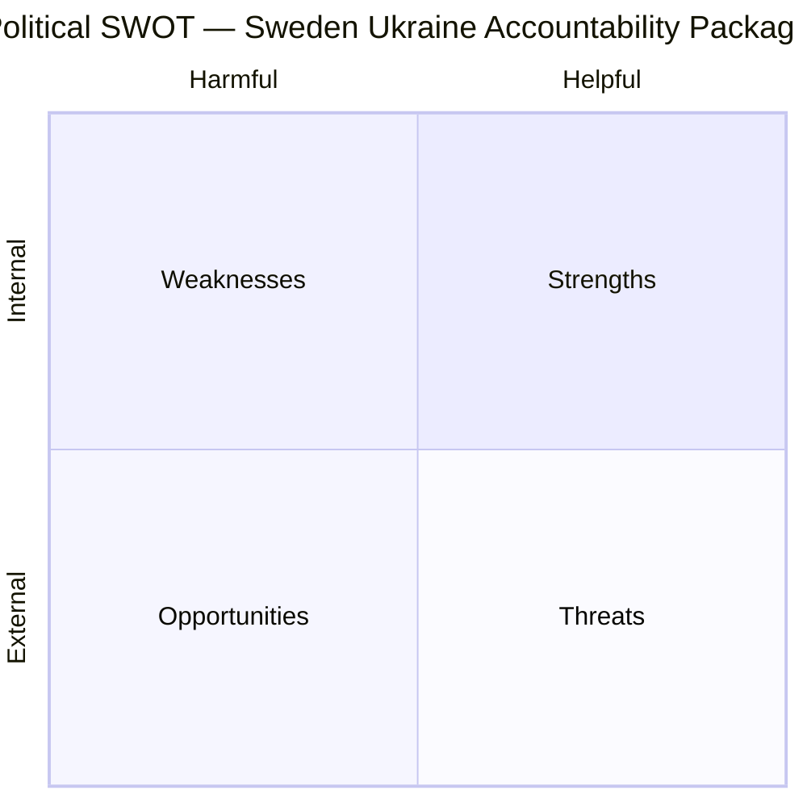

# SWOT Analysis — Realtime Monitor 1434
**Date**: 2026-04-17 | **Focus**: Sweden's Ukraine Accountability Propositions

---

## Overall Strategic SWOT

| Dimension | Factor | Evidence Citation | Confidence |
|-----------|--------|------------------|-----------|
| **STRENGTH** | Historic founding membership in Ukraine Tribunal | HD03231 — Sweden among first signatories March 2026 | HIGH |
| **STRENGTH** | Cross-party consensus ensures parliamentary passage | All 8 parties have supported Ukraine measures since 2022 | HIGH |
| **STRENGTH** | No fiscal burden on Swedish taxpayers (reparations from Russia) | HD03232 — funded from Russian assets | HIGH |
| **STRENGTH** | Reinforces Sweden's international reputation post-NATO | FM Stenergard's Nuremberg framing | HIGH |
| **STRENGTH** | Sweden's convening role in working group since Feb 2022 | Press release 2026-04-16 | HIGH |
| **WEAKNESS** | Enforcement depends on non-member state cooperation | US, China not expected to join tribunal | MEDIUM |
| **WEAKNESS** | Reparations timeline may span decades (Iraq precedent: 31 years) | UNCC historical precedent | HIGH |
| **WEAKNESS** | Tribunal jurisdiction contested for sitting heads of state | International law gap — Rome Statute amendment politics | MEDIUM |
| **OPPORTUNITY** | Sets global precedent closing the Nuremberg gap | First aggression tribunal since 1945 | HIGH |
| **OPPORTUNITY** | Enhances Sweden's influence in Ukraine reconstruction | Founding membership = governance voice | MEDIUM |
| **OPPORTUNITY** | Deters future aggressors — strengthens international law norms | Long-term deterrence effect | MEDIUM |
| **THREAT** | Russian retaliation — hybrid warfare, cyber attacks | Russia designated Sweden as "unfriendly state" | HIGH |
| **THREAT** | US foreign policy shift could undermine Western unity on assets | Changes in transatlantic relations | MEDIUM |
| **THREAT** | Tribunal effectiveness if key powers refuse to join | Precedent from ICC limitations | HIGH |

---

## Constitutional Amendments SWOT

| Dimension | HD01KU32 (Accessibility) | HD01KU33 (Search/Seizure) |
|-----------|--------------------------|--------------------------|
| **Strength** | EU compliance; disability rights | Criminal investigation effectiveness |
| **Weakness** | Expands ordinary law intrusion into fundamental law sphere | Reduces transparency of law enforcement materials |
| **Opportunity** | Accessible digital media market | Better organized crime prosecution |
| **Threat** | Precedent for further limiting press freedom protections | Chilling effect on investigative journalism |
