# SWOT Analysis — Realtime Monitor 1434

| Field | Value |
|-------|-------|
| **SWOT-ID** | SWT-2026-04-17-1434 |
| **Analysis Date** | 2026-04-17 14:34 UTC |
| **Analysis Scope** | Primary: Constitutional Press-Freedom Reforms (HD01KU32 + HD01KU33). Secondary: Ukraine Accountability Package (HD03231 + HD03232). Tertiary: Housing/AML (HD01CU27 + HD01CU28) |
| **Reference Period** | 2025/26 Riksmöte |
| **Produced By** | news-realtime-monitor |
| **Primary MCP Sources** | `get_betankanden`, `get_propositioner`, `search_regering`, `search_dokument` |
| **Validity Window** | Valid until 2026-04-24 |
| **Framework** | political-swot-framework v3.0 (TOWS interference applied) |

---

## 🏛️ Section 1 — Constitutional Press-Freedom Reforms (PRIMARY SCOPE)

Scope: HD01KU32 (media accessibility amendment to TF + YGL) and HD01KU33 (removal of "allmän handling" status from digital material seized at husrannsakan). First reading only; second reading required post-2026 election for entry into force (proposed 2027-01-01).

### ✅ Strengths — Government & Constitutional Framework Position

| # | Strength Statement | Evidence (dok_id / source) | Confidence | Impact | Entry Date |
|---|-------------------|----------------------------|:----------:|:------:|:----------:|
| S1 | KU secured cross-party support for **first reading** of two grundlag amendments — politically rare achievement | KU committee record; HD01KU32, HD01KU33 betänkanden | **HIGH** | **HIGH** | 2026-04-17 |
| S2 | KU32 discharges a clear **EU legal obligation** (Accessibility Act 2019/882, in force since June 2025) — forecloses infringement-proceeding risk | HD01KU32 betänkande; EAA 2019/882 | **HIGH** | **MEDIUM** | 2026-04-17 |
| S3 | KU33 solves a **concrete investigative problem** — premature disclosure of seized digital material was compromising ongoing criminal investigations (gäng-/organised-crime cases) | HD01KU33 rationale; police operational experience | **MEDIUM** | **MEDIUM** | 2026-04-17 |
| S4 | Narrow carve-out design — "allmän handling" status retained when material is formally incorporated as evidence — provides **textual safeguard** | HD01KU33 text | **HIGH** | **MEDIUM** | 2026-04-17 |
| S5 | Disability-rights framing (KU32) unifies M/KD/L/C/MP/L and neutralises opposition | KU32 committee support pattern | **HIGH** | LOW | 2026-04-17 |

### ⚠️ Weaknesses — Democratic-Infrastructure Risks

| # | Weakness Statement | Evidence | Confidence | Impact | Entry Date |
|---|-------------------|----------|:----------:|:------:|:----------:|
| W1 | KU33 is the **first substantive narrowing** of TF's offentlighetsprincip in the digital-evidence sphere — compresses a 260-year-old transparency guarantee (TF 1766) | TF 1766 text; KU33 betänkande comparison; press-freedom literature | **HIGH** | **HIGH** | 2026-04-17 |
| W2 | Definition of "*formellt tillförd bevisning*" is **interpretively fragile** — a future government interpreting narrowly could systematically shield police operations from insyn | HD01KU33 text; förvaltningsrätt interpretation risk | **MEDIUM** | **HIGH** | 2026-04-17 |
| W3 | KU32 establishes **precedent** that EU obligations can justify ordinary-law intrusion into grundlag sphere — template for future grundlag compression (digital services, platform regulation) | HD01KU32 structural change; EAA implementation pattern | **MEDIUM** | **MEDIUM** | 2026-04-17 |
| W4 | Timing places constitutional press-freedom debate **inside 2026 campaign** — politicising grundlag in a way previous amendments were shielded from | 8 kap. 14 § RF two-reading rule; election cycle | **HIGH** | **MEDIUM** | 2026-04-17 |
| W5 | Lagrådet review still pending at publication — constitutional craftsmanship not yet independently vetted | Lagrådet process | **HIGH** | LOW | 2026-04-17 |

### 🚀 Opportunities — Democratic Upside

| # | Opportunity Statement | Evidence | Confidence | Impact | Entry Date |
|---|----------------------|----------|:----------:|:------:|:----------:|
| O1 | Sweden continues to **modernise world's oldest press-freedom framework** — balancing investigative integrity with transparency; could become model for other democracies facing digital-evidence dilemmas | TF 1766 text; comparative press-freedom research | **MEDIUM** | **HIGH** | 2026-04-17 |
| O2 | KU32 improves real-world accessibility (e-books, streaming, e-commerce) for ~1.5M Swedes with disabilities — **tangible human-rights delivery** | EAA 2019/882 impact assessments | **HIGH** | **MEDIUM** | 2026-04-17 |
| O3 | Strengthened investigative integrity (KU33) → improved **organised-crime prosecution** outcomes; feeds government's gäng-agenda policy coherence | Gäng-agenda policy framework | **MEDIUM** | **MEDIUM** | 2026-04-17 |
| O4 | Second-reading moment after election = **democratic stress-test** — new Riksdag's democratic bona fides judged by how it handles KU33 | 8 kap. RF | **MEDIUM** | **MEDIUM** | 2026-04-17 |

### 🔴 Threats — Democratic Downside

| # | Threat Statement | Evidence | Confidence | Impact | Entry Date |
|---|------------------|----------|:----------:|:------:|:----------:|
| T1 | **Chilling effect on investigative journalism** — sources may fear material seized at husrannsakan becomes un-inspectable; possible source-protection erosion | SJF, Utgivarna press-freedom doctrine; historical journalist-source patterns | **MEDIUM** | **HIGH** | 2026-04-17 |
| T2 | **Campaign instrumentalisation** of KU33 by opposition — V, MP, S-left may frame government as press-freedom revisionist; could harden into political polarisation | 2026 valrörelse dynamics | **HIGH** | **MEDIUM** | 2026-04-17 |
| T3 | **International press-freedom index** erosion signal — Reporters Without Borders and similar indices may downgrade Sweden's score based on TF amendment, weakening soft-power posture (especially vis-à-vis Ukraine-tribunal leadership rhetoric — see Cluster 2 tension) | RSF methodology; comparable index events | **MEDIUM** | **MEDIUM** | 2026-04-17 |
| T4 | **Slippery-slope** grundlag compression: KU32's EU-obligation template + KU33's investigative-integrity template, combined, could be used to justify further TF/YGL narrowings on digital platforms, AI content moderation, or national-security grounds | Grundlag erosion pattern analysis | **MEDIUM** | **HIGH** | 2026-04-17 |
| T5 | **Second-reading failure** if post-election Riksdag has V/MP-strengthened left majority — amendments fall, but government loses political capital | Opinion polling; mandate distribution scenarios | **LOW** | **MEDIUM** | 2026-04-17 |

---

## 📊 SWOT Quadrant Mapping — Constitutional Reforms (Color-Coded)

```mermaid
graph TD
    subgraph SWOT["Political SWOT — Constitutional Press-Freedom Reforms (HD01KU32 + HD01KU33) — LEAD"]
        direction TB
        subgraph INT_POS["✅ Strengths — Internal Positive"]
            S1N["💪 S1 Cross-party KU support<br/>for first reading"]
            S2N["💪 S2 EU obligation<br/>discharged (KU32)"]
            S3N["💪 S3 Investigative problem<br/>solved (KU33)"]
            S4N["💪 S4 Narrow carve-out<br/>(textual safeguard)"]
        end
        subgraph INT_NEG["⚠️ Weaknesses — Internal Negative"]
            W1N["⚡ W1 First TF narrowing<br/>in years (1766 text)"]
            W2N["⚡ W2 Interpretively fragile<br/>(allmän handling test)"]
            W3N["⚡ W3 Precedent for future<br/>grundlag compression"]
            W4N["⚡ W4 Campaign-ised<br/>grundlag (2026 val)"]
        end
        subgraph EXT_POS["🚀 Opportunities — External Positive"]
            O1N["🌟 O1 World's oldest press-<br/>freedom law modernised"]
            O2N["🌟 O2 1.5M disabled Swedes<br/>accessibility gain (KU32)"]
            O3N["🌟 O3 Gäng-prosecution<br/>improvement (KU33)"]
        end
        subgraph EXT_NEG["🔴 Threats — External Negative"]
            T1N["☁️ T1 Chilling effect on<br/>investigative journalism"]
            T2N["☁️ T2 Campaign weaponisation<br/>(V/MP/S-left)"]
            T3N["☁️ T3 Int'l press-freedom<br/>index downgrade"]
            T4N["☁️ T4 Slippery-slope grundlag<br/>compression"]
            T5N["☁️ T5 Second-reading failure<br/>(post-election)"]
        end
    end

    S1N -.enables.-> O1N
    S2N -.exploits.-> O2N
    S3N -.exploits.-> O3N
    T1N -.amplifies.-> W1N
    T2N -.amplifies.-> W4N
    T3N -.targets.-> W1N
    T4N -.exploits.-> W3N
    T5N -.triggered by.-> W4N

    style S1N fill:#28a745,color:#fff
    style S2N fill:#28a745,color:#fff
    style S3N fill:#28a745,color:#fff
    style S4N fill:#28a745,color:#fff
    style W1N fill:#fd7e14,color:#fff
    style W2N fill:#fd7e14,color:#fff
    style W3N fill:#fd7e14,color:#fff
    style W4N fill:#fd7e14,color:#fff
    style O1N fill:#0d6efd,color:#fff
    style O2N fill:#0d6efd,color:#fff
    style O3N fill:#0d6efd,color:#fff
    style T1N fill:#dc3545,color:#fff
    style T2N fill:#dc3545,color:#fff
    style T3N fill:#dc3545,color:#fff
    style T4N fill:#dc3545,color:#fff
    style T5N fill:#dc3545,color:#fff
```

---

## 🔀 TOWS Interference Matrix — Constitutional Cluster

| Interaction | Mechanism | Strategic Implication | Confidence |
|-------------|-----------|----------------------|:----------:|
| **S4 × T1** | Narrow carve-out language limits (but does not eliminate) chilling-effect concerns | Press-freedom NGOs should focus remissvar energy on codifying a **strict test** for "formellt tillförd bevisning" before second reading | **HIGH** |
| **S1 × O4** | Cross-party first-reading coalition demonstrates that constitutional process works — but the test is the second reading | Government should maintain coalition width; avoid partisan capture of KU33 | **HIGH** |
| **W1 × T3** | Amendment to TF 1766 + high international visibility → RSF-class index risk | UD/Sida should pre-brief press-freedom diplomacy before amendments enter force | **MEDIUM** |
| **W2 × T4** | Fragile test + precedent-setting EU template = **compound slippery-slope risk** | Lagrådet review should explicitly scope future-use limits; Riksdag record should document legislator intent tightly | **HIGH** |
| **W4 × T2** | Campaign-ised grundlag invites polarisation — risk of KU33 becoming a partisan wedge rather than a constitutional debate | Cross-party statesmanship is the strategic counter; S/M party-leader statements during campaign will be diagnostic | **MEDIUM** |
| **S3 × O3** | Investigative-integrity gain feeds gäng-agenda coherence — government can point to **concrete democratic gains** (organised-crime prosecution) to rebut press-freedom criticism | Talking-point discipline for government side in campaign | **MEDIUM** |

> **Cross-SWOT interference finding** `[HIGH]`: The **strategic centre of gravity** of the constitutional package is the interpretation of "*formellt tillförd bevisning*" (S4 / W2). If Lagrådet and Riksdag's legislative history lock in a strict interpretation, KU33 functions as a narrow, proportionate reform and T1/T3/T4 largely dissipate. If the language is left loose, T1+T4 combine into a durable democratic-infrastructure threat. **Recommendation**: press-freedom NGOs and opposition parties should make a **strict interpretive record** the price of second-reading support.

### 🔗 Cross-Cluster Tension — Constitutional × Ukraine

| Tension | Description | Strategic Implication |
|---------|-------------|----------------------|
| **Rhetorical coherence** | Government simultaneously championing HD03231 (aggression-tribunal — implicitly valorises press freedom, journalists documenting war crimes) while narrowing TF via HD01KU33 | Opposition parties can **weaponise the inconsistency**: "Sweden defends press freedom abroad while compressing it at home." Government counter: KU33 is narrow and investigation-specific, not a press-freedom retreat. |

---

## 🌍 Section 2 — Ukraine Accountability Package (SECONDARY SCOPE)

### Strengths

| # | Statement | Evidence | Confidence | Impact |
|---|-----------|----------|:---:|:---:|
| S1 | Sweden **founding member** of first aggression tribunal since Nuremberg (HD03231) | HD03231; Stenergard press release | HIGH | HIGH |
| S2 | Cross-party Riksdag consensus (all 8 parties historically supported Ukraine measures since 2022) | Ukrainepaket voting record 2022-2025 | HIGH | HIGH |
| S3 | **No direct Swedish fiscal burden** for reparations — funded from Russian immobilised assets (~EUR 260B; EUR 191B at Euroclear) | HD03232; G7 Ukraine Loan | HIGH | HIGH |
| S4 | Sweden's post-NATO (March 2024) norm-entrepreneurship credentials reinforced | HD03231; NATO accession context | HIGH | MEDIUM |

### Weaknesses

| # | Statement | Evidence | Confidence | Impact |
|---|-----------|----------|:---:|:---:|
| W1 | Enforcement depends on non-member cooperation (US, China, Russia not expected to join) | ICC precedent; US historical reluctance | MEDIUM | HIGH |
| W2 | Reparations timeline may span decades (Iraq UNCC: 31 years, $52B) | UNCC historical record | HIGH | MEDIUM |
| W3 | Sitting-HoS immunity gap in international law | Rome Statute 2017 amendment limits | MEDIUM | MEDIUM |

### Opportunities

| # | Statement | Evidence | Confidence | Impact |
|---|-----------|----------|:---:|:---:|
| O1 | Closes Nuremberg gap in modern international criminal law | First aggression tribunal since 1945-46 | HIGH | HIGH |
| O2 | Reconstruction-governance voice (USD 486B+ damages per World Bank 2024) | HD03232; World Bank RDNA | HIGH | MEDIUM |

### Threats

| # | Statement | Evidence | Confidence | Impact |
|---|-----------|----------|:---:|:---:|
| T1 | Russian hybrid warfare intensifies against Sweden as tribunal founder | Nordic sabotage events 2024; "unfriendly state" designation | HIGH | HIGH |
| T2 | US defection from asset immobilisation undermines enforcement (EUR 191B at Euroclear) | Transatlantic policy volatility | MEDIUM | HIGH |
| T3 | Tribunal legitimacy erosion if boycotted by key states | ICC 124 states parties, major absences | HIGH | MEDIUM |

---

## 🏠 Section 3 — Housing Reforms (TERTIARY SCOPE)

| Dimension | HD01CU28 (Register) | HD01CU27 (Identity + Ombildning) | Confidence |
|-----------|---------------------|----------------------------------|:----------:|
| **Strength** | First unified register for ~2M bostadsrätter — closes decades-old opacity | Closes ombildning ghost-tenant loophole (6-month folkbokförd rule); lagfart AML hardening | HIGH |
| **Weakness** | 2M-record IT migration by Jan 2027 — Lantmäteriet execution risk | Privacy considerations for centralised personnummer-linked property data | MEDIUM |
| **Opportunity** | Foundation for digital property market; AML pipeline feed | Direct anti-gäng tool — property as laundering vector | HIGH |
| **Threat** | Cyber-attack surface on centralised financial data | Mission-creep into surveillance state | MEDIUM |

---

**Classification**: Public · **Next Review**: 2026-04-24 · **Methodology**: `analysis/methodologies/political-swot-framework.md`
