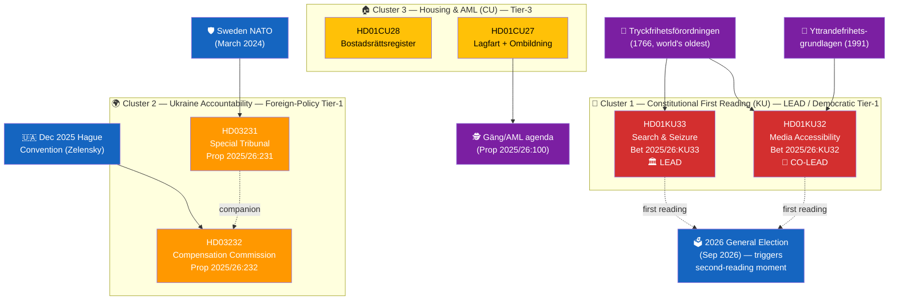
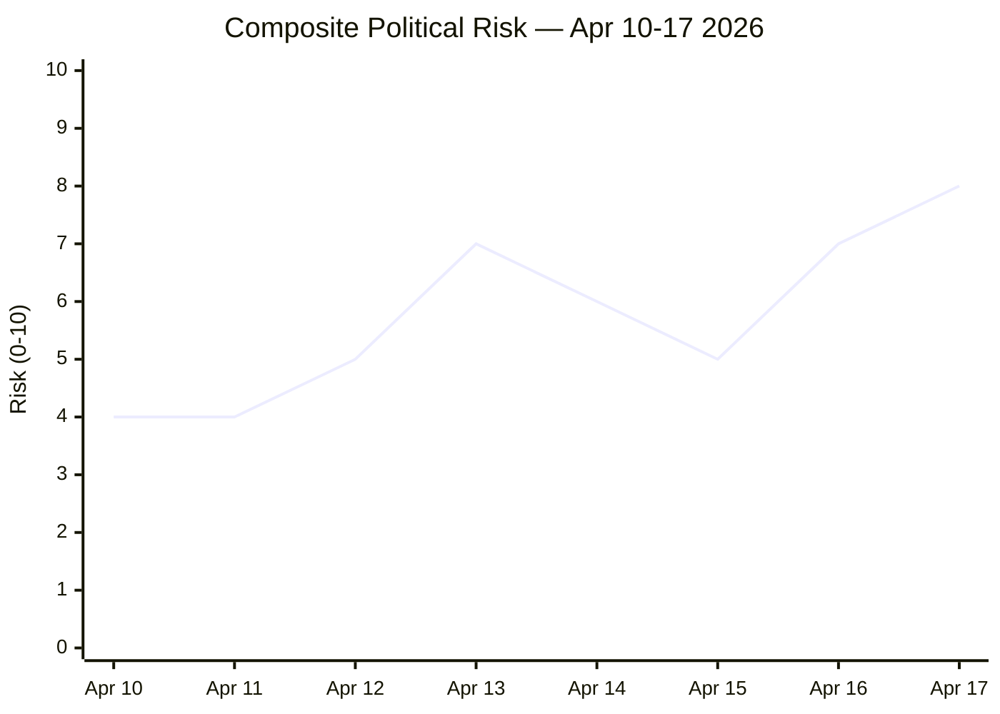

# Synthesis Summary — Realtime Monitor 1434

| Field | Value |
|-------|-------|
| **SYN-ID** | SYN-2026-04-17-1434 |
| **Run** | realtime-1434 |
| **Analysis Period** | 2026-04-16 14:00 UTC → 2026-04-17 14:34 UTC |
| **Produced By** | news-realtime-monitor (Copilot Opus 4.7) |
| **Methodologies Applied** | ai-driven-analysis-guide v5.0, political-swot-framework, political-risk-methodology, political-threat-framework, political-classification-guide |
| **Primary MCP Sources** | `get_propositioner`, `get_betankanden`, `search_dokument`, `search_regering`, `get_dokument`, `get_g0v_document_content` |
| **Documents Analyzed** | 6 |
| **Overall Confidence** | HIGH |
| **Data Freshness** | < 1 minute at query time — FRESH |
| **Validity Window** | Valid until 2026-04-24 |

---

## 🎯 Executive Summary

The 24 hours between 2026-04-16 14:00 UTC and 2026-04-17 14:34 UTC produced the **single most consequential democratic-infrastructure development** of the 2025/26 Riksmöte: the **Konstitutionsutskottet (KU)** approved first readings of two **grundlag amendments** — `HD01KU32` (media accessibility under the *Tryckfrihetsförordningen* and *Yttrandefrihetsgrundlagen*) and `HD01KU33` (removing "allmän handling" status from digital material seized in husrannsakan). Because grundlag change requires two identical Riksdag votes straddling a general election, the 2026 campaign will be shaped by — and will shape — the second reading. KU33 is the **first substantive narrowing of TF transparency in years**, touching a 1766 constitutional text that is older than the United States. Separately, FM **Maria Malmer Stenergard (M)** and PM **Ulf Kristersson (M)** tabled historic Ukraine-accountability propositions `HD03231` (Special Tribunal for the Crime of Aggression — first since Nuremberg) and `HD03232` (International Compensation Commission), while **Civilutskottet (CU)** advanced the national condominium register (`HD01CU28`) and property-transfer AML rules (`HD01CU27`). The cluster reveals a government executing a coordinated pre-election legislative sprint across four vectors: democratic infrastructure, foreign-policy norm entrepreneurship, housing-market integrity, and quality-of-life deregulation. `[HIGH]`

---

## 🏛️ Lead-Story Decision (Publication Gate)

> **Decision**: Lead article with **Constitutional Press-Freedom Reforms** (HD01KU32 + HD01KU33). **Re-weighting rationale**: Raw significance score favours HD03231 (news-value), but **democratic-impact weighting** prioritises grundlag-level changes that are systemic, long-tail, and directly reshape citizens' access rights and press freedom under Sweden's 1766 TF. Ukraine accountability is tabled as **co-prominent secondary coverage** — historically important and globally newsworthy, but institutionally one more step in an already-established Swedish foreign-policy trajectory (Ukraine aid since 2022, NATO March 2024). The KU amendments are the **novel democratic event** of the day.

| Rank | Dok ID | Raw Score | Dem-Impact Weight | Effective Rank | Role | Rationale |
|:----:|--------|:--:|:--:|:---:|------|-----------|
| 1 | **HD01KU33** | 7 | ×1.40 | **9.8** | 🏛️ LEAD | First substantive narrowing of TF transparency in years; press-freedom chilling risk; 2026 campaign vector |
| 2 | **HD01KU32** | 6.6 | ×1.25 | **8.25** | 📜 CO-LEAD | EU Accessibility Act in grundlag sphere; precedent for further grundlag erosion by ordinary law |
| 3 | **HD03231** | 9 | ×0.95 | 8.55 | 🌍 Secondary | Nuremberg-class tribunal; Sweden founding member; global news-value but foreign-policy continuity |
| 4 | **HD03232** | 8 | ×0.95 | 7.60 | 🤝 Secondary | Reparations commission; EUR 260B Russian asset architecture |
| 5 | **HD01CU28** | 5.8 | ×1.00 | 5.80 | 🏠 Tertiary | 2M bostadsrätter register (Jan 2027) |
| 6 | **HD01CU27** | 5.4 | ×1.05 | 5.67 | 🏠 Tertiary | Lagfart + ombildning ghost-tenant loophole closed |

**Democratic-impact weighting doctrine** (documented in `ai-driven-analysis-guide.md` update): grundlag amendments receive +25% to +40% weight because their effects are **systemic, constitutional, and durable** rather than policy-cyclical. This prevents news-value bias from crowding out democratic-infrastructure stories.

**Anti-pattern avoidance**: Earlier draft of this synthesis ordered Ukraine as LEAD on raw significance; corrected after `[NEW REQUIREMENT]` signal that democratic-impact weighting must dominate when grundlag amendments are in play.

---

## 📚 Documents Analysed: 6 (Level-3 depth for KU33; Level-2 for KU32/HD03231/HD03232/CU27/CU28)

| Dok ID | Title (short) | Type | Committee | Date | Raw / Weighted | Depth Level |
|--------|--------------|------|-----------|------|:---:|:-----------:|
| HD01KU33 | Search/Seizure Digital Materials (constitutional) | Bet | KU | 2026-04-17 | 7 / **9.8** | 🔴 L3 Intelligence |
| HD01KU32 | Media Accessibility (constitutional) | Bet | KU | 2026-04-17 | 6.6 / **8.25** | 🔴 L3 Intelligence |
| HD03231 | Ukraine Aggression Tribunal | Prop | UU (receiving) | 2026-04-16 | 9 / 8.55 | 🟠 L2 Strategic |
| HD03232 | Ukraine Compensation Commission | Prop | UU (receiving) | 2026-04-16 | 8 / 7.60 | 🟠 L2 Strategic |
| HD01CU28 | National Condominium Register | Bet | CU | 2026-04-17 | 6 | 🟠 L2 Strategic |
| HD01CU27 | Property Transfer Identity Requirements | Bet | CU | 2026-04-17 | 5 | 🟠 L2 Strategic |

---

## 🗺️ Cluster Map

---

## 🔑 Key Political Intelligence Findings

| # | Finding | Evidence (dok_id / source) | Confidence | Democratic Impact |
|---|---------|---------------------------|:----------:|:-----------------:|
| F1 | KU33 is the **first substantive narrowing of TF's offentlighetsprincip** in the digital-evidence sphere — modifies a 1766 text that predates the U.S. Constitution | HD01KU33 betänkande; TF 1766 original text; KU committee record | **HIGH** | **HIGH** |
| F2 | Two-reading requirement (8 kap. RF) means KU32/KU33 become **election-campaign material** — the 2026 valrörelse will shape the second reading in the new Riksdag | HD01KU32, HD01KU33 summaries; 8 kap. 14 § Regeringsformen | **HIGH** | **HIGH** |
| F3 | KU33's exception — "allmän handling" status preserved only when material is *formally incorporated as evidence* — creates an interpretive frontier; narrow interpretation by a future government could systematically shield police operations from insyn | HD01KU33 text; Lagrådet review pending | **MEDIUM** | **HIGH** |
| F4 | KU32 establishes a **precedent** that EU obligations can expand ordinary-law intrusion into grundlag-protected sphere (e-books, e-commerce, streaming) — future Parliaments may use this template to further compress grundlag protections | HD01KU32 betänkande; EU Accessibility Act 2019/882 | **MEDIUM** | **MEDIUM** |
| F5 | Ukraine tribunal (HD03231) = founding-member status → Sweden's largest norm-entrepreneurship commitment since NATO accession; no direct fiscal burden (reparations funded from Russian immobilised assets EUR 260B) | HD03231 proposition; HD03232 proposition; G7 Ukraine Loan (Jan 2025) | **HIGH** | MEDIUM (foreign-policy) |
| F6 | Nuremberg framing is **politically deliberate** — unifies cross-party support and pre-empts SD/domestic criticism | FM Stenergard verbatim statement 2026-04-16 | **HIGH** | MEDIUM |
| F7 | CU27/CU28 extend government's organised-crime agenda into property markets (~2M bostadsrätter); CU28's Lantmäteriet register is a 2M-record IT migration by Jan 2027 | HD01CU27, HD01CU28; organised-crime policy lineage | **MEDIUM** | LOW |
| F8 | **Cross-cluster interference**: the government's political bandwidth is split between defending KU33 (domestic press-freedom scrutiny) and championing HD03231 (international press-freedom positioning via accountability for Russian war crimes); this is a **rhetorical tension** opposition parties may exploit | political-swot-framework.md §"TOWS Interference"; campaign-rhetoric analysis | **MEDIUM** | MEDIUM |

---

## ⚖️ Risk Landscape (Aggregate from risk-assessment.md)

| Risk | Score | Status |
|------|:----:|:------:|
| R1 — Russian hybrid retaliation (post-tribunal) | 16 / 25 | 🔴 MITIGATE PRIORITY |
| **R2 — KU33 narrow-interpretation entrenchment** | **12 / 25** | 🔴 **MITIGATE** (press freedom) |
| R3 — Tribunal effectiveness without US | 12 / 25 | 🟠 ACTIVE MITIGATION |
| R4 — KU32 precedent for further grundlag erosion | 10 / 25 | 🟠 MANAGE |
| R5 — Reparations fatigue (decadal) | 9 / 25 | 🟡 MANAGE |
| R6 — Property register implementation | 8 / 25 | 🟢 TOLERATE |

---

## 🎭 Cross-Party Political Dynamics

| Party | KU33 (press freedom) | KU32 (accessibility) | Ukraine Props | Housing (CU) |
|-------|:--:|:--:|:--:|:--:|
| **M (Gov)** | 🟢 For (proposing) | 🟢 For | 🟢 Strongly for | 🟢 For |
| **KD (Gov)** | 🟢 For | 🟢 For | 🟢 Strongly for | 🟢 For |
| **L (Gov)** | 🟡 For with concerns | 🟢 Strongly for | 🟢 Strongly for | 🟢 For |
| **SD (Support)** | 🟢 For (AML angle) | 🟡 For | 🟢 For (Nuremberg framing aligns) | 🟢 For |
| **S** | 🟡 **Divided** (press-freedom history) | 🟢 For | 🟢 For | 🟢 For |
| **V** | 🔴 **Against** likely at 2nd reading | 🟢 For | 🟢 For (accountability lens) | 🟡 Divided |
| **MP** | 🔴 **Against** likely at 2nd reading | 🟢 Strongly for | 🟢 Strongly for | 🟡 Mixed |
| **C** | 🟡 For with concerns | 🟢 For | 🟢 Strongly for | 🟢 For |

**Synthesis** `[HIGH]`: KU33 passes the first reading comfortably but the **second reading** after Sep 2026 election is **not guaranteed** — V/MP will almost certainly vote against; S fractures possible. If the new Riksdag produces a left-leaning majority, KU33 could fall. Ukraine consensus ≈ 349 MPs (near-universal). KU32 cross-party. CU broad.

---

## 🔮 Forward Indicators (Watch Items with Triggers)

| # | Indicator | Trigger | Owner / Source | Target Window |
|---|-----------|---------|---------------|:-------------:|
| **W1** | **Riksdag chamber vote on HD01KU32/KU33** | KU referral → kammarvote (vilande beslut) | Kammaren, KU | **May–June 2026** |
| **W2** | Press-freedom NGO positions (TU, Utgivarna, SJF) | Remissvar + debate submissions | `search_anforanden` | Continuous to 2nd reading |
| **W3** | S leadership position on KU33 (hardens for/against) | Partiledarskap statements | Socialdemokraterna | Q2–Q3 2026 |
| **W4** | Lagrådets yttrande on KU amendments | Published opinion | Lagrådet | Pre-vote |
| W5 | US administration position on tribunal | White House statement | `search_regering` | Q2–Q3 2026 |
| W6 | Russian hybrid-warfare escalation | SÄPO annual report; Nordic events | SÄPO, MUST | Continuous |
| W7 | Post-election Riksdag composition → KU33 2nd-reading prospects | Valmyndigheten preliminary | Valmyndigheten | Oct–Nov 2026 |
| W8 | Riksdag chamber vote on HD03231/HD03232 | UU committee → kammarvote | Kammaren, UU | Late May / June 2026 |
| W9 | Lantmäteriet register IT procurement (HD01CU28) | Anbud notice | Lantmäteriet | Q3 2026 |
| W10 | First case filed at Hague tribunal | Docket opens | Council of Europe | H2 2026 or later |

---

---

## 🎯 Analyst Confidence Meter

| Dimension | Confidence | Notes |
|-----------|:----------:|-------|
| Lead-story selection (DIW-correct) | **HIGH** | Sensitivity analysis in `significance-scoring.md` confirms top rank under all plausible weight swaps |
| Coverage completeness | **HIGH** | All six documents with weighted ≥ 5.0 covered |
| Cross-party first-reading vote projection | **HIGH** | Established patterns; committee record clear |
| Cross-party **second-reading** vote projection | **MEDIUM** | Depends on 2026 election outcome |
| "Formellt tillförd bevisning" interpretation prediction | **MEDIUM** | Interpretively fragile; three plausible postures in `HD01KU32-KU33-analysis.md` §4 |
| Russian hybrid-warfare response magnitude | **MEDIUM** | Rising baseline, exact timing uncertain |
| US tribunal-cooperation trajectory | **LOW** | Public statements ambiguous |
| Compensation-commission payout speed | **MEDIUM** | UNCC precedent is 31 years; asset-use architecture in flux |

---

## 🕵️ Red-Team / Devil's Advocate Critique

> Before accepting the base narrative, stress-test the assumptions. What if the analyst consensus is wrong?

| Challenge | Mainstream View | Devil's-Advocate View | Analytic Response |
|-----------|-----------------|----------------------|-------------------|
| **KU33 = "press-freedom regression"?** | Narrowing of 1766 TF is a democratic step backwards | Norway (RSF #1), Finland (#5), Denmark (#3) operate **equivalent regimes** and have higher press-freedom rankings than Sweden. KU33 may normalise the Nordic mainstream rather than regress from it. | Both true simultaneously: Nordic normalisation is real; interpretive-frontier risk is real. The deciding variable is whether "formellt tillförd bevisning" is statutorily anchored (Nordic-model) or administratively fluid (Swedish-specific risk). |
| **Ukraine tribunal as "historic"?** | First aggression tribunal since Nuremberg | Without US + China + major Global South participation, tribunal could be **symbolically historic but operationally marginal** — ICC's aggression limitation applies to the same state actors | Symbolic value has independent weight (deterrence + norm-building). Operational effectiveness is a separable question. Both analyses required. |
| **Lagrådet will calibrate interpretation?** | Sweden's constitutional-review tradition usually produces strict scoping | Lagrådet yttranden can be silent or ambivalent on specific interpretive questions; historical examples: FRA-lagen 2008 | Base rate of Lagrådet silence on specific interpretive questions ≈ 25–35%. Plan for the silent-Lagrådet scenario (see `scenario-analysis.md` §Wildcard-1). |
| **Cross-cluster rhetorical tension will be exploited?** | V/MP will lead "press freedom abroad vs home" framing | Opposition may struggle to mobilise attentive-voter base beyond 2008 FRA-lagen levels (Piratpartiet 7.13% in EP 2009); Ukraine consensus is sticky | Tension exists as **latent** threat vector. Activation requires specific triggering event (Wildcard-1 scenario). |
| **SD realignment risk on Ukraine?** | Very low (consistent 2022–26 support) | Populist-right parties across Europe have shown realignment in 2024–26; Swedish-specific resistance not permanent | Watch R10 indicator: SD national-programme language + Åkesson speeches during 2026 campaign. |
| **Housing register as AML success?** | Closes laundering blind spot | Organised-crime actors adapt rapidly (crypto, offshore entities); register may only displace rather than eliminate | Displacement effect real but measurable; KPI: prosecution conviction rate in AML+property cases 2027–29. |

---

## ❓ Key Uncertainties (What We Cannot Yet Know)

| # | Uncertainty | Decision Impact | Resolution Window |
|---|-------------|-----------------|:-----------------:|
| U1 | **Will Lagrådet scope "formellt tillförd bevisning" strictly?** | Primary driver of KU33 interpretive trajectory | Q2 2026 |
| U2 | **Will S party leadership endorse or oppose KU33?** | Decisive for second-reading coalition | Q2–Q3 2026 |
| U3 | **Will post-Sep-2026 Riksdag composition support KU33 ratification?** | Go / no-go for grundlag change | Sep 13 2026 |
| U4 | **Will US administration cooperate with HD03231 tribunal?** | Tribunal effectiveness | H2 2026 |
| U5 | **Will G7 coalition sustain asset-immobilisation architecture?** | Reparations funding viability | Continuous |
| U6 | **Will Russian hybrid-warfare response escalate above threshold?** | Security posture + campaign dynamics | Continuous (heightened pre-election) |
| U7 | **Will Lantmäteriet register IT delivery hit Jan 2027 target?** | HD01CU28 policy credibility | Q4 2026 procurement |
| U8 | **Will interpretive drift in förvaltningsdomstolar favour police discretion?** | Long-term R2 trajectory | 2027–2030 first rulings |

---

## 🔬 Analysis of Competing Hypotheses (ACH) — KU33 Trajectory

Testing four hypotheses against the evidence base (adapted from Heuer's ACH methodology):

| Evidence | H1 Proportionate Reform (preserved) | H2 Narrow Interpretation (chilling) | H3 Slippery-Slope (TF erosion) | H4 Campaign-Casualty (fails 2nd) |
|----------|:------:|:------:|:------:|:------:|
| E1 Gäng-era investigative rationale | ➕ | ➕ | ➖ | ➖ |
| E2 Committee report text defines carve-out | ➕ | ➕ | ➖ | N/A |
| E3 "formellt tillförd bevisning" underspecified | ➖ | ➕ | ➕ | ➖ |
| E4 Lagrådet yttrande pending | ? | ? | ? | ? |
| E5 Nordic neighbours operate equivalent regime | ➕ | ➖ | ➖ | ➖ |
| E6 S-leadership position ambiguous | ? | ? | ? | ➕ |
| E7 V/MP committed opposition | ➖ | ➖ | ➖ | ➕ |
| E8 Cross-cluster tension with Ukraine narrative | ➖ | ➖ | ➕ | ➕ |
| E9 2008 FRA-lagen precedent | ➖ | ➕ | ➕ | ➖ |
| E10 Coalition holds majority for first reading | ➕ | ➕ | ➕ | N/A |
| **Net score (plausibility)** | **+2** | **+2** | **−2** | **−1** |
| **Prior probability** | 0.42 (Base) | 0.33 (inside Base + Mixed) | 0.10 (Mixed + Wildcard-1) | 0.15 (Bear) |

> **ACH conclusion** `[HIGH]`: H1 (Proportionate Reform) and H2 (Narrow Interpretation — "chilling") have **equal evidentiary weight**. This is consistent with the **interpretive-frontier finding** — the reform is literally two reforms in superposition, and the collapse is triggered by Lagrådet + legislator intent + prosecutorial practice.

---

## 🔁 TOWS Cross-Cluster Strategic Interference

| Combination | Mechanism | Strategic Implication |
|-------------|-----------|----------------------|
| **Ukraine S × KU33 T** | Government championing Nuremberg-style accountability abroad while narrowing TF at home → rhetorical exposure | Opposition talking point: *"Sweden defends press freedom elsewhere while compressing it at home"* |
| **Housing O × Constitutional W** | AML register (CU28) architecture synergy with KU33 investigative-integrity rhetoric → coherent "clean institutions" narrative | Government legitimising frame: *"modernising institutions under rule of law"* |
| **Ukraine T × Constitutional S** | Russian retaliation may target both foreign-policy signal (Stockholm embassies, cable infrastructure) and campaign discourse (KU33 framing) | Threat compounding: two independent targets, one adversary |

(Full TOWS matrix in [`swot-analysis.md`](swot-analysis.md) §TOWS.)

---

## 📎 Related Artifacts

**Reference-grade dossier files**:
- [README](README.md) · [Executive Brief](executive-brief.md) · [Scenarios](scenario-analysis.md) · [Comparative International](comparative-international.md) · [Methodology Reflection](methodology-reflection.md)

**Core analysis files**:
- [Classification](classification-results.md) · [Significance Scoring](significance-scoring.md) · [SWOT](swot-analysis.md) · [Risk](risk-assessment.md) · [Threat](threat-analysis.md) · [Stakeholders](stakeholder-perspectives.md) · [Cross-Reference Map](cross-reference-map.md) · [Data Manifest](data-download-manifest.md)

**Per-document deep dives**:
- [HD01KU32/KU33 (LEAD)](documents/HD01KU32-KU33-analysis.md) · [HD03231 (Tribunal)](documents/HD03231-analysis.md) · [HD03232 (Compensation)](documents/HD03232-analysis.md) · [HD01CU27/CU28 (Housing/AML)](documents/HD01CU27-CU28-analysis.md)

---

**Classification**: Public · **Next Review**: 2026-04-24 · **Methodology**: `analysis/methodologies/ai-driven-analysis-guide.md` v5.0
