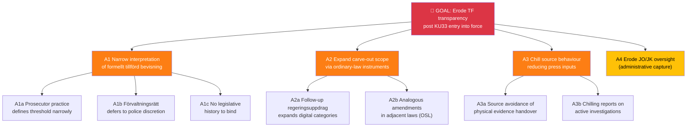
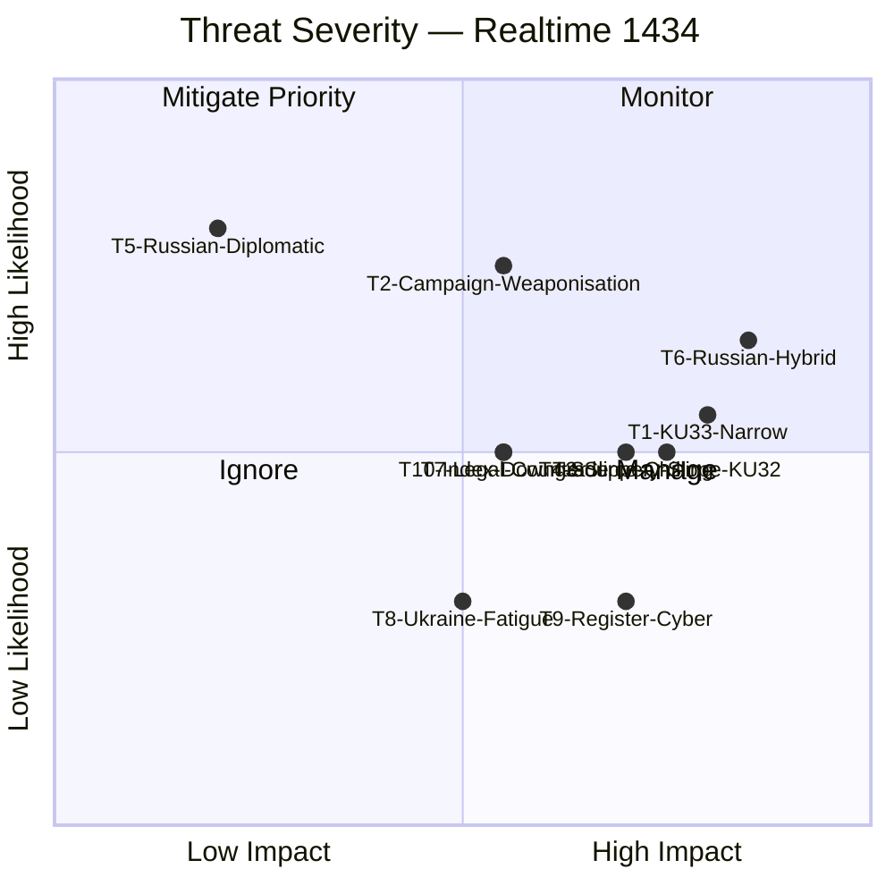
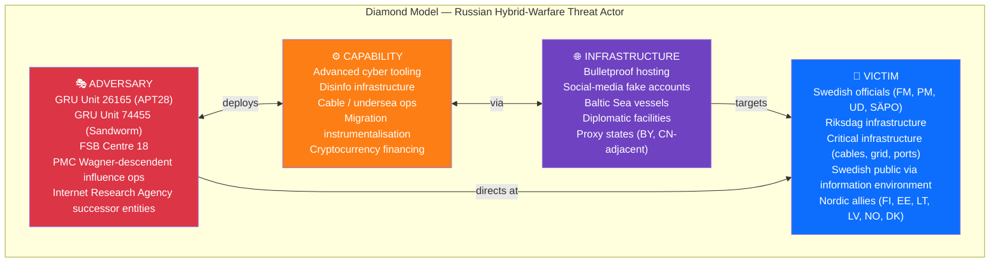

# Threat Analysis — Realtime Monitor 1434

| Field | Value |
|-------|-------|
| **THR-ID** | THR-2026-04-17-1434 |
| **Analysis Date** | 2026-04-17 14:34 UTC |
| **Framework** | STRIDE (political-adapted) + `analysis/methodologies/political-threat-framework.md` v2.0 |
| **Scope** | Constitutional Reforms (LEAD) · Ukraine Accountability · Housing/AML |
| **Validity Window** | Valid until 2026-04-24 |

---

## 🌳 Attack-Tree — Democratic-Infrastructure Threats (KU33 Focus)

---

## 🎭 Threat Register

| Threat ID | Threat | Cluster | Actor | Method / TTP | Likelihood | Impact | Priority | Confidence |
|:---------:|--------|:-------:|-------|--------------|:----------:|:------:|:--------:|:----------:|
| **T1** | **KU33 narrow-interpretation entrenchment** | Constitutional | Future gov / prosecutorial practice / förvaltningsrätt | Interpretation drift; administrative discretion without legislative-history anchor | MEDIUM | HIGH | 🔴 MITIGATE | MEDIUM |
| **T2** | **Campaign weaponisation of KU33** | Constitutional | V, MP, S-left; journalism NGOs | Framing amendment as press-freedom regression; 2026 valrörelse talking points | HIGH | MEDIUM | 🔴 MITIGATE | HIGH |
| **T3** | **Slippery-slope via KU32 EU-obligation template** | Constitutional | Future legislation (digital platforms, AI, national security) | Re-use of EU-obligation → grundlag-compression template | MEDIUM | HIGH | 🟠 ACTIVE | MEDIUM |
| **T4** | **Source-chilling effect on investigative journalism** | Constitutional | Structural / systemic | Source avoidance of physical evidence handover; reduced tips to journalists | MEDIUM | HIGH | 🟠 ACTIVE | MEDIUM |
| **T5** | **Russian diplomatic pressure** (post-HD03231/232) | Ukraine | RF MFA | Official protests, diplomatic notes; status quo pattern since 2022 | HIGH | LOW | 🟢 MONITOR | HIGH |
| **T6** | **Russian hybrid warfare** (cyber, disinformation, sabotage) | Ukraine | GRU, SVR, FSB | Cyber ops on SE gov infra; disinformation in valrörelse; Nordic infrastructure sabotage | MEDIUM-HIGH | HIGH | 🔴 MITIGATE | HIGH |
| **T7** | **Tribunal legal counter-challenges** | Ukraine | Russia + sympathetic fora | Jurisdictional challenges; forum shopping | MEDIUM | MEDIUM | 🟡 MANAGE | MEDIUM |
| **T8** | **Ukraine fatigue narrative** | Ukraine | Domestic populist actors | Framing continued engagement as economically costly | LOW-MEDIUM | MEDIUM | 🟡 MONITOR | MEDIUM |
| **T9** | **Property-register cyber attack** (post-Jan 2027) | Housing | State + criminal actors | Data exfiltration from Lantmäteriet; ransomware | LOW-MEDIUM | HIGH | 🟠 ACTIVE | MEDIUM |
| **T10** | **International press-freedom index downgrade** | Constitutional | RSF, Freedom House | Downgrade of Sweden post-TF amendment; reputational blowback for UD press-freedom diplomacy | MEDIUM | MEDIUM | 🟡 MANAGE | MEDIUM |

---

## 🧭 STRIDE Mapping (Political Adaptation)

| STRIDE | Threat ID(s) | Political Translation |
|:------:|:------------:|-----------------------|
| **S**poofing | T6 | Disinformation campaigns impersonating Swedish authorities during valrörelse |
| **T**ampering | T1, T3 | Interpretive tampering with KU33 test; legal-template tampering via KU32 precedent |
| **R**epudiation | T7 | Russia repudiates tribunal jurisdiction |
| **I**nformation Disclosure | T4, T9 | Chilling effect suppresses legitimate disclosure; cyber attacks force illegitimate disclosure |
| **D**enial of Service | T6, T9 | Cyber ops against gov infrastructure; register DoS |
| **E**levation of Privilege | T1, T3 | Administrative actors obtain grundlag-level discretion by interpretive creep |

---

## 🔥 Priority-Mitigation Actions

### T1 — KU33 Narrow-Interpretation (MITIGATE PRIORITY)
- **Pre-vote**: Lagrådet yttrande must explicitly scope "formellt tillförd bevisning" test
- **Pre-vote**: KU committee record should document legislator intent (strict interpretation)
- **Post-vote**: JO/JK annual reporting on KU33 application; NGO monitoring framework

### T2 — Campaign Weaponisation (MITIGATE)
- Cross-party leadership statements on KU33 (avoid partisan capture)
- Early NGO engagement (SJF, Utgivarna, TU) to co-design interpretive guardrails
- Government transparency commitment: annual published summary of KU33 applications

### T6 — Russian Hybrid (MITIGATE PRIORITY)
- SÄPO reinforced posture during valrörelse
- NCSC continuous monitoring of gov infrastructure
- NATO CCDCOE and StratCom COE coordination
- MSB public-awareness campaign on information-operation tactics

### T3 / T10 — Slippery-Slope + Index Downgrade (ACTIVE)
- UD press-freedom diplomacy pre-brief RSF/Freedom House on amendment scope
- Constitutional scholars' commentary positioned for international audiences

---

## 🧪 Threat Severity Matrix

---

## 🎯 Cyber-Kill-Chain Adaptation — Hybrid-Warfare Scenario (T6)

> Adapting the Lockheed Martin Cyber Kill Chain (Hutchins et al. 2011) to Russian hybrid-warfare targeting of Sweden after HD03231 founding-member status.

```mermaid
flowchart LR
    RE["1. Reconnaissance<br/>OSINT on SE critical<br/>infrastructure + officials"]
    WE["2. Weaponisation<br/>Cyber tools + disinfo<br/>narratives prepared"]
    DE["3. Delivery<br/>Phishing, cable ops,<br/>disinfo seeding"]
    EX["4. Exploitation<br/>Access gained;<br/>narratives take hold"]
    IN["5. Installation<br/>Persistence; influence<br/>network solidifies"]
    CC["6. C2<br/>Command infrastructure<br/>active"]
    AC["7. Actions on<br/>Objectives<br/>Disruption, coercion,<br/>narrative amplification"]

    RE --> WE --> DE --> EX --> IN --> CC --> AC

    style RE fill:#0d6efd,color:#fff
    style WE fill:#6f42c1,color:#fff
    style DE fill:#fd7e14,color:#fff
    style EX fill:#dc3545,color:#fff
    style IN fill:#dc3545,color:#fff
    style CC fill:#dc3545,color:#fff
    style AC fill:#dc3545,color:#fff
```

### Kill-Chain Specific Indicators (for SÄPO / MSB)

| Stage | Observable | Sensor | Detection Confidence |
|-------|------------|--------|:-------------------:|
| 1. Reconnaissance | OSINT scraping of Riksdag / UD / SÄPO personnel; social-engineering LinkedIn contacts | MSB CERT; SÄPO | HIGH |
| 2. Weaponisation | Fake-document kit prepared; deepfake/audio tooling activity | Signals intel | MEDIUM |
| 3. Delivery | Spear-phishing against key officials; subsea-cable anomalies; suspicious vessel tracking; bot-network seeding | MSB, Kustbevakningen, MUST | HIGH |
| 4. Exploitation | Account compromise; narrative traction (Twitter/X, TikTok) | Internal IR teams; civil-society monitors | MEDIUM |
| 5. Installation | Persistent access (implants, dormant accounts); long-term troll-network warm-up | SÄPO, FRA | LOW-MEDIUM |
| 6. C2 | Beaconing patterns; coordinated amplification campaigns | FRA, Graphika / civil-society | MEDIUM |
| 7. Actions | DoS on Swedish infrastructure; public-opinion shift; specific policy reversal attempts | Broad sensor set | HIGH |

**Defence posture** `[HIGH]`: The defensive goal is interception **before stage 5** (Installation). Post-Installation displacement costs are an order of magnitude higher than pre-Installation prevention.

---

## 🔺 Diamond Model — Adversary Profile (T6 Russian Hybrid)

**Confidence**: HIGH — mapping consistent with SÄPO annual assessments (2023–25) and FOI / Nordic-Baltic intelligence-sharing findings.

---

## 🧰 MITRE-Style TTP Library (Hybrid-Warfare Observables)

| TTP Code | Tactic | Technique | Observable in Sweden (2023–25 baseline) |
|----------|--------|-----------|------------------------------------------|
| TA-01 | Reconnaissance | Target-list harvesting (LinkedIn, registries) | Observed — officials, journalists, military |
| TA-02 | Resource Development | Shell-company acquisitions | Documented (Fastighetsmäklarinspektionen cases) |
| TA-03 | Initial Access | Spear-phishing | Consistently observed; 2024 SÄPO report |
| TA-04 | Persistence | Dormant accounts, long-cycle troll operators | Graphika / EUvsDisinfo documentation |
| TA-05 | Defense Evasion | Proxy-state laundering of attribution | Standard tradecraft |
| TA-06 | Credential Access | Password spraying, credential stuffing | Routine observation |
| TA-07 | Discovery | Internal lateral mapping post-compromise | Routine in compromised-account investigations |
| TA-08 | Lateral Movement | Email-chain compromise | Observed |
| TA-09 | Collection | Document exfiltration | Observed |
| TA-10 | C2 | Telegram channels, alternative platforms | Observed |
| TA-11 | Exfiltration | Dead drops via cloud services | Observed |
| **TA-12** | **Impact — Narrative** | **Coordinated disinformation campaigns** | **Observed and escalating 2022→2026** |
| **TA-13** | **Impact — Physical** | **Cable-cutting, GPS spoofing, migration instrumentalisation** | **Elevated 2023–24** |
| TA-14 | Impact — Legal | SLAPP / GDPR-abuse litigation | Observed in Nordic context |

**Cross-reference** `[HIGH]`: Compare with [`comparative-international.md`](comparative-international.md) §Diplomatic Response Patterns — Estonia (2022–), Finland (2023–), Netherlands (sustained). Sweden's expected pattern interpolates between Finland and Netherlands severity.

---

## 🛡️ Defensive Recommendations (Prioritised)

| # | Recommendation | Owner | Horizon |
|---|---------------|-------|:-------:|
| D1 | **Heighten SÄPO / MSB posture pre-election** through Sep 2026 | SÄPO, MSB | Continuous |
| D2 | **Engage Lagrådet** on KU33 interpretation scoping (mitigates T1, T2, T4, T10) | Press-freedom NGOs, legal academia | Q2 2026 |
| D3 | **Prepare RSF / FH / V-Dem engagement plan** for post-amendment index defence | UD Press Office, PK | H2 2026 |
| D4 | Baltic-Nordic intelligence-sharing on cable + hybrid ops | FRA, MUST, partner services | Continuous |
| D5 | Civil-society disinfo-resilience investment | MSB, civic organisations | Continuous |
| D6 | KU33 statutory clarity amendment during second reading (if path opens) | S, M, KD, L MPs | H2 2026 |
| D7 | Counter-narrative prep on "press freedom abroad vs at home" rhetorical tension | UD, press-freedom NGOs | Q2–Q3 2026 |

---

**Classification**: Public · **Next Review**: 2026-04-24 · **Methodology**: `analysis/methodologies/political-threat-framework.md`
