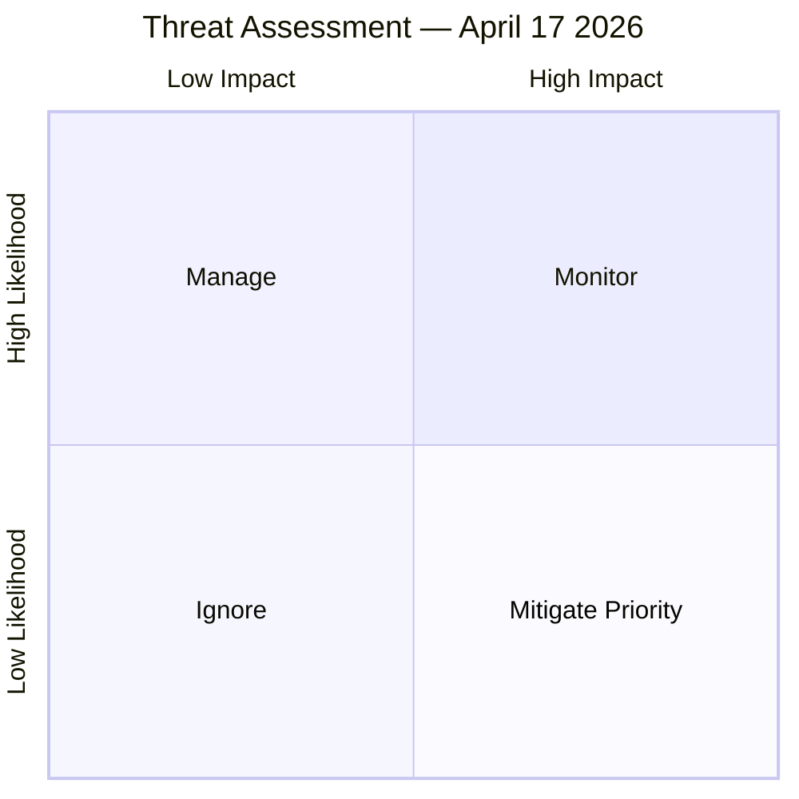

# Threat Analysis — Realtime Monitor 1434
**Date**: 2026-04-17 | **Framework**: STRIDE + Political Threat Framework v2.0

---

## Primary Threat Vector: Russian State Response

### T1 — Diplomatic Pressure (HIGH likelihood)
**Actor**: Russian Federation (Ministry of Foreign Affairs)
**Method**: Official protests, diplomatic notes, accusations of "anti-Russian" activity
**Impact**: Manageable — Sweden has accepted Russian criticism since 2022
**Current status**: Russia has already designated Sweden "unfriendly state"
**Mitigation**: NATO collective defense; EU sanctions coordination

### T2 — Hybrid Warfare (MEDIUM-HIGH likelihood)
**Actor**: GRU, SVR, FSB (Russian intelligence)
**Method**: 
- Cyber attacks on Swedish government infrastructure
- Disinformation campaigns (social media; targeting domestic Ukraine fatigue)
- Interference in 2026 election (potential)
- Physical sabotage (cable, pipeline) — precedent from Nordic incidents 2024
**Impact**: HIGH if successful — government credibility, public support
**Mitigation**: NCSC (Swedish National Cybersecurity Centre); NATO CCDCOE; MUST (military intelligence)

### T3 — Legal Counter-Challenges (MEDIUM likelihood)
**Actor**: Russia + sympathetic legal actors
**Method**: Challenge tribunal's jurisdiction under international law; use non-member states as forum shopping
**Impact**: MEDIUM — could delay/delegitimize but not stop proceedings
**Mitigation**: Council of Europe framework provides solid legal foundation

---

## Secondary Threat Vector: Domestic Political

### T4 — Pre-Election Ukraine Fatigue (LOW-MEDIUM)
**Actor**: Domestic political actors, potentially SD if they shift position
**Method**: Framing continued Ukraine engagement as economically costly
**Impact**: MEDIUM if combined with economic pressures
**Mitigation**: Spring budget 2026 (HD0399) shows fiscal space; Ukraine costs framed as NATO burden-sharing

### T5 — Press Freedom Criticism (MEDIUM)
**Actor**: Journalists, press freedom organizations, V/MP
**Method**: Campaign against KU33 constitutional amendment during 2026 election period
**Impact**: MEDIUM — constitutional second reading requires post-election Riksdag approval
**Mitigation**: KU33's scope is limited; investigative journalism protections remain

---

## Threat Severity Matrix

| Threat | Likelihood | Impact | Priority |
|--------|-----------|--------|---------|
| T1 Russian diplomatic | HIGH | LOW | Monitor |
| T2 Russian hybrid warfare | MEDIUM-HIGH | HIGH | **MITIGATE PRIORITY** |
| T3 Legal counter-challenge | MEDIUM | MEDIUM | Manage |
| T4 Ukraine fatigue | LOW-MEDIUM | MEDIUM | Monitor |
| T5 Press freedom backlash | MEDIUM | MEDIUM | Manage |
