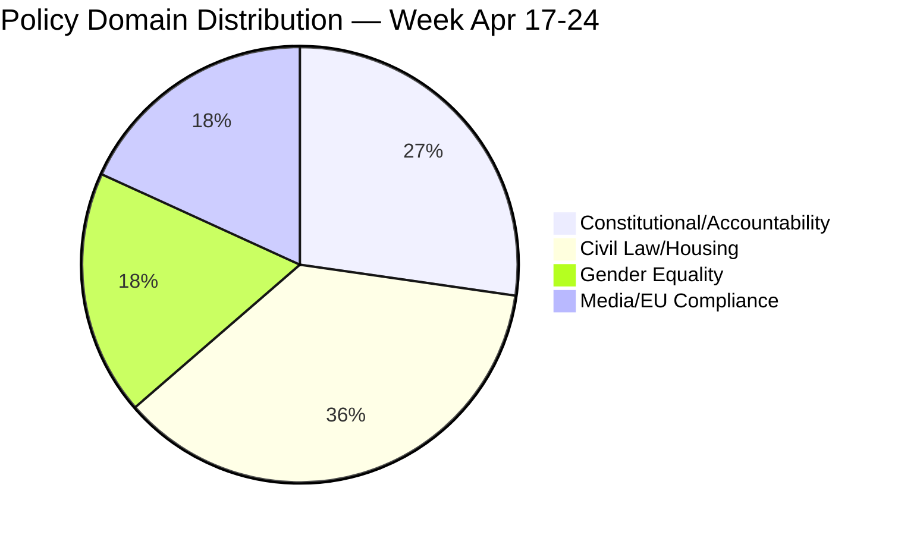

# Classification Results — Week Ahead 2026-04-17

**Generated**: 2026-04-17  
**Classification Framework**: Policy Domain × Legislative Stage × Political Valence

---

## Document Classification

| dok_id | Title | Primary Domain | Secondary Domain | Stage | Valence |
|--------|-------|----------------|------------------|-------|---------|
| HDA7KU42 | KU Granskning | Constitutional | Accountability | Scrutiny | Contested |
| HDC220260421ou1 | KU hearing: Svantesson | Economic | Constitutional | Hearing | Contested |
| HDC220260421ou2 | KU hearing: Wallström | Foreign Policy | Constitutional | Hearing | Contested |
| HD01CU22 | Guardianship reform | Civil Law | Social Welfare | Plenary Debate | Broadly supported |
| HD01CU27 | Property ID/condo law | Civil Law | Housing | Plenary Debate | Broadly supported |
| HD01CU28 | Condo register | Civil Law | Housing | Plenary Debate | Broadly supported |
| HD01CU42 | Riksrev: estates | Civil Law | Audit | Plenary Debate | Non-partisan |
| HD01KU32 | Media accessibility | Media | EU Compliance | Plenary Debate | Broadly supported |
| HD01KU33 | Search-seizure transparency | Rule of Law | Privacy | Plenary Debate | Contested |
| HD10437 | Wage transparency | Gender Equality | EU Compliance | Interpellation | Contested |
| HD10438 | Women's shelters | Social Welfare | Gender Equality | Interpellation | Contested |

---

## Domain Distribution

---

## Legislative Stage Mapping

| Stage | Events | Count |
|-------|--------|-------|
| Annual Scrutiny | KU Granskning + Ministerial Hearings | 3 |
| Plenary Debate (Betänkanden) | CU × 4, KU × 2 | 6 |
| Interpellation (Active) | Gender equality × 2 | 2 |
| Committee Meetings | 11 Tue + 10+ Thu + EU Fri | 25+ |

---

## Political Valence Analysis

**Broadly Supported** (cross-party consensus expected):
- CU guardianship reform (HD01CU22): Responds to documented system failures; all parties support reform
- CU condo register (HD01CU28): Demanded for years by all housing policy stakeholders
- KU media accessibility (HD01KU32): EU compliance obligation; non-partisan

**Contested** (significant party opposition):
- KU search-and-seizure transparency (HD01KU33): Civil liberties vs security balance
- Wage transparency interpellation (HD10437): Coalition resists EU mandate as business regulation burden
- Women's shelters interpellation (HD10438): Coalition denies systemic closure pattern

**Key Electoral Cleavage**: Civil law/housing reforms benefit property-owning middle class (M/KD/SD voter base), while opposition interpellations highlight welfare and gender equality deficits (S/MP/V voter base). This mirrors the fundamental E2026 electoral divide.

