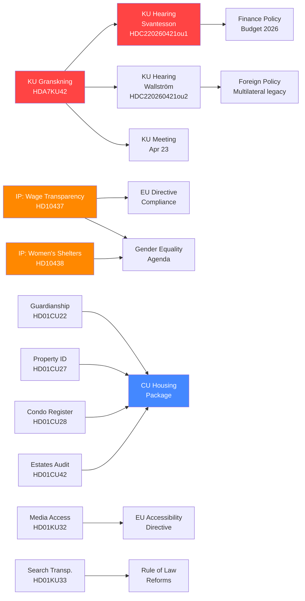

# Cross-Reference Map — Week Ahead 2026-04-17

**Generated**: 2026-04-17  
**Purpose**: Map relationships between documents, events, and actors

---

## Document Relationship Network

---

## Actor-Document Cross-Reference

| Actor | Role | Connected Documents |
|-------|------|---------------------|
| Elisabeth Svantesson (M) | Finance Minister — under scrutiny | HDC220260421ou1, HD10433 |
| Margot Wallström (S) | Former FM — KU witness | HDC220260421ou2 |
| Sofia Amloh (S) | Opposition MP — gender equality | HD10437, HD10438 |
| Nina Larsson (L) | Jämstalldhetsminister — defending | HD10437, HD10438 |
| Erik Slottner (KD) | Civilminister | HD11718 |
| KU Committee | Constitutional scrutiny body | HDA7KU42, HD01KU32, HD01KU33 |
| CU Committee | Civil law / housing reforms | HD01CU22, HD01CU27, HD01CU28, HD01CU42 |

---

## Thematic Threads

### Thread 1: Constitutional Accountability
KU Granskning (HDA7KU42) → Ministerial Hearings (ou1, ou2) → KU April 23 meeting → Scrutiny report publication (likely May). This is the most structurally significant thread.

### Thread 2: Gender Equality Under Pressure
IP: Women's shelters (HD10438) + IP: Wage transparency (HD10437) → Jämstalldhetsminister Larsson (L) under fire → Coalition tension L/SD → Election 2026 gender equality positioning.

### Thread 3: Civil Law Modernization
Four CU betänkanden (CU22, CU27, CU28, CU42) → Plenary debate this week → Expected passage with minor opposition reservations → Implementation timeline 2026-2027. These are consensus-building reforms unlikely to generate major political controversy.

### Thread 4: EU Compliance Week
Media accessibility (KU32) + Wage transparency directive (HD10437) + EU fisheries council briefing (April 24) → Sweden's EU compliance posture tested on multiple fronts simultaneously.

---

## Cross-Reference to Previous Weeks

| Previous Coverage | Connected This Week |
|-------------------|---------------------|
| Vårproposition (Apr 13 debate) | Svantesson KU hearing on economic policy |
| SfU migration reforms (Apr 10) | SfU committee April 21 + 23 |
| UFöU NATO contribution (Apr 13) | FöU committee April 21 + 23 |

