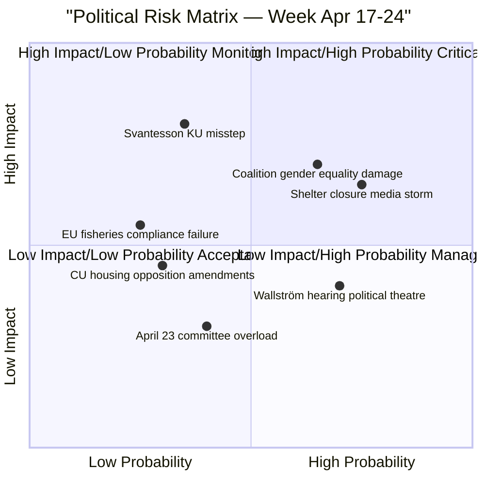

# Risk Assessment — Week Ahead 2026-04-17

**Generated**: 2026-04-17  
**Framework**: Political Risk × Institutional Stability × Legislative Success Probability  
**Confidence**: 🟧 MEDIUM-HIGH

---

## Risk Heat Map

---

## Risk Catalogue

### 🔴 CRITICAL RISKS

**R1: Finance Minister Svantesson (M) under KU scrutiny — April 21, 11:00**  
Probability: 🟧 MEDIUM | Impact: 🔴 VERY HIGH  
*Risk*: KU members from S, MP, V ask pointed questions about the government's economic equality record, particularly around the 2026 budget's distributional effects. Any admission of knowledge gaps or policy contradictions could be amplified by opposition ahead of Election 2026.  
*Mitigation*: Government will prepare thoroughly; Svantesson is experienced and poised under pressure.

**R2: Women's Shelter Closures — Ongoing Media Risk**  
Probability: 🟩 HIGH | Impact: 🟠 HIGH  
*Risk*: S interpellation (HD10438) from Sofia Amloh on women's shelter closures arrives as statistics show record domestic violence cases. If Jämställdhetsminister Larsson (L) cannot provide concrete government action, the story dominates broadcast media through the week.  
*Mitigation*: L will point to other funding mechanisms; however, documented closures (20+ women's jourer nationally in 2025) make denial difficult.

### 🟠 HIGH RISKS

**R3: Wage Transparency Directive Implementation Gap**  
Probability: 🟧 MEDIUM | Impact: �� HIGH  
*Risk*: EU Lönetransparensdirektivet requires member state implementation by 2026. S interpellation (HD10437) challenges Sweden's readiness and the government's position on gender pay reporting requirements. Any delay signals governance failure.  
*Mitigation*: Government likely has implementation framework in progress; L minister can present timeline.

**R4: KU Scrutiny Report Language (April 23 meeting)**  
Probability: 🟧 MEDIUM | Impact: 🟠 HIGH  
*Risk*: April 23 KU meeting finalizes scrutiny report language. If KU (which has cross-party membership) finds constitutional breaches or criticizes government action, published findings damage executive credibility.

### 🟡 MEDIUM RISKS

**R5: CU Housing Reform Opposition**  
Probability: 🟩 HIGH | Impact: 🟡 MEDIUM  
*Risk*: Opposition motions against CU housing reforms unlikely to pass given government majority, but reservations will be filed and publicized.

**R6: EU Agriculture/Fisheries Council April 24**  
Probability: 🟩 HIGH | Impact: 🟡 MEDIUM  
*Risk*: EU Committee briefing for April 27 Council requires government to define Sweden's negotiating position. Any internal coalition disagreement on fisheries quotas or agricultural subsidies becomes visible.

---

## Risk Trend Assessment

| Risk Domain | Direction | Assessment |
|-------------|-----------|------------|
| Constitutional/KU Accountability | ↑ Increasing | Pre-election scrutiny intensity highest in session |
| Gender Equality Policy | ↑ Increasing | L portfolio under sustained S attack |
| Housing Policy | → Stable | CU reforms well-prepared, low reversal risk |
| EU/International | → Stable | Standard council coordination, low risk |
| Coalition Cohesion | ↓ Slightly decreasing | L-SD tensions on gender equality ongoing |

