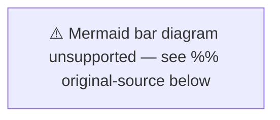

# Significance Scoring — Week Ahead 2026-04-17

**Generated**: 2026-04-17  
**Scoring Methodology**: Multi-factor (electoral impact × policy scope × institutional weight × media salience)

---

## Significance Score Matrix

| dok_id / Event | Policy Scope | Electoral Impact | Institutional Weight | Media Salience | **TOTAL** |
|----------------|-------------|-----------------|---------------------|----------------|-----------|
| KU Granskning (HDA7KU42) | 9/10 | 10/10 | 10/10 | 9/10 | **38/40** |
| KU hearing: Svantesson (HDC220260421ou1) | 8/10 | 10/10 | 10/10 | 9/10 | **37/40** |
| KU hearing: Wallström (HDC220260421ou2) | 7/10 | 8/10 | 9/10 | 8/10 | **32/40** |
| CU Housing: Property identity (HD01CU27) | 7/10 | 6/10 | 7/10 | 6/10 | **26/40** |
| CU Condo register (HD01CU28) | 7/10 | 6/10 | 7/10 | 6/10 | **26/40** |
| CU Guardianship reform (HD01CU22) | 7/10 | 5/10 | 7/10 | 5/10 | **24/40** |
| KU Media accessibility (HD01KU32) | 5/10 | 4/10 | 7/10 | 5/10 | **21/40** |
| KU Search-seizure transparency (HD01KU33) | 6/10 | 4/10 | 7/10 | 5/10 | **22/40** |
| IP Wage transparency (HD10437) | 6/10 | 7/10 | 5/10 | 7/10 | **25/40** |
| IP Women's shelters (HD10438) | 7/10 | 8/10 | 5/10 | 8/10 | **28/40** |
| Apr 23 Mass Committee Day | 5/10 | 4/10 | 8/10 | 4/10 | **21/40** |

---

## Priority Ranking

---

## Top Significance Items for Editorial Focus

1. **KU Granskning + Ministerial Hearings** (Score: 37-38/40) — Annual constitutional scrutiny is THE institutional story of the week. Two hearings in one day with senior government/former ministers defines the political news cycle April 21.

2. **IP: Women's Shelters Closures** (Score: 28/40) — Interpellation by Sofia Amloh (S) targeting Jämställdhetsminister Nina Larsson (L) on shelter closures is a high-salience welfare-state story that directly challenges the coalition's gender equality record. Election 2026 implication: 🟩 HIGH.

3. **IP: Wage Transparency Directive** (Score: 25/40) — EU directive implementation debate challenges whether Sweden will lead or lag on pay equity. The directive mandates salary reporting by gender, threatening to expose pay gaps in Swedish corporations.

4. **CU Housing Reforms** (Score: 24-26/40) — Four housing/civil law committee reports entering plenary debate represent the government's most tangible legislative output of the spring.

