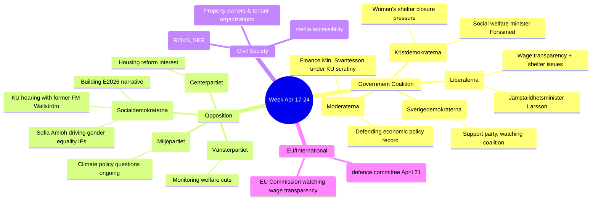

# Stakeholder Perspectives — Week Ahead 2026-04-17

**Analysis Date**: 2026-04-17  
**Key Events**: KU Granskning, CU Housing Reforms, Gender Equality Interpellations  
**Confidence**: 🟩 HIGH

---

## Stakeholder Map

---

## Perspective Analysis

### 1. Government Coalition (M-KD-L, supported by SD)
**Primary interest**: Demonstrating legislative competence and fiscal responsibility before KU scrutiny. Finance Minister Svantesson wants to project stability despite opposition questions about tax reform and economic inequality. The coalition will use the KU hearing as a transparency showcase.

**Vulnerability**: The L-held equality portfolio is under simultaneous attack from two S interpellations (wage transparency + women's shelters). Nina Larsson must defend government positions that critics argue represent welfare state retreat, particularly the shelter closures which multiple civil society organizations have publicly condemned.

**Strategic move**: Advance CU housing reforms (4 betänkanden) in plenary to demonstrate tangible homeowner-focused policy delivery.

### 2. Social Democrats (S) — Primary Opposition
**Primary interest**: Building pre-election narrative around government failures in welfare, gender equality, and economic fairness. KU hearing with former FM Margot Wallström allows S to contrast progressive foreign policy traditions with the current government's more transactional approach.

**Tactical approach**: Sofia Amloh's dual interpellations on wage transparency and women's shelters are a coordinated gender equality push. By targeting Jämställdhetsminister Larsson (L), S exploits coalition tensions between the L minority and SD's more conservative positions on gender equality.

**Election 2026 positioning**: Every KU scrutiny question becomes pre-campaign opposition research material. S will amplify any government fumbles.

### 3. KU (Constitutional Committee) — Institutional Actors
**Role**: Annual Granskning is the most constitutionally significant action the KU takes. It examines whether ministers have acted within their constitutional mandate. The decision to call Finance Minister Svantesson AND former FM Wallström in the same day reflects a broad-scope review spanning economic governance and foreign policy legacy.

**Independence**: KU operates across party lines in its scrutiny function, though its members are still party-affiliated. April 23 KU meeting will likely finalize scrutiny report language.

### 4. CU (Civil Law Committee) — Legislative Output
Four betänkanden entering debate represent the culmination of months of legislative work:
- **Guardianship reform**: Responds to well-documented failures in the current legal guardian system for vulnerable adults
- **Property title identity**: Addresses money-laundering and fraud risks in real estate transfers  
- **Condo register**: Long-demanded transparency tool for Sweden's 700,000+ bostadsrätter
- **Riksrevisionen estates**: Parliament responding to National Audit findings on state estate management

### 5. Civil Society
**Women's shelter organizations** (ROKS, Unizon, SKR): Actively lobbying against shelter closures amid documented increases in domestic violence cases. Their data directly supports S interpellation arguments.

**Tenant and property owner organizations**: Support KU housing reforms with mixed positions — condo register welcomed by buyers, concern about identity documentation burden from HD01CU27.

**Disability rights organizations**: Media accessibility bill (HD01KU32) implements EU accessibility directive, welcomed by organizations representing people with hearing/visual impairments.

